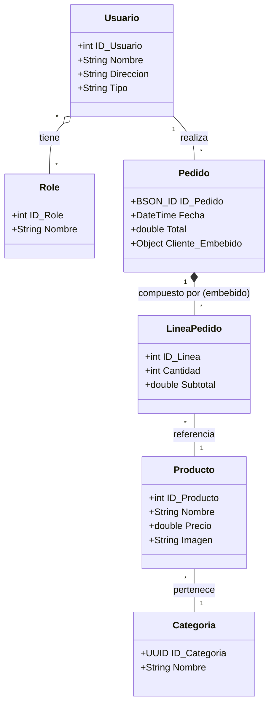

# TiendaApiDaw-NetCore
Proyecto de una API REST usando .NET Core y ASP.NET Core con C#.
- [TiendaApiDaw-NetCore](#tiendaapidaw-netcore)
- [Proyecto](#proyecto)
  - [🚀 Inicio Rápido](#-inicio-rápido)
    - [Requisitos Previos](#requisitos-previos)
    - [Instalación y Ejecución](#instalación-y-ejecución)
    - [Comandos Docker Útiles](#comandos-docker-útiles)
    - [Comandos de Desarrollo](#comandos-de-desarrollo)
  - [🔐 Credenciales de Prueba](#-credenciales-de-prueba)
    - [Usuario Administrador](#usuario-administrador)
    - [Usuario Normal](#usuario-normal)
    - [Autenticación JWT](#autenticación-jwt)
  - [📮 Guía de Uso con Postman](#-guía-de-uso-con-postman)
    - [Importar la Colección](#importar-la-colección)
    - [Configuración Inicial](#configuración-inicial)
    - [Flujo de Trabajo Recomendado](#flujo-de-trabajo-recomendado)
    - [Scripts Automáticos](#scripts-automáticos)
  - [🎯 Conceptos Clave para Estudiantes 2DAW](#-conceptos-clave-para-estudiantes-2daw)
    - [Railway Oriented Programming (ROP)](#railway-oriented-programming-rop)
      - [Características de ROP:](#características-de-rop)
      - [Implementación en este Proyecto:](#implementación-en-este-proyecto)
      - [¿Cuándo usar cada enfoque?](#cuándo-usar-cada-enfoque)
    - [Patrones de Arquitectura Implementados](#patrones-de-arquitectura-implementados)
      - [1. **Repository Pattern**](#1-repository-pattern)
      - [2. **Dependency Injection**](#2-dependency-injection)
      - [3. **DTO Pattern**](#3-dto-pattern)
      - [4. **Middleware Pipeline**](#4-middleware-pipeline)
    - [Características Runtime Avanzadas](#características-runtime-avanzadas)
      - [🔴 Redis Cache (Cache-Aside Pattern)](#-redis-cache-cache-aside-pattern)
      - [🔌 WebSocket (Notificaciones en Tiempo Real)](#-websocket-notificaciones-en-tiempo-real)
      - [📧 Email Asíncrono (Background Workers)](#-email-asíncrono-background-workers)
      - [🗄️ Múltiples Bases de Datos](#️-múltiples-bases-de-datos)
    - [Estructura del Proyecto](#estructura-del-proyecto)
- [Problema](#problema)
  - [Elementos del dominio](#elementos-del-dominio)
  - [Diagrama](#diagrama)
  - [Bases de datos:](#bases-de-datos)
  - [UUID vs Auto](#uuid-vs-auto)
  - [Almacenamiento de imágenes](#almacenamiento-de-imágenes)
  - [Manejo de plantillas](#manejo-de-plantillas)
  - [Documentación](#documentación)
  - [Testing](#testing)
  - [Perfiles](#perfiles)
  - [Despliegue](#despliegue)
  - [Postman](#postman)
  - [Endpoints](#endpoints)
    - [Auth](#auth)
    - [Auth](#auth-1)
    - [Categorías](#categorías)
    - [Pedidos](#pedidos)
    - [Productos](#productos)
    - [Storage](#storage)
    - [Users](#users)
  - [Autor](#autor)
    - [Contacto](#contacto)
  - [Licencia de uso](#licencia-de-uso)


# Proyecto
Este proyecto es una muestra de lo que se ha ido viendo en clase siguiendo los pasos del [repositorio del tema](https://github.com/joseluisgs?tab=repositories&q=DesarrolloWebEntornosServidor-04&type=&language=&sort=).

Podrás seguir sus pasos commit a commit o en las ramas indicadas por clase.

## 🚀 Inicio Rápido

### Requisitos Previos
- .NET 10 SDK
- Docker y Docker Compose (para bases de datos)
- PostgreSQL (o usa Docker)
- Redis (o usa Docker)
- MongoDB (o usa Docker)

### Instalación y Ejecución

1. **Clonar el repositorio**
```bash
git clone https://github.com/joseluisgs/TiendaDawApi-NetCore.git
cd TiendaDawApi-NetCore
```

2. **Iniciar servicios con Docker**
```bash
docker-compose up -d
```

Esto iniciará:
- PostgreSQL en puerto 5432
- Redis en puerto 6379
- MongoDB en puerto 27017

3. **Restaurar dependencias**
```bash
dotnet restore
```

4. **Ejecutar la aplicación**
```bash
cd TiendaApi
dotnet run
```

5. **Acceder a la API**
- **Swagger UI**: http://localhost:5000
- **GraphiQL**: http://localhost:5000/graphiql
- **API REST**: http://localhost:5000/api

### Comandos Docker Útiles

```bash
# Iniciar todos los servicios
docker-compose up -d

# Ver logs de los servicios
docker-compose logs -f

# Detener todos los servicios
docker-compose down

# Detener y eliminar volúmenes (datos)
docker-compose down -v

# Reiniciar un servicio específico
docker-compose restart postgres
docker-compose restart redis
docker-compose restart mongodb
```

### Comandos de Desarrollo

```bash
# Compilar el proyecto
dotnet build

# Ejecutar tests
dotnet test

# Ejecutar con hot reload
dotnet watch run --project TiendaApi

# Limpiar y compilar
dotnet clean && dotnet build

# Crear migración de base de datos
dotnet ef migrations add NombreMigracion --project TiendaApi

# Aplicar migraciones
dotnet ef database update --project TiendaApi
```

## 🔐 Credenciales de Prueba

La aplicación se inicializa con usuarios por defecto para facilitar las pruebas:

### Usuario Administrador
- **Username**: `admin`
- **Email**: `admin@tienda.com`
- **Password**: `Admin123`
- **Rol**: ADMIN
- **Permisos**: Acceso completo a todos los endpoints

### Usuario Normal
- **Username**: `user`
- **Email**: `user@tienda.com`
- **Password**: `User123`
- **Rol**: USER
- **Permisos**: Acceso limitado (solo lectura en la mayoría de endpoints)

### Autenticación JWT

1. Usa el endpoint `POST /v1/auth/signin` con las credenciales
2. Recibirás un token JWT en la respuesta
3. En Swagger: Haz clic en el botón 🔒 **Authorize** y pega el token
4. En Postman: El token se guarda automáticamente con los scripts incluidos
5. En otras herramientas: Añade el header `Authorization: Bearer <token>`

## 📮 Guía de Uso con Postman

### Importar la Colección

1. Abre Postman
2. Haz clic en **Import** en la esquina superior izquierda
3. Selecciona el archivo `TiendaApi-Postman-Collection.json` del repositorio
4. La colección se importará con todas las peticiones organizadas

### Configuración Inicial

Las variables de entorno ya están configuradas en la colección:
- `base_url`: http://localhost:5000 (cámbiala si usas otro puerto)
- `jwt_token`: Se rellena automáticamente al hacer login
- Variables de IDs: Se guardan automáticamente después de crear recursos

### Flujo de Trabajo Recomendado

1. **Autenticación**
   - Ejecuta `Login Admin` o `Login User`
   - El token JWT se guarda automáticamente
   - Todas las peticiones posteriores usarán este token

2. **Explorar Categorías** (Patrón Tradicional)
   - `Get All Categorías` - Lista todas
   - `Create Categoría` - Crea una nueva (requiere ADMIN)
   - El ID se guarda automáticamente

3. **Explorar Productos** (Result Pattern Moderno)
   - `Get All Productos` - Cacheo con Redis
   - `Create Producto` - WebSocket + Email (requiere ADMIN)
   - Prueba también la versión XML

4. **Crear Pedidos**
   - `Create Pedido` - Crea un pedido con productos
   - WebSocket notifica en tiempo real
   - Email asíncrono de confirmación

5. **Probar GraphQL**
   - Ejecuta queries GraphQL desde la carpeta GraphQL
   - O visita http://localhost:5000/graphiql en el navegador

### Scripts Automáticos

La colección incluye scripts que:
- ✅ Extraen y guardan el token JWT automáticamente
- ✅ Guardan IDs de recursos creados para usarlos en otras peticiones
- ✅ Muestran mensajes informativos en la consola de Postman
- ✅ Validan respuestas con tests automáticos

## 🎯 Conceptos Clave para Estudiantes 2DAW

### Railway Oriented Programming (ROP)

Railway Oriented Programming es una forma de pensar sobre el flujo de tu código como dos vías de tren paralelas:

```
😊 VÍA DEL ÉXITO (Happy Path)
═══════════════════════════════════════════════════════════════
    Validar    →    Procesar    →    Guardar    →    Responder
═══════════════════════════════════════════════════════════════

❌ VÍA DEL ERROR (Failure Path)
─────────────────────────────────────────────────────────────── 
         ↓              ↓              ↓              ↓
    Error 400     Error 404      Error 500      Error 409
─────────────────────────────────────────────────────────────── 
```

#### Características de ROP:

1. **Dos Caminos**: Éxito o Fracaso, nunca ambos
2. **Sin Sorpresas**: Los errores son valores, no excepciones
3. **Composición**: Encadena operaciones fácilmente
4. **Explícito**: La firma del método dice "esto puede fallar"

#### Implementación en este Proyecto:

**Productos** usa Result Pattern (ROP):
```csharp
// Servicio retorna Result<ProductoDto, AppError>
var resultado = await _service.CreateAsync(dto);

// Pattern matching - dos caminos claros
return resultado.Match(
    onSuccess: producto => Created(...),  // 😊 Camino del éxito
    onFailure: error => BadRequest(...)   // ❌ Camino del error
);
```

**Categorías** usa el enfoque tradicional con excepciones para comparación:
```csharp
try {
    var categoria = await _service.CreateAsync(dto);
    return Created(...);
} catch (NotFoundException ex) {
    return NotFound(...);
} catch (ValidationException ex) {
    return BadRequest(...);
}
```

#### ¿Cuándo usar cada enfoque?

**ROP/Result Pattern** (Moderno):
- ✅ Lógica de negocio compleja
- ✅ Múltiples puntos de fallo
- ✅ Necesitas composición funcional
- ✅ Quieres rendimiento óptimo
- ✅ Proyectos greenfield modernos

**Excepciones** (Tradicional):
- ✅ Errores verdaderamente excepcionales
- ✅ Integrando con librerías que lanzan excepciones
- ✅ Código legacy o equipo acostumbrado a excepciones
- ✅ Errores de los que no puedes recuperarte

### Patrones de Arquitectura Implementados

#### 1. **Repository Pattern**
Abstrae el acceso a datos:
```
Controller → Service → Repository → Database
```

#### 2. **Dependency Injection**
Todas las dependencias se inyectan, similar a Spring Boot:
```csharp
builder.Services.AddScoped<IProductoRepository, ProductoRepository>();
builder.Services.AddScoped<ProductoService>();
```

#### 3. **DTO Pattern**
Separación entre entidades de dominio y contratos de API:
- `Producto` (Entidad) → No se expone directamente
- `ProductoDto` (DTO) → Respuestas de API
- `ProductoRequestDto` (DTO) → Peticiones de API

#### 4. **Middleware Pipeline**
Similar a Spring Security filter chain:
```
Request → Exception Handler → CORS → Auth → Controllers
```

### Características Runtime Avanzadas

#### 🔴 Redis Cache (Cache-Aside Pattern)
Los productos implementan cacheo con Redis:

1. **Primera petición**: Lee de PostgreSQL, guarda en Redis
2. **Siguientes peticiones**: Lee directamente de Redis (más rápido)
3. **Invalidación**: Al crear/actualizar/eliminar, se limpia el cache

```csharp
// Buscar en cache primero
var cached = await _cache.GetAsync<ProductoDto>($"producto:{id}");
if (cached != null) return Result.Success(cached);

// Si no está en cache, buscar en DB y cachear
var producto = await _repo.FindByIdAsync(id);
await _cache.SetAsync($"producto:{id}", producto, TimeSpan.FromMinutes(10));
```

#### 🔌 WebSocket (Notificaciones en Tiempo Real)
Cuando se crea/actualiza/elimina un producto:

1. Operación se completa en el servidor
2. WebSocket envía notificación a todos los clientes conectados
3. Los clientes reciben actualizaciones en tiempo real

**Conectarse al WebSocket**:
```javascript
const ws = new WebSocket('ws://localhost:5000/ws/v1/productos');
ws.onmessage = (event) => {
    const notification = JSON.parse(event.data);
    console.log('Producto actualizado:', notification);
};
```

#### 📧 Email Asíncrono (Background Workers)
Los emails no bloquean las peticiones HTTP:

1. Petición crea un producto
2. Mensaje de email se añade a una cola (Channel)
3. Respuesta HTTP se devuelve inmediatamente
4. Background worker procesa emails de la cola
5. Emails se envían en segundo plano con MailKit

#### 🗄️ Múltiples Bases de Datos
- **PostgreSQL**: Usuarios, Categorías, Productos (relacional)
- **MongoDB**: Pedidos y líneas de pedido (NoSQL, documentos)
- **Redis**: Cache para mejorar rendimiento (in-memory)

### Estructura del Proyecto

```
TiendaApi/
├── Controllers/              # Capa de presentación (REST API)
│   ├── AuthController.cs    # Autenticación JWT
│   ├── CategoriasController.cs  # CRUD Categorías (Exception pattern)
│   ├── ProductosController.cs   # CRUD Productos (Result pattern)
│   ├── PedidosController.cs     # CRUD Pedidos (MongoDB)
│   └── GraphQLController.cs     # Endpoint GraphQL
├── Services/                 # Lógica de negocio
│   ├── Auth/                # Servicios de autenticación
│   ├── Cache/               # Abstracción de Redis
│   ├── Email/               # Envío de emails con MailKit
│   ├── Pedidos/             # Lógica de pedidos
│   └── Users/               # Gestión de usuarios
├── Repositories/             # Acceso a datos
│   ├── CategoriaRepository.cs
│   ├── ProductoRepository.cs
│   ├── UserRepository.cs
│   └── PedidosRepository.cs
├── Models/                   # Entidades y DTOs
│   ├── Entities/            # Entidades de dominio
│   └── DTOs/                # Data Transfer Objects
├── Data/                     # Configuración de bases de datos
│   └── TiendaDbContext.cs   # DbContext de Entity Framework
├── Common/                   # Tipos y utilidades comunes
│   ├── Result.cs            # Implementación Result Pattern
│   ├── AppError.cs          # Tipos de errores
│   └── Unit.cs              # Tipo Unit (void funcional)
├── Middleware/               # Middleware personalizado
│   └── GlobalExceptionHandler.cs
├── WebSockets/               # Handlers de WebSocket
│   ├── ProductoWebSocketHandler.cs
│   └── PedidoWebSocketHandler.cs
├── GraphQL/                  # Configuración GraphQL
│   ├── Types/               # Tipos GraphQL
│   └── TiendaSchema.cs      # Esquema GraphQL
├── Mappings/                 # Perfiles de AutoMapper
└── Program.cs               # Configuración y startup

TiendaApi.Tests/              # Pruebas unitarias e integración
├── Controllers/             # Tests de controllers
├── Services/                # Tests de servicios
└── Repositories/            # Tests de repositorios
```

# Problema
Vamos a crear una API REST y página web de una tienda de productos
- Tenemos una serie de productos con sus atributos
- Sabemos que todos los productos pertenecen a una categoría
- Hay usuarios en el sistema, que pueden ser clientes o administradores
- Los clientes hacen pedidos
- Los pedidos esta formados por líeneas de pedidos
- Cada línea de pedido está formada por un producto.

## Elementos del dominio
Entidad: Usuario
- Atributos: ID_Usuario (Auto), Nombre, Dirección, Tipo, etc.
- Relaciones: Realiza uno o varios Pedidos, Tiene varios Roles.

Entidad: Pedido
- Atributos: ID_Usuario (BSON_ID), Fecha, Total, etc.
- Relaciones: Es realizado por un Cliente, Está compuesto por una o varias Líneas de pedido. Los datos de un cliente y su dirección, todo como embebido

Entidad: Línea de pedido
- Atributos: ID_Línea, Cantidad, Subtotal, etc.
- Relaciones: Está formada por un Producto

Entidad: Producto
- Atributos: ID_Producto (AUTO), Nombre, Precio, Imagen, etc.
- Relaciones: Pertenece a una Categoría

Entidad: Categoría
- Atributos: ID_Categoría (UUID), Nombre
- Relaciones: Tiene varios Productos

Entidad: Role
- Atributos: ID_Role (AUTO), Nombre
- Relaciones: Tiene varios Usuarios

## Diagrama
Role * <----- * Usuario 1 ----- * Pedido 1 -----> * Línea de Pedido * -----> 1 Producto * ----- Categoría



## Bases de datos:
Se analizará ventajas e inconvenientes para gestionar la información y alternativas.
- BB.DD Relacionales: Para Roles, Usuarios, Categorías y Productos
- BB.DD NoSQL: Pedidos y Lineas de Pedidos

## UUID vs Auto
Se abordará el uso de UUID para identificar las entidades en lugar de usar un ID autoincremental Analizando Pros y contras

## Almacenamiento de imágenes
Se almacenará imágenes para productos.

## Manejo de plantillas
Se usará Thymeleaf para el manejo de plantillas.

## Documentación
Se documentará con Swagger.

## Testing
Se introducirá el testing en distintas capas.

## Perfiles
Tendremos distintos perfiles de desarrollo.

## Despliegue
Desplegaremos en contenedores el servició y sus dependencias: almacenamiento y bases de datos.

## Postman
Se usará Postman como cliente para acceder al servicio.

## Endpoints

### Auth

Aquí tienes las tablas actualizadas con la columna "Otras Salidas" y ejemplos de posibles códigos de estado, excluyendo el "500 Internal Server Error":

### Auth

| Endpoint                    | URL                             | HTTP Verbo | AUTH                         | Descripción                 | HTTP Status Code | Otras Salidas                                           |
| --------------------------- | ------------------------------- | ---------- | ---------------------------- | --------------------------- | ---------------- | ------------------------------------------------------- |
| Registra un usuario         | `POST /api.version/auth/signup` | POST       | No se requiere autenticación | Registra un nuevo usuario   | 200 OK           | 400 Bad Request, 409 Conflict, 422 Unprocessable Entity |
| Inicia sesión de un usuario | `POST /api.version/auth/signin` | POST       | No se requiere autenticación | Inicia sesión de un usuario | 200 OK           | 400 Bad Request, 401 Unauthorized, 404 Not Found        |

### Categorías

| Endpoint                        | URL                                | HTTP Verbo | AUTH                                    | Descripción                              | HTTP Status Code | Otras Salidas                                  |
| ------------------------------- | ---------------------------------- | ---------- | --------------------------------------- | ---------------------------------------- | ---------------- | ---------------------------------------------- |
| Obtiene todas las categorias    | `GET /api.version/categorias`      | GET        | Requiere autenticación                  | Obtiene todas las categorías disponibles | 200 OK           | 401 Unauthorized, 403 Forbidden, 404 Not Found |
| Obtiene una categoría por su id | `GET /api.version/categorias/{id}` | GET        | Requiere autenticación                  | Obtiene una categoría por su id          | 200 OK           | 401 Unauthorized, 403 Forbidden, 404 Not Found |
| Crear una categoría             | `POST /api.version/categorias`     | POST       | Requiere autenticación de administrador | Crea una nueva categoría                 | 201 Created      | 401 Unauthorized, 403 Forbidden, 409 Conflict  |

### Pedidos

| Endpoint                    | URL                                | HTTP Verbo | AUTH                       | Descripción                           | HTTP Status Code | Otras Salidas                                                |
| --------------------------- | ---------------------------------- | ---------- | -------------------------- | ------------------------------------- | ---------------- | ------------------------------------------------------------ |
| Obtiene todos los pedidos   | `GET /api.version/pedidos`         | GET        | Requiere ser administrador | Obtiene todos los pedidos disponibles | 200 OK           | 401 Unauthorized, 403 Forbidden, 404 Not Found               |
| Obtiene un pedido por su id | `GET /api.version/pedidos/{id}`    | GET        | Requiere ser administrador | Obtiene un pedido por su id           | 200 OK           | 401 Unauthorized, 403 Forbidden, 404 Not Found               |
| Crea un nuevo pedido        | `POST /api.version/pedidos`        | POST       | Requiere ser administrador | Crea un nuevo pedido                  | 201 Created      | 401 Unauthorized, 403 Forbidden, 404 Not Found               |
| Actualiza un pedido         | `PUT /api.version/pedidos/{id}`    | PUT        | Requiere ser administrador | Actualiza un pedido existente         | 200 OK           | 401 Unauthorized, 403 Forbidden, 404 Not Found, 409 Conflict |
| Elimina un pedido           | `DELETE /api.version/pedidos/{id}` | DELETE     | Requiere ser administrador | Elimina un pedido existente           | 204 No Content   | 401 Unauthorized, 403 Forbidden, 404 Not Found               |


### Productos

| Endpoint                           | URL                                        | HTTP Verbo | AUTH                                    | Descripción                                                      | HTTP Status Code | Otras Salidas                                                   |
| ---------------------------------- | ------------------------------------------ | ---------- | --------------------------------------- | ---------------------------------------------------------------- | ---------------- | --------------------------------------------------------------- |
| Obtiene todos los productos        | `GET /api.version/productos`               | GET        | No requiere autenticación               | Obtiene todos los productos disponibles con opciones de filtrado | 200 OK           | 401 Unauthorized, 403 Forbidden, 404 Not Found                  |
| Obtiene un producto por su id      | `GET /api.version/productos/{id}`          | GET        | No requiere autenticación               | Obtiene un producto por su id                                    | 200 OK           | 401 Unauthorized, 403 Forbidden, 404 Not Found                  |
| Crear un producto                  | `POST /api.version/productos`              | POST       | Requiere autenticación de administrador | Crea un nuevo producto                                           | 201 Created      | 401 Unauthorized, 403 Forbidden, 409 Conflict                   |
| Actualiza un producto              | `PUT /api.version/productos/{id}`          | PUT        | Requiere autenticación de administrador | Actualiza un producto                                            | 200 OK           | 400 Bad Request, 401 Unauthorized, 403 Forbidden, 404 Not Found |
| Actualiza parcialmente un producto | `PATCH /api.version/productos/{id}`        | PATCH      | Requiere autenticación de administrador | Actualiza parcialmente un producto                               | 200 OK           | 400 Bad Request, 401 Unauthorized, 403 Forbidden, 404 Not Found |
| Borra un producto                  | `DELETE /api.version/productos/{id}`       | DELETE     | Requiere autenticación de administrador | Borra un producto                                                | 204 No Content   | 401 Unauthorized, 403 Forbidden, 404 Not Found                  |
| Actualiza la imagen de un producto | `PATCH /api.version/productos/imagen/{id}` | PATCH      | Requiere autenticación de administrador | Actualiza la imagen de un producto                               | 200 OK           | 400 Bad Request, 401 Unauthorized, 403 Forbidden, 404 Not Found |

### Storage

| Endpoint                                         | URL                          | HTTP Verbo | AUTH                      | Descripción                                                                                                        | HTTP Status Code | Otras Salidas                                  |
| ------------------------------------------------ | ---------------------------- | ---------- | ------------------------- | ------------------------------------------------------------------------------------------------------------------ | ---------------- | ---------------------------------------------- |
| Obtiene un fichero del sistema de almacenamiento | `GET /storage/{filename:.+}` | GET        | No requiere autenticación | Obtiene un fichero del sistema de almacenamiento. El parámetro `filename` debe ser el nombre del fichero a obtener | 200 OK           | 401 Unauthorized, 403 Forbidden, 404 Not Found |

### Users

| Endpoint                     | URL                               | HTTP Verbo | AUTH                                    | Descripción                                         | HTTP Status Code | Otras Salidas                                                   |
| ---------------------------- | --------------------------------- | ---------- | --------------------------------------- | --------------------------------------------------- | ---------------- | --------------------------------------------------------------- |
| Obtiene todos los usuarios   | `GET /api/v1/users`               | GET        | Requiere autenticación de administrador | Obtiene todos los usuarios con opciones de filtrado | 200 OK           | 401 Unauthorized, 403 Forbidden, 404 Not Found                  |
| Obtiene un usuario por su id | `GET /api/v1/users/{id}`          | GET        | Requiere autenticación de administrador | Obtiene un usuario por su id                        | 200 OK           | 401 Unauthorized, 403 Forbidden, 404 Not Found                  |
| Crear un usuario             | `POST /api/v1/users`              | POST       | Requiere autenticación de administrador | Crea un nuevo usuario                               | 201 Created      | 401 Unauthorized, 403 Forbidden, 409 Conflict                   |
| Actualiza un usuario         | `PUT /api/v1/users/{id}`          | PUT        | Requiere autenticación de administrador | Actualiza un usuario                                | 200 OK           | 400 Bad Request, 401 Unauthorized, 403 Forbidden, 404 Not Found |
| Borra un usuario             | `DELETE /api/v1/users/{id}`       | DELETE     | Requiere autenticación de administrador | Borra un usuario                                    | 204 No Content   | 401 Unauthorized, 403 Forbidden, 404 Not Found                  |
| Obtiene el usuario actual    | `GET /api/v1/users/me/profile`    | GET        | Requiere autenticación de usuario       | Obtiene el perfil del usuario actual                | 200 OK           | 400 Bad Request, 401 Unauthorized, 403 Forbidden, 404 Not Found |
| Actualiza el usuario actual  | `PUT /api/v1/users/me/profile`    | PUT        | Requiere autenticación de usuario       | Actualiza el perfil del usuario actual              | 200 OK           | 400 Bad Request, 401 Unauthorized, 403 Forbidden, 404 Not Found |
| Borra el usuario actual      | `DELETE /api/v1/users/me/profile` | DELETE     | Requiere autenticación de usuario       | Borra el perfil del usuario actual                  | 204 No Content   | 401 Unauthorized, 403 Forbidden, 404 Not Found                  |

## Autor

Codificado con :sparkling_heart: por [José Luis González Sánchez](https://twitter.com/JoseLuisGS_)

[](https://twitter.com/JoseLuisGS_)
[](https://github.com/joseluisgs)
[](https://github.com/joseluisgs)

### Contacto

<p>
  Cualquier cosa que necesites házmelo saber por si puedo ayudarte 💬.
</p>
<p>
 <a href="https://joseluisgs.dev" target="_blank">
        
    </a>  &nbsp;&nbsp;
    <a href="https://github.com/joseluisgs" target="_blank">
        
    </a> &nbsp;&nbsp;
        <a href="https://twitter.com/JoseLuisGS_" target="_blank">
        
    </a> &nbsp;&nbsp;
    <a href="https://www.linkedin.com/in/joseluisgonsan" target="_blank">
        
    </a>  &nbsp;&nbsp;
    <a href="https://g.dev/joseluisgs" target="_blank">
        
    </a>  &nbsp;&nbsp;
<a href="https://www.youtube.com/@joseluisgs" target="_blank">
        
    </a>  
</p>

## Licencia de uso

Este repositorio y todo su contenido está licenciado bajo licencia **Creative Commons**, si desea saber más, vea
la [LICENSE](https://joseluisgs.dev/docs/license/). Por favor si compartes, usas o modificas este proyecto cita a su
autor, y usa las mismas condiciones para su uso docente, formativo o educativo y no comercial.

<a rel="license" href="http://creativecommons.org/licenses/by-nc-sa/4.0/"></a><br /><span xmlns:dct="http://purl.org/dc/terms/" property="dct:title">
JoseLuisGS</span>
by <a xmlns:cc="http://creativecommons.org/ns#" href="https://joseluisgs.dev/" property="cc:attributionName" rel="cc:attributionURL">
José Luis González Sánchez</a> is licensed under
a <a rel="license" href="http://creativecommons.org/licenses/by-nc-sa/4.0/">Creative Commons
Reconocimiento-NoComercial-CompartirIgual 4.0 Internacional License</a>.<br />Creado a partir de la obra
en <a xmlns:dct="http://purl.org/dc/terms/" href="https://github.com/joseluisgs" rel="dct:source">https://github.com/joseluisgs</a>.

