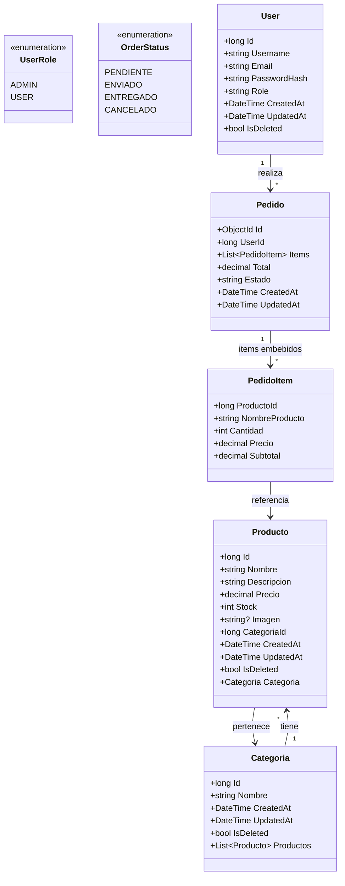
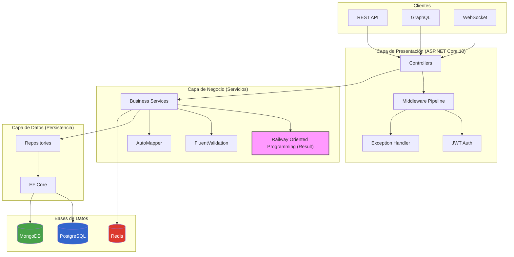

# TiendaDawApi 🛒


[](https://dotnet.microsoft.com/)
[](https://dotnet.microsoft.com/en-us/apps/aspnet)
[](https://docs.microsoft.com/en-us/dotnet/csharp/)
[](https://docs.microsoft.com/en-us/ef/core/)
[](https://www.postgresql.org/)
[](https://www.mongodb.com/)
[](https://redis.io/)
[](https://jwt.io/)
[](https://graphql.org/)
[](https://dotnet.microsoft.com/en-us/apps/aspnet/signalr)
[](https://www.docker.com/)
[](https://opensource.org/licenses/MIT)

**API REST empresarial desarrollada con .NET 10, ASP.NET Core y C# 14.**

Una API de comercio electrónico con arquitectura profesional, múltiples bases de datos, cacheo con Redis, GraphQL, WebSockets y versionado de API.

## 🎯 Descripción

TiendaDawApi es una API REST completa desarrollada con las mejores prácticas de .NET 10:

- 🏪 **Gestión de Productos y Categorías**: CRUD completo con validaciones
- 🛒 **Sistema de Pedidos**: Documentos embebidos con MongoDB
- 👥 **Gestión de Usuarios**: Autenticación JWT con roles (ADMIN, USER)
- 💾 **Multi-Base de Datos**: PostgreSQL (relacional), MongoDB (documentos), Redis (caché)
- 🔐 **Seguridad**: JWT, validaciones FluentValidation, manejo global de excepciones
- 📡 **APIs Avanzadas**: GraphQL con HotChocolate, WebSockets con SignalR
- 📊 **Versionado de API**: Control de versiones por URL
- 🧪 **Testing**: 262 tests con NUnit, Moq y 50% coverage

## 📑 Tabla de Contenidos

- [TiendaDawApi 🛒](#tiendadawapi-)
  - [🎯 Descripción](#-descripción)
  - [📑 Tabla de Contenidos](#-tabla-de-contenidos)
  - [✨ Características](#-características)
  - [🚀 Tecnologías](#-tecnologías)
  - [🏃‍♂️ Inicio Rápido](#️-inicio-rápido)
    - [Desarrollo Local](#desarrollo-local)
    - [Docker](#docker)
  - [🧪 Estrategia de Testing](#-estrategia-de-testing)
  - [📚 Documentación](#-documentación)
  - [⚒️ Diagrama de Entidades](#️-diagrama-de-entidades)
  - [📂 Estructura del Proyecto](#-estructura-del-proyecto)
  - [🏗️ Arquitectura](#️-arquitectura)
    - [Railway Oriented Programming (ROP)](#railway-oriented-programming-rop)
    - [Multi-Database Strategy](#multi-database-strategy)
  - [🔐 Seguridad](#-seguridad)
  - [📡 Endpoints](#-endpoints)
    - [Auth](#auth)
    - [Categorías](#categorías)
    - [Productos](#productos)
    - [Pedidos](#pedidos)
    - [Users](#users)
    - [GraphQL](#graphql)
  - [👥 Usuarios Demo](#-usuarios-demo)
  - [📝 Licencia](#-licencia)
  - [👨‍💻 Autor](#-autor)
    - [Contacto](#contacto)
  - [Licencia de uso](#licencia-de-uso)

## ✨ Características

- 🏪 **CRUD Completo**: Productos, Categorías, Pedidos y Usuarios
- 🔐 **Autenticación JWT**: Token-based con roles y claims
- 📧 **Notificaciones por Email**: Envío asíncrono con MailKit
- 📊 **Cacheo con Redis**: Patrón Cache-Aside para mejorar rendimiento
- 📡 **GraphQL**: Consultas flexibles con HotChocolate
- 🔌 **WebSockets**: Notificaciones en tiempo real con SignalR
- 🗄️ **Multi-Database**: PostgreSQL + MongoDB + Redis
- 📈 **Versionado de API**: Control de versiones por URL
- ✅ **Validaciones**: FluentValidation declarativo
- 🛡️ **Exception Handling**: Middleware global de errores
- 🧪 **Testing**: Unit tests con NUnit y Moq
- 📊 **Code Coverage**: Métricas con Coverlet
- 🐳 **Docker**: Contenedores para desarrollo y producción

## 🚀 Tecnologías

- **.NET 10 con C# 14** - Plataforma principal
- **ASP.NET Core Web API** - Framework REST
- **EF Core 10** - ORM con PostgreSQL y MongoDB
- **PostgreSQL 15** - Base de datos relacional
- **MongoDB 7.0** - Base de datos de documentos
- **Redis** - Cache distribuido
- **JWT** - Autenticación basada en tokens
- **FluentValidation** - Validaciones declarativas
- **AutoMapper** - Mapeo de objetos
- **SignalR** - WebSockets en tiempo real
- **HotChocolate** - GraphQL server
- **NUnit + Moq** - Testing unitario
- **Coverlet** - Métricas de coverage
- **Docker** - Containerización

## 🏃‍♂️ Inicio Rápido

### Desarrollo Local

```bash
# Clonar repositorio
git clone https://github.com/joseluisgs/TiendaDawApi-NetCore.git
cd TiendaDawApi-NetCore

# Restaurar dependencias
dotnet restore

# Iniciar servicios (PostgreSQL, Redis, MongoDB)
docker-compose up -d

# Ejecutar aplicación
dotnet run --project TiendaApi.Apis

# O con Hot Reload
dotnet watch run --project TiendaApi.Apis
```

### Docker

```bash
# Construir imagen
docker-compose build

# Ejecutar todos los servicios
docker-compose up -d

# Ver logs
docker-compose logs -f api

# Detener servicios
docker-compose down
```

## 🧪 Estrategia de Testing

TiendaDawApi implementa una pirámide de pruebas profesional:

- **Unit Tests**: Validación de servicios, repositorios y lógica de negocio
- **Integration Tests**: Tests con bases de datos reales
- **Coverage**: 50% de cobertura de código con Coverlet

### Ejecución de Tests

```bash
# Ejecutar todos los tests
dotnet test

# Con coverage
dotnet test --collect:"XPlat Code Coverage"

# Ver reporte de coverage
open coverage/index.html
```

## 📚 Documentación

Para una comprensión profunda de la arquitectura y las tecnologías utilizadas, consulta los documentos en la carpeta [`doc/`](doc/):

### Fundamentos y Arquitectura
| # | Documento | Descripción |
|---|-----------|-------------|
| 01 | [Arquitectura y Pipeline DI](doc/01-arquitectura-pipeline-di.md) | Patrón pipeline de middlewares e inyección de dependencias |
| 02 | [Constructores Primarios C# 14](doc/02-constructores-primarios.md) | Nueva sintaxis de constructores en C# 14 |
| 03 | [Entity Framework Core con PostgreSQL](doc/03-ef-postgresql.md) | Configuración y uso de EF Core con PostgreSQL |
| 04 | [MongoDB EF Core Provider](doc/04-mongodb-ef-core.md) | Integración de MongoDB con EF Core 8.3 |

### Técnicas y Patrones
| # | Documento | Descripción |
|---|-----------|-------------|
| 05 | [Redis Caching](doc/05-redis-caching.md) | Patrón Cache-Aside con Redis |
| 06 | [Patrón Result](doc/06-patron-result.md) | Railway Oriented Programming con CSharpFunctionalExtensions |
| 07 | [AutoMapper](doc/07-automapper.md) | Mapping entre entidades y DTOs |
| 08 | [FluentValidation](doc/08-fluent-validation.md) | Validación de modelos declarativa |

### Seguridad y APIs
| # | Documento | Descripción |
|---|-----------|-------------|
| 09 | [JWT Authentication](doc/09-jwt-authentication.md) | Autenticación y autorización con JWT |
| 10 | [Global Exception Handling](doc/10-global-exception-handling.md) | Manejo centralizado de excepciones |
| 11 | [GraphQL](doc/11-graphql.md) | Endpoint GraphQL con HotChocolate |
| 12 | [WebSockets y SignalR](doc/12-websockets-signalr.md) | Comunicaciones en tiempo real |
| 13 | [API Versioning](doc/13-api-versioning.md) | Versionado de API |

### Testing y DevOps
| # | Documento | Descripción |
|---|-----------|-------------|
| 14 | [Unit Testing con NUnit y Moq](doc/14-unit-testing-nunit-mock.md) | Pruebas unitarias y mocking |
| 15 | [Code Coverage con Coverlet](doc/15-code-coverage-coverlet.md) | Métricas de cobertura de código |
| 16 | [Docker Operations](doc/16-docker-operations.md) | Contenedores y Docker Compose |
| 17 | [Formato .slnx](doc/17-slnx-solution-format.md) | Migración al nuevo formato de solución |

## ⚒️ Diagrama de Entidades


```mermaid
classDiagram
  direction TB

  %% ENUMS
  class UserRole {
    <<enumeration>>
    ADMIN
    USER
  }

  class OrderStatus {
    <<enumeration>>
    PENDIENTE
    ENVIADO
    ENTREGADO
    CANCELADO
  }

  %% CLASES PRINCIPALES - PostgreSQL
  class User {
    +long Id
    +string Username
    +string Email
    +string PasswordHash
    +string Role
    +DateTime CreatedAt
    +DateTime UpdatedAt
    +bool IsDeleted
  }

  class Categoria {
    +long Id
    +string Nombre
    +DateTime CreatedAt
    +DateTime UpdatedAt
    +bool IsDeleted
    +List~Producto~ Productos
  }

  class Producto {
    +long Id
    +string Nombre
    +string Descripcion
    +decimal Precio
    +int Stock
    +string? Imagen
    +long CategoriaId
    +DateTime CreatedAt
    +DateTime UpdatedAt
    +bool IsDeleted
    +Categoria Categoria
  }

  %% CLASES PRINCIPALES - MongoDB
  class Pedido {
    +ObjectId Id
    +long UserId
    +List~PedidoItem~ Items
    +decimal Total
    +string Estado
    +DateTime CreatedAt
    +DateTime UpdatedAt
  }

  class PedidoItem {
    +long ProductoId
    +string NombreProducto
    +int Cantidad
    +decimal Precio
    +decimal Subtotal
  }

  %% RELACIONES - PostgreSQL
  User "1" --> "*" Pedido : realiza
  Categoria "1" --> "*" Producto : tiene
  Producto --> Categoria : pertenece

  %% RELACIONES - MongoDB (Embebido)
  Pedido "1" --> "*" PedidoItem : items embebidos
  PedidoItem --> Producto : referencia
```

## 📂 Estructura del Proyecto

```
TiendaDawApi-NetCore/
├── TiendaApi.slnx                # Solución global de .NET (formato moderno)
│
├── TiendaApi.Apis/               # Proyecto Principal (ASP.NET Core 10)
│   ├── Program.cs                # Configuración de Pipeline, DI y Middlewares
│   ├── Controllers/              # Controladores REST
│   │   ├── AuthController.cs     # Autenticación JWT
│   │   ├── CategoriasController.cs
│   │   ├── ProductosController.cs
│   │   ├── PedidosController.cs
│   │   ├── UsersController.cs
│   │   └── GraphQLController.cs
│   ├── Services/                 # Lógica de negocio
│   │   ├── Auth/
│   │   ├── Categorias/
│   │   ├── Productos/
│   │   └── Users/
│   ├── Repositories/             # Acceso a datos
│   │   ├── CategoriaRepository.cs
│   │   ├── ProductoRepository.cs
│   │   ├── UserRepository.cs
│   │   └── PedidosRepository.cs
│   ├── Models/                   # Entidades de dominio
│   │   ├── Entities/
│   │   └── DTOs/
│   ├── Data/                     # Configuración de bases de datos
│   │   └── TiendaDbContext.cs
│   ├── Common/                   # Tipos compartidos
│   │   ├── Result.cs
│   │   └── AppError.cs
│   ├── Middleware/               # Middlewares personalizados
│   │   └── GlobalExceptionHandler.cs
│   ├── Mappings/                 # Perfiles AutoMapper
│   ├── Validators/               # Validadores FluentValidation
│   ├── WebSockets/               # Handlers SignalR
│   ├── GraphQL/                  # Schema y tipos GraphQL
│   └── Dockerfile                # Multi-stage build
│
├── TiendaApi.Tests/              # Pruebas Unitarias
│   ├── Controllers/
│   ├── Services/
│   └── Repositories/
│
├── docker-compose.yml            # Orquestación de servicios
├── doc/                          # Documentación técnica (17 archivos)
└── README.md                     # Este archivo
```

## 🏗️ Arquitectura

El proyecto sigue una arquitectura en capas profesional con soporte multi-base de datos:


```mermaid
graph TD
    subgraph Cliente["Clientes"]
        REST["REST API"]
        GQL["GraphQL"]
        WS["WebSocket"]
    end

    subgraph CapaPresentacion["Capa de Presentación (ASP.NET Core 10)"]
        CTRL["Controllers"]
        MID["Middleware Pipeline"]
        AUTH["JWT Auth"]
        EXC["Exception Handler"]
    end

    subgraph CapaNegocio["Capa de Negocio (Servicios)"]
        SVC["Business Services"]
        ROP["Railway Oriented Programming (Result)"]
        VAL["FluentValidation"]
        MAP["AutoMapper"]
    end

    subgraph CapaAccesoDatos["Capa de Datos (Persistencia)"]
        EF["EF Core"]
        REP["Repositories"]
    end

    subgraph BasesDatos["Bases de Datos"]
        PG[(PostgreSQL)]
        MONGO[(MongoDB)]
        REDIS[(Redis)]
    end

    REST --> CTRL
    GQL --> CTRL
    WS --> CTRL

    CTRL --> MID
    MID --> AUTH
    MID --> EXC

    CTRL --> SVC
    SVC --> ROP
    SVC --> VAL
    SVC --> MAP

    SVC --> REP
    REP --> EF

    EF --> PG
    EF --> MONGO
    SVC --> REDIS

    %% Estilos
    style ROP fill:#f9f,stroke:#333,stroke-width:2px
    style PG fill:#3366cc,color:#fff
    style MONGO fill:#47a248,color:#fff
    style REDIS fill:#dc382d,color:#fff
```

### Railway Oriented Programming (ROP)

El proyecto implementa ROP usando `CSharpFunctionalExtensions`:

```csharp
public async Task<Result<ProductoDto, DomainError>> CreateAsync(ProductoRequestDto dto)
{
    var validation = Validate(dto);
    if (validation.IsFailure)
        return Result.Failure<ProductoDto, DomainError>(validation.Error);

    var producto = await _repository.SaveAsync(mapped);
    return Result.Success<ProductoDto, DomainError>(_mapper.Map<ProductoDto>(producto));
}
```

### Multi-Database Strategy

| Base de Datos | Uso | Tecnologías |
|---------------|-----|-------------|
| **PostgreSQL** | Usuarios, Categorías, Productos | EF Core, SQLite-like syntax |
| **MongoDB** | Pedidos con items embebidos | EF Core MongoDB Provider |
| **Redis** | Cacheo de consultas | StackExchange.Redis |

## 🔐 Seguridad

- ✅ **JWT Authentication**: Tokens Bearer con expiración
- ✅ **Role-Based Authorization**: ADMIN y USER roles
- ✅ **FluentValidation**: Validaciones declarativas en DTOs
- ✅ **Global Exception Handler**: Respuestas de error consistentes
- ✅ **Password Hashing**: BCrypt con Identity
- ✅ **Soft Delete**: Eliminación lógica en entidades
- ✅ **Input Sanitization**: Protección contra inyecciones

## 📡 Endpoints

### Auth (versionado)

| Endpoint | Método | Auth | Descripción |
|----------|--------|------|-------------|
| `/api/v1/auth/signup` | POST | No | Registrar usuario |
| `/api/v1/auth/signin` | POST | No | Iniciar sesión |

### Categorías

| Endpoint | Método | Auth | Descripción |
|----------|--------|------|-------------|
| `/api/categorias` | GET | Yes | Obtener todas |
| `/api/categorias/{id}` | GET | Yes | Obtener por ID |
| `/api/categorias` | POST | ADMIN | Crear categoría |
| `/api/categorias/{id}` | PUT | ADMIN | Actualizar categoría |
| `/api/categorias/{id}` | DELETE | ADMIN | Eliminar categoría |

### Productos

| Endpoint | Método | Auth | Descripción |
|----------|--------|------|-------------|
| `/api/productos` | GET | No | Obtener todos |
| `/api/productos/{id}` | GET | No | Obtener por ID |
| `/api/productos/categoria/{categoriaId}` | GET | No | Por categoría |
| `/api/productos` | POST | USER | Crear producto |
| `/api/productos/{id}` | PUT | USER | Actualizar producto |
| `/api/productos/{id}` | DELETE | USER | Eliminar producto |

### Pedidos

| Endpoint | Método | Auth | Descripción |
|----------|--------|------|-------------|
| `/api/pedidos/me` | GET | Yes | Mis pedidos |
| `/api/pedidos/{id}` | GET | Yes | Obtener por ID |
| `/api/pedidos` | POST | Yes | Crear pedido |
| `/api/pedidos/{id}/estado` | PUT | ADMIN | Actualizar estado |

### GraphQL

| Endpoint | Método | Descripción |
|----------|--------|-------------|
| `/graphql` | POST | Endpoint GraphQL |
| `/graphiql` | GET | Playground GraphQL |

```graphql
query {
  productos {
    id
    nombre
    precio
    categoriaNombre
  }
  categorias {
    id
    nombre
  }
}
```

## 👥 Usuarios Demo

| Usuario | Email | Password | Rol |
|---------|-------|----------|-----|
| Admin | admin@tienda.com | Admin123 | ADMIN |
| User | user@tienda.com | User123 | USER |

## 📝 Licencia

Este proyecto es un ejemplo educativo con fines didácticos.

## 👨‍💻 Autor

Codificado con :sparkling_heart: por [José Luis González Sánchez](https://twitter.com/JoseLuisGS_)

[](https://twitter.com/JoseLuisGS_)
[](https://github.com/joseluisgs)
[](https://github.com/joseluisgs)

### Contacto

<p>
   Cualquier cosa que necesites házmelo saber por si puedo ayudarte 💬.
</p>
<p>
   <a href="https://joseluisgs.dev" target="_blank">
        
     </a> &nbsp;&nbsp;
     <a href="https://github.com/joseluisgs" target="_blank">
        
     </a> &nbsp;&nbsp;
     <a href="https://twitter.com/JoseLuisGS_" target="_blank">
        
     </a> &nbsp;&nbsp;
     <a href="https://www.linkedin.com/in/joseluisgonsan" target="_blank">
        
     </a> &nbsp;&nbsp;
     <a href="https://g.dev/joseluisgs" target="_blank">
        
     </a>
     <a href="https://www.youtube.com/@joseluisgs" target="_blank">
        
     </a>
</p>

## Licencia de uso

Este repositorio y todo su contenido está licenciado bajo licencia **Creative Commons**, si desea saber más, vea
la [LICENSE](https://joseluisgs.dev/docs/license/). Por favor si compartes, usas o modificas este proyecto cita a su
autor, y usa las mismas condiciones para su uso docente, formativo o educativo y no comercial.

<a rel="license" href="http://creativecommons.org/licenses/by-nc-sa/4.0/"></a><br /><span xmlns:dct="http://purl.org/dc/terms/" property="dct:title">JoseLuisGS</span> by <a xmlns:cc="http://creativecommons.org/ns#" href="https://joseluisgs.dev/" property="cc:attributionName" rel="cc:attributionURL">
    José Luis González Sánchez</a> is licensed under
<a rel="license" href="http://creativecommons.org/licenses/by-nc-sa/4.0/">Creative Commons
Reconocimiento-NoComercial-CompartirIgual 4.0 Internacional License</a>.<br />Creado a partir de la obra
en <a xmlns:dct="http://purl.org/dc/terms/" href="https://github.com/joseluisgs" rel="dct:source">https://github.com/joseluisgs</a>.
