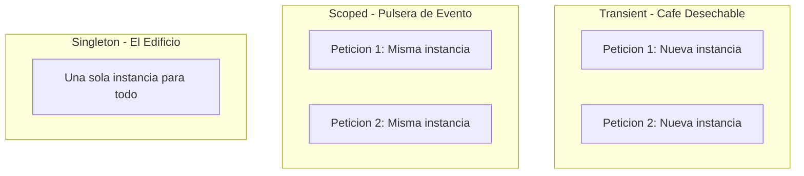

# 01. Arquitectura, Pipeline HTTP y Constructores Primarios

## Bienvenido al Centro de la Arquitectura

Entender como funciona una aplicacion ASP.NET Core es fundamental para construir APIs robustas. En este documento exploraremos el pipeline de middlewares, la inyeccion de dependencias y los constructores primarios de C# 14.

---

## 1. El Viaje de una Peticion HTTP

Imagina tu API como una fabrica de procesamiento. Cada middleware es una estacion que transforma la peticion antes de pasarla a la siguiente.

```mermaid
flowchart LR
    CLIENT["Cliente curl/Postman/Browser"]
    KESTREL["Kestrel Servidor Web"]
    EXCEPTION["Exception Handler"]
    HTTPS["HTTPS Redirection"]
    STATIC["Static Files"]
    ROUTING["Routing"]
    CORS["CORS"]
    AUTH["Authentication"]
    AUTHZ["Authorization"]
    CONTROLLER["Controller"]
    
    CLIENT --> KESTREL
    KESTREL --> EXCEPTION
    EXCEPTION --> HTTPS
    HTTPS --> STATIC
    STATIC --> ROUTING
    ROUTING --> CORS
   
    AUTH --> AUTHZ
    CORS --> AUTH AUTHZ --> CONTROLLER
```

### El Pipeline en Program.cs

```csharp
var builder = WebApplication.CreateBuilder(args);
var app = builder.Build();

// 1. Gestion global de excepciones (lo primero)
app.UseExceptionHandler("/error");

// 2. Redireccion HTTPS
app.UseHttpsRedirection();

// 3. Archivos estaticos
app.UseStaticFiles();

// 4. Routing
app.UseRouting();

// 5. CORS
app.UseCors("AllowAll");

// 6. Autenticacion JWT
app.UseAuthentication();

// 7. Autorizacion
app.UseAuthorization();

// 8. Controladores
app.MapControllers();

// 9. GraphQL
app.MapGraphQL();

// 10. WebSockets
app.MapHub<ProductoHub>("/ws/v1/productos");

app.Run();
```

> **Regla de Oro**: El orden de los middlewares importa. Un UseAuthentication despues de MapControllers significa que tus endpoints seran publicos.

---

## 2. Inyeccion de Dependencias (DI)

La Inyeccion de Dependencias es el patron estrella de .NET. Permite construir aplicaciones desacopladas, testables y mantenibles.

### Los 3 Tiempos de Vida



| Lifetime | Creacion | Uso |
|----------|----------|-----|
| **Transient** | Cada vez que se pide | Servicios ligeros, sin estado |
| **Scoped** | Una vez por peticion HTTP | DbContext, servicios de negocio |
| **Singleton** | Primera vez, reuse | Configuracion, logging, cache |

### Configuracion en Program.cs

```csharp
// Transient: Creado cada vez
builder.Services.AddTransient<IEmailService, MailKitEmailService>();

// Scoped: Creado por peticion
builder.Services.AddScoped<ICategoriaService, CategoriaService>();

// Singleton: Una sola instancia
builder.Services.AddSingleton<RedisCacheService>();
```

---

## 3. Constructores Primarios (C# 14)

Los constructores primarios eliminan el boilerplate. Las dependencias se declaran directamente en la firma de la clase.

### Antes (C# 12)

```csharp
public class ProductoService : IProductoService
{
    private readonly IProductoRepository _repository;
    private readonly ILogger<ProductoService> _logger;
    private readonly ICacheService _cache;

    public ProductoService(
        IProductoRepository repository,
        ILogger<ProductoService> logger,
        ICacheService cache)
    {
        _repository = repository;
        _logger = logger;
        _cache = cache;
    }
}
```

### Despues (C# 14)

```csharp
public class ProductoService(
    IProductoRepository repository,
    ILogger<ProductoService> logger,
    ICacheService cache
) : IProductoService {
    
    public async Task<ProductoDto> GetByIdAsync(long id)
    {
        logger.LogInformation("Buscando producto {Id}", id);
        var producto = await repository.FindByIdAsync(id);
        return producto.ToDto();
    }
}
```

### En Controladores

```csharp
public class ProductosController(
    IProductoService productoService,
    ILogger<ProductosController> logger
) : ControllerBase {

    [HttpGet("{id}")]
    public async Task<IActionResult> GetById(long id)
    {
        logger.LogInformation("GET /api/productos/{Id}", id);
        var result = await productoService.FindByIdAsync(id);
        return result.Match(Ok, NotFound);
    }
}
```

---

## 4. Estructura del Proyecto

```
TiendaApi.Apis/
├── Controllers/
│   ├── AuthController(IAuthService, ILogger).cs
│   ├── ProductosController(IProductoService, ILogger).cs
│   └── CategoriasController(ICategoriaService, ILogger).cs
│
├── Services/
│   ├── AuthService(IUserRepository, IJwtService, ILogger).cs
│   └── ProductoService(IProductoRepository, ICategoriaRepository, ILogger, ...).cs
│
└── Repositories/
    ├── CategoriaRepository(TiendaDbContext, ILogger).cs
    └── ProductoRepository(TiendaDbContext, ILogger).cs
```

---

## 5. Beneficios

1. **Codigo Conciso**: Menos boilerplate
2. **Testabilidad**: Dependencias explicitas y mockeables
3. **Mantenibilidad**: Cambio de implementacion en un solo lugar
4. **Modernidad**: Caracteristicas latest de C#
