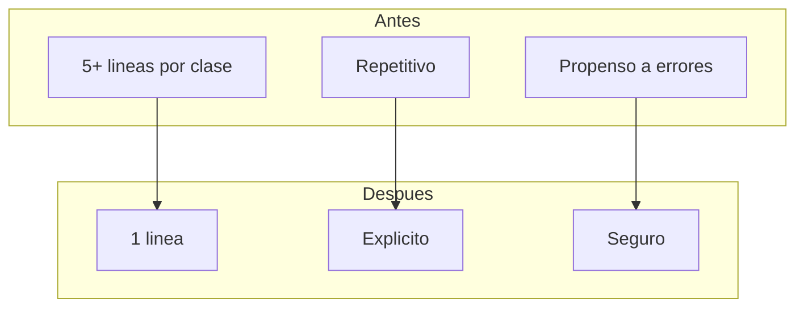

# 02. Constructores Primarios C# 14

## La Evolucion del Codigo C#

Los constructores primarios llegaron en C# 12 y se perfeccionaron en C# 14. Esta caracteristica revoluciona como escribimos clases, especialmente en aplicaciones ASP.NET Core.

---

## 1. El Problema del Boilerplate

Antes de los constructores primarios, cada clase con dependencias requeria un constructor con asignaciones:

```csharp
public class ProductoService : IProductoService
{
    private readonly IProductoRepository _repository;
    private readonly ILogger<ProductoService> _logger;
    private readonly ICacheService _cache;
    private readonly IConfiguration _config;
    private readonly ProductoWebSocketHandler _wsHandler;

    public ProductoService(
        IProductoRepository repository,
        ILogger<ProductoService> logger,
        ICacheService cache,
        IConfiguration config,
        ProductoWebSocketHandler wsHandler)
    {
        _repository = repository;
        _logger = logger;
        _cache = cache;
        _config = config;
        _wsHandler = wsHandler;
    }
}
```

5+ lineas solo para declarar dependencias. Repetitivo y propenso a errores.

---

## 2. La Solucion: Constructores Primarios

```csharp
public class ProductoService(
    IProductoRepository repository,
    ILogger<ProductoService> logger,
    ICacheService cache,
    IConfiguration config,
    ProductoWebSocketHandler wsHandler
) : IProductoService {
    
    // Las dependencias estan disponibles directamente
    public async Task<ProductoDto> GetByIdAsync(long id)
    {
        logger.LogInformation("Buscando producto {Id}", id);
        
        // Verificar cache primero
        var cached = await cache.GetAsync<ProductoDto>($"productos:{id}");
        if (cached != null) return cached;
        
        // Consultar base de datos
        var producto = await repository.FindByIdAsync(id);
        if (producto == null) return null;
        
        // Guardar en cache
        await cache.SetAsync($"productos:{id}", producto.ToDto());
        
        return producto.ToDto();
    }
}
```

---

## 3. En Controladores MVC

```csharp
public class AuthController(
    IAuthService authService,
    ILogger<AuthController> logger
) : ControllerBase {

    [HttpPost("signup")]
    public async Task<IActionResult> SignUp([FromBody] RegisterDto dto)
    {
        logger.LogInformation("Signup para: {Username}", dto.Username);
        var result = await authService.SignUpAsync(dto);
        return result.Match(Created, BadRequest);
    }

    [HttpPost("signin")]
    public async Task<IActionResult> SignIn([FromBody] LoginDto dto)
    {
        logger.LogInformation("Signin para: {Username}", dto.Username);
        var result = await authService.SignInAsync(dto);
        return result.Match(Ok, Unauthorized);
    }
}
```

---

## 4. En Repositorios

```csharp
public class CategoriaRepository(
    TiendaDbContext context,
    ILogger<CategoriaRepository> logger
) : ICategoriaRepository {

    public async Task<IEnumerable<Categoria>> FindAllAsync()
    {
        logger.LogDebug("FindAllAsync ejecutado");
        return await context.Categorias
            .OrderBy(c => c.Nombre)
            .ToListAsync();
    }

    public async Task<Categoria?> FindByIdAsync(long id)
    {
        return await context.Categorias.FindAsync(id);
    }
}
```

---

## 5. En Servicios con Patrones de Diseno

### Patron Result con CSharpFunctionalExtensions

```csharp
public class CategoriaService(
    ICategoriaRepository repository,
    ILogger<CategoriaService> logger
) : ICategoriaService {

    public async Task<Result<CategoriaDto, DomainError>> CreateAsync(
        CategoriaRequestDto dto)
    {
        // Validacion
        if (string.IsNullOrWhiteSpace(dto.Nombre))
            return Result.Failure<CategoriaDto, DomainError>(
                DomainError.Validation("Nombre requerido"));

        // Verificar duplicados
        if (await repository.ExistsByNombreAsync(dto.Nombre))
            return Result.Failure<CategoriaDto, DomainError>(
                DomainError.Conflict("Ya existe"));

        // Crear
        var categoria = dto.ToEntity();
        var saved = await repository.SaveAsync(categoria);

        return Result.Success<CategoriaDto, DomainError>(saved.ToDto());
    }
}
```

---

## 6. Beneficios



| Aspecto | Antes | Despues |
|---------|-------|---------|
| Lineas de codigo | 5-8 | 1 |
| Legibilidad | Baja | Alta |
| Mantenimiento | Dificil | Facil |
| Errores | Comunes | Raros |

---

## 7. Convenciones

1. **Orden de parametros**: De mas a menos especifico
2. **Herencia**: Se pasa al base()
3. **Propiedades**: Usar campos private si no se usan externamente
4. **Interfaces**: Implementar en la firma de la clase

```csharp
public interface IService { }
public interface ILogger { }

public class MiServicio(
    IService servicioPrincipal,
    ILogger<MiServicio> logger
) : IService, ILogger {
    // Implementacion
}
```

---

## 8. Mejores Practicas

- **Orden alfabetico** de dependencias para facil busqueda
- **Agrupar** dependencias relacionadas
- **No abuse**: Si son muchas dependencias, considerar refactorizacion
- **Testeable**: Las dependencias son facilmente mockeables
