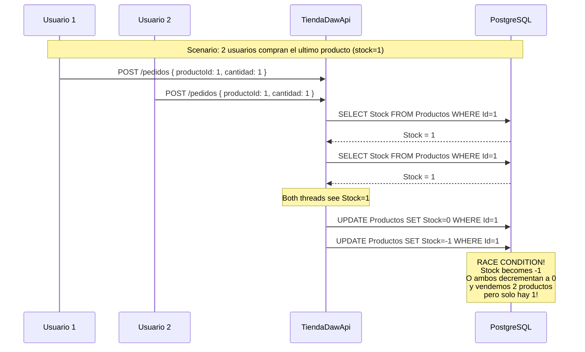
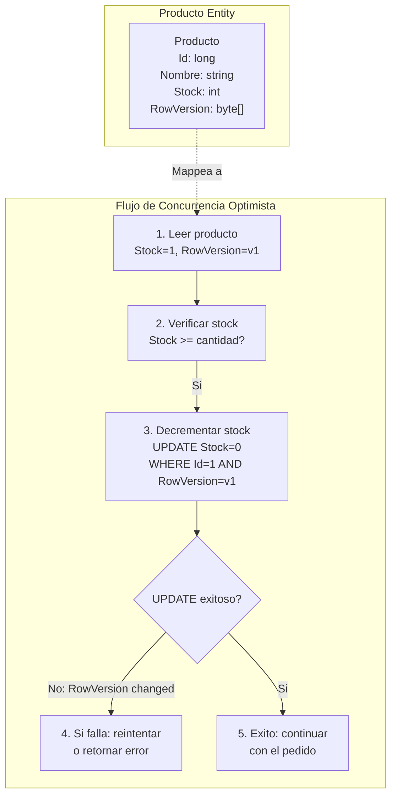
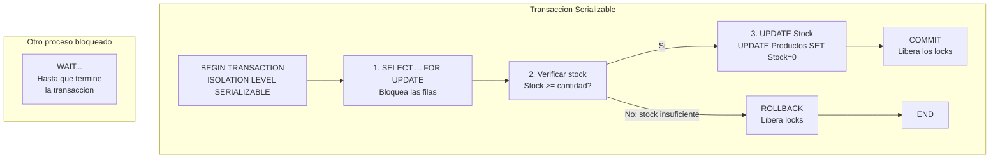
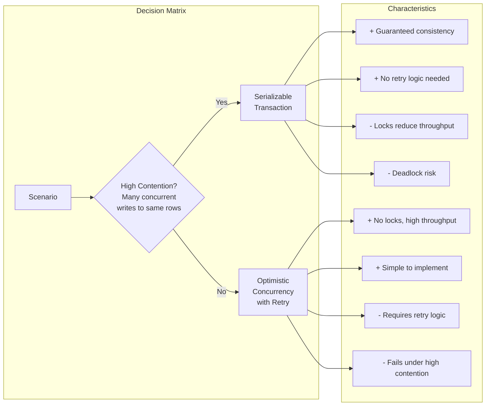

# 03. Entity Framework Core 10 con PostgreSQL

Entity Framework Core 10 es el ORM de Microsoft para .NET. En TiendaDawApi-NetCore gestiona las entidades relacionales: Categorias, Productos y Usuarios.

---

## 1. El DbContext: El Centro del Universo EF

El DbContext representa tu sesion con la base de datos. Es responsable de mapear clases C# a tablas SQL, rastrear cambios y persistirlos.

```mermaid
flowchart TB
    subgraph "Tu Codigo C#"
        ENT["Entidades Producto, Categoria, User"]
    end
    
    subgraph "DbContext"
        CHANGE["Change Tracker"]
        MAPPER["Entity Type Builder"]
    end
    
    subgraph "PostgreSQL"
        SQL["Tablas SQL"]
    end
    
    ENT -->|SaveChanges| CHANGE
    CHANGE -->|INSERT/UPDATE/DELETE| SQL
    SQL -->|SELECT| CHANGE
    CHANGE -->|ToList/First| ENT
 ```

### Diagrama de Entidades Relacionales

```mermaid
classDiagram
    class User {
        +long Id
        +string Username
        +string Email
        +string PasswordHash
        +string Role
        +DateTime CreatedAt
        +DateTime UpdatedAt
        +bool IsDeleted
    }
    
    class Categoria {
        +long Id
        +string Nombre
        +DateTime CreatedAt
        +DateTime UpdatedAt
        +bool IsDeleted
        +List~Producto~ Productos
    }
    
    class Producto {
        +long Id
        +string Nombre
        +decimal Precio
        +int Stock
        +string? Imagen
        +long CategoriaId
        +DateTime CreatedAt
        +DateTime UpdatedAt
        +bool IsDeleted
        +Categoria Categoria
    }
    
    User "1" --> "*" Categoria : relacion
    Categoria "1" --> "*" Producto : tiene
    Producto --> Categoria : pertenece
```

### El DbContext de TiendaApi

```csharp
using Microsoft.EntityFrameworkCore;
using TiendaApi.Apis.Models;

namespace TiendaApi.Apis.Data;

public class TiendaDbContext : DbContext
{
    public TiendaDbContext(DbContextOptions<TiendaDbContext> options) 
        : base(options)
    {
    }

    public DbSet<Categoria> Categorias { get; set; } = null!;
    public DbSet<Producto> Productos { get; set; } = null!;
    public DbSet<User> Users { get; set; } = null!;

    protected override void OnModelCreating(ModelBuilder modelBuilder)
    {
        base.OnModelCreating(modelBuilder);

        modelBuilder.Entity<Categoria>(entity =>
        {
            entity.ToTable("categorias");
            entity.HasKey(c => c.Id);
            entity.Property(c => c.Nombre).IsRequired().HasMaxLength(100);
            entity.HasIndex(c => c.Nombre).IsUnique();
        });

        modelBuilder.Entity<Producto>(entity =>
        {
            entity.ToTable("productos");
            entity.HasKey(p => p.Id);
            entity.Property(p => p.Nombre).IsRequired().HasMaxLength(200);
            entity.Property(p => p.Precio).HasPrecision(10, 2);
            
            entity.HasOne(p => p.Categoria)
                .WithMany(c => c.Productos)
                .HasForeignKey(p => p.CategoriaId)
                .OnDelete(DeleteBehavior.Restrict);
        });

        modelBuilder.Entity<User>(entity =>
        {
            entity.ToTable("users");
            entity.HasKey(u => u.Id);
            entity.Property(u => u.Username).IsRequired().HasMaxLength(50);
            entity.Property(u => u.Email).IsRequired().HasMaxLength(100);
            entity.HasIndex(u => u.Username).IsUnique();
            entity.HasIndex(u => u.Email).IsUnique();
        });
    }
}
```

---

## 2. Configuracion en Program.cs

```csharp
var builder = WebApplication.CreateBuilder(args);

var connectionString = builder.Configuration.GetConnectionString("DefaultConnection")
    ?? throw new InvalidOperationException("Connection string not found");

builder.Services.AddDbContext<TiendaDbContext>(options =>
    options.UseNpgsql(connectionString));

var app = builder.Build();
app.Run();
```

---

## 3. El Patrón Repository

```csharp
public interface ICategoriaRepository
{
    Task<IEnumerable<Categoria>> FindAllAsync();
    Task<Categoria?> FindByIdAsync(long id);
    Task<Categoria> SaveAsync(Categoria categoria);
    Task<Categoria> UpdateAsync(Categoria categoria);
    Task DeleteAsync(long id);
}

public class CategoriaRepository(
    TiendaDbContext context,
    ILogger<CategoriaRepository> logger
) : ICategoriaRepository {

    public async Task<IEnumerable<Categoria>> FindAllAsync()
    {
        return await context.Categorias
            .OrderBy(c => c.Nombre)
            .ToListAsync();
    }

    public async Task<Categoria?> FindByIdAsync(long id)
    {
        return await context.Categorias.FindAsync(id);
    }

    public async Task<Categoria> SaveAsync(Categoria categoria)
    {
        categoria.CreatedAt = DateTime.UtcNow;
        categoria.UpdatedAt = DateTime.UtcNow;
        
        context.Categorias.Add(categoria);
        await context.SaveChangesAsync();
        
        logger.LogInformation("Categoria guardada ID: {Id}", categoria.Id);
        return categoria;
    }

    public async Task<Categoria> UpdateAsync(Categoria categoria)
    {
        categoria.UpdatedAt = DateTime.UtcNow;
        context.Categorias.Update(categoria);
        await context.SaveChangesAsync();
        return categoria;
    }

    public async Task DeleteAsync(long id)
    {
        var categoria = await FindByIdAsync(id);
        if (categoria != null)
        {
            categoria.IsDeleted = true;
            await context.SaveChangesAsync();
        }
    }
}
```

---

## 4. Seed Data

```csharp
protected override void OnModelCreating(ModelBuilder modelBuilder)
{
    base.OnModelCreating(modelBuilder);

    modelBuilder.Entity<User>().HasData(
        new User {
            Id = 1,
            Username = "admin",
            Email = "admin@tienda.com",
            PasswordHash = "$2a$11$...",
            Role = "ADMIN",
            CreatedAt = DateTime.UtcNow
        },
        new User {
            Id = 2,
            Username = "userdaw",
            Email = "userdaw@tienda.com",
            PasswordHash = "$2a$11$...",
            Role = "USER",
            CreatedAt = DateTime.UtcNow
        }
    );

    modelBuilder.Entity<Categoria>().HasData(
        new Categoria { Id = 1, Nombre = "Electronica" },
        new Categoria { Id = 2, Nombre = "Ropa" },
        new Categoria { Id = 3, Nombre = "Libros" }
    );
}
```

---

## 5. Consultas LINQ

```csharp
// Productos con su categoria
var productos = await context.Productos
    .Include(p => p.Categoria)
    .Where(p => p.Stock > 0)
    .OrderBy(p => p.Nombre)
    .ToListAsync();

// Proyeccion
var summary = await context.Productos
    .Where(p => p.CategoriaId == 1)
    .Select(p => new {
        p.Id,
        p.Nombre,
        p.Precio,
        Categoria = p.Categoria.Nombre
    })
    .ToListAsync();

// Conteo eficiente
var count = await context.Productos.CountAsync(p => p.Stock > 0);
```

---

## 6. Soft Delete con Query Filters

```csharp
modelBuilder.Entity<Categoria>(entity =>
{
    entity.HasQueryFilter(c => !c.IsDeleted);
});
```

Ahora FindAllAsync automaticamente filtra categorias no eliminadas.

---

## 7. Control de Concurrencia

### 7.1 El Problema: Condicion de Carrera en Reservas de Stock

Imagina un escenario ficticio en TiendaDawApi:



**El problema**: Sin control de concurrencia, dos lecturas simultaneas pueden 导致 (cheng dao) a:
- **Sobrescritura perdida (Lost Update)**: Ambos decrementan el stock, resultando en stock incorrecto
- **Inventario negativo**: Stock se vuelve negativo
- **Over-selling**: Vendemos mas de lo que tenemos

### 7.2 Solucion 1: Concurrencia Optimista con RowVersion

Esta solucion usa un campo `[Timestamp]` que EF Core actualiza automaticamente en cada UPDATE. Si otro proceso modified el registro, el UPDATE fallara.



**Implementacion en la entidad**:

```csharp
public class Producto
{
    public long Id { get; set; }
    public string Nombre { get; set; } = string.Empty;
    public decimal Precio { get; set; }
    public int Stock { get; set; }
    public DateTime CreatedAt { get; set; } = DateTime.UtcNow;
    public DateTime UpdatedAt { get; set; } = DateTime.UtcNow;
    
    [Timestamp]
    public byte[] RowVersion { get; set; } = null!;
    
    public long CategoriaId { get; set; }
    public Categoria Categoria { get; set; } = null!;
}
```

**Repositorio con metodo atomico**:

```csharp
public async Task<bool> DecrementStockAsync(long productoId, int cantidad, byte[] expectedRowVersion)
{
    var producto = await context.Productos.FindAsync(productoId);
    if (producto == null) return false;
    
    producto.Stock -= cantidad;
    producto.UpdatedAt = DateTime.UtcNow;
    
    try
    {
        await context.SaveChangesAsync();
        return true;
    }
    catch (DbUpdateConcurrencyException ex)
    {
        logger.LogWarning(ex, "Conflicto de concurrencia para producto {ProductoId}", productoId);
        throw;
    }
}
```

**Pros de Concurrencia Optimista**:
- ✅ **Sin bloqueos**: No hay locks que bloqueen otras transacciones
- ✅ **Mejor rendimiento**: Escalable para alta concurrencia
- ✅ **Simplicidad**: EF Core maneja el WHERE automaticamente
- ✅ **Ideal para pocos conflictos**: La mayoria de pedidos no tendran conflictos

**Contras de Concurrencia Optimista**:
- ❌ **Requiere reintentos**: El cliente debe reintentar si hay conflicto
- ❌ **Mas complejo en el cliente**: Necesita logica de reintento
- ❌ **No sirve para alta contention**: Si hay muchos conflictos, el rendimiento cae

### 7.3 Solucion 2: Transaccion Serializable

Esta solucion usa isolation level Serializable para que la base de datos bloquee las filas durante la transaccion, previniendo que otros lean o modifiquen hasta que termine.



**Implementacion con DbContextTransaction**:

```csharp
public async Task<Result<PedidoDto, DomainError>> CreateWithSerializableAsync(
    long userId, 
    PedidoRequestDto dto)
{
    await using var transaction = await context.Database
        .BeginTransactionAsync(IsolationLevel.Serializable);
    
    try
    {
        foreach (var item in dto.Items)
        {
            var producto = await context.Productos
                .FirstOrDefaultAsync(p => p.Id == item.ProductoId);
            
            if (producto == null)
            {
                await transaction.RollbackAsync();
                return Result.Failure<PedidoDto, DomainError>(
                    DomainError.NotFound($"Producto {item.ProductoId} no encontrado"));
            }
            
            if (producto.Stock < item.Cantidad)
            {
                await transaction.RollbackAsync();
                return Result.Failure<PedidoDto, DomainError>(
                    DomainError.BusinessRule($"Stock insuficiente"));
            }
            
            producto.Stock -= item.Cantidad;
        }
        
        // ... crear pedido ...
        
        await transaction.CommitAsync();
        return Result.Success(dto);
    }
    catch (Exception ex)
    {
        await transaction.RollbackAsync();
        throw;
    }
}
```

**Pros de Transaccion Serializable**:
- ✅ **Garantia total**: Nunca hay race conditions
- ✅ **Simplicidad en el cliente**: No necesita reintentos
- ✅ **Ideal para alta contention**: Si hay muchos conflictos, funciona bien

**Contras de Transaccion Serializable**:
- ❌ **Bloqueos**: Las filas quedan bloqueadas durante la transaccion
- ❌ **Deadlocks posibles**: Dos transacciones pueden bloquearse mutuamente
- ❌ **Peor rendimiento**: Los locks reducen la concurrencia
- ❌ **Errores de serializacion**: PostgreSQL puede fallar con error 40001

### 7.4 Comparativa: Optimista vs Serializable



| Criterio | Optimista (RowVersion) | Serializable |
|----------|------------------------|--------------|
| **Rendimiento** | Alto (sin locks) | Bajo (locks) |
| **Escalabilidad** | Excelente | Limitada |
| **Complejidad** | Media (retry logic) | Baja |
| **Consistencia** | Eventual (con reintentos) | Inmediata |
| **Conflictos** | Manejados por aplicacion | Manejados por DB |
| **Best For** | E-commerce tipico | Sistemas financieros |

### 7.5 Implementacion Elegida: Concurrencia Optimista con Reintentos

Para TiendaDawApi-NetCore, usamos **Concurrencia Optimista** porque:

1. **Patron tipico de e-commerce**: Pocos conflictos de stock
2. **Alto throughput**: Sin bloqueos, multiples pedidos simultaneos
3. **EF Core nativo**: `[Timestamp]` esta bien integrado

```csharp
public async Task<Result<PedidoDto, DomainError>> CreateAsync(long userId, PedidoRequestDto dto)
{
    var pedidoItems = new List<PedidoItem>();
    var productosDecrementados = new List<(long ProductoId, int Cantidad)>();
    const int MaxRetries = 3;
    
    foreach (var itemDto in dto.Items)
    {
        var producto = await productoRepository.FindByIdAsync(itemDto.ProductoId);
        
        if (producto == null)
        {
            await CompensarStockAsync(productosDecrementados);
            return Result.Failure(...);
        }
        
        if (producto.Stock < itemDto.Cantidad)
        {
            await CompensarStockAsync(productosDecrementados);
            return Result.Failure(...);
        }
        
        var stockDecremented = await DecrementStockWithRetryAsync(
            producto.Id, 
            itemDto.Cantidad, 
            producto.RowVersion, 
            MaxRetries);
        
        if (!stockDecremented)
        {
            await CompensarStockAsync(productosDecrementados);
            return Result.Failure(
                DomainError.Conflict("No se pudo reservar stock. Reintente."));
        }
        
        productosDecrementados.Add((producto.Id, itemDto.Cantidad));
    }
    
    // ... crear pedido ...
}

private async Task<bool> DecrementStockWithRetryAsync(
    long productoId, 
    int cantidad, 
    byte[] rowVersion, 
    int maxRetries)
{
    for (int attempt = 1; attempt <= maxRetries; attempt++)
    {
        try
        {
            return await productoRepository.DecrementStockAsync(productoId, cantidad, rowVersion);
        }
        catch (DbUpdateConcurrencyException)
        {
            if (attempt == maxRetries) return false;
            
            await Task.Delay(100 * attempt); // Exponential backoff
            rowVersion = (await productoRepository.FindByIdAsync(productoId))?.RowVersion;
        }
    }
    return false;
}
```

### 7.6 Manejo de Errores de Concurrencia en GlobalExceptionHandler

```csharp
catch (DbUpdateConcurrencyException ex)
{
    var entry = ex.Entries[0];
    var databaseValues = await entry.GetDatabaseValuesAsync();
    
    logger.LogWarning(ex, 
        "Conflicto de concurrencia. Usuario: {UserId}", 
        userId);
    
    return Result.Failure<PedidoDto, DomainError>(
        DomainError.Conflict(
            "El producto fue modificado por otro usuario. Por favor, reintente la operacion."));
}
```

---

## 8. Referencia Rapida

| Concepto | Codigo |
|----------|--------|
| Timestamp | `[Timestamp] public byte[] RowVersion { get; set; }` |
| Catch concurrency | `catch (DbUpdateConcurrencyException ex)` |
| Get DB values | `await entry.GetDatabaseValuesAsync()` |
| Refresh entity | `await entry.ReloadAsync()` |
| Serializable | `BeginTransactionAsync(IsolationLevel.Serializable)` |
