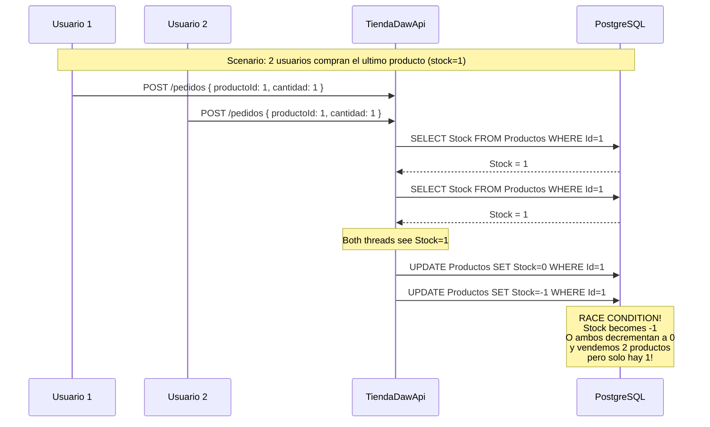
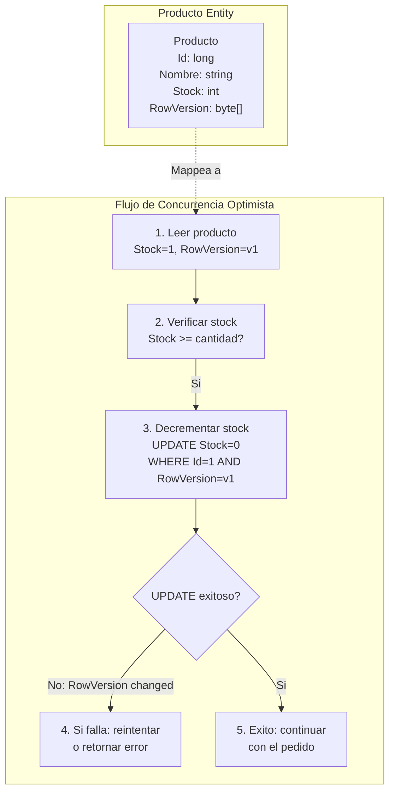
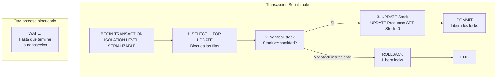
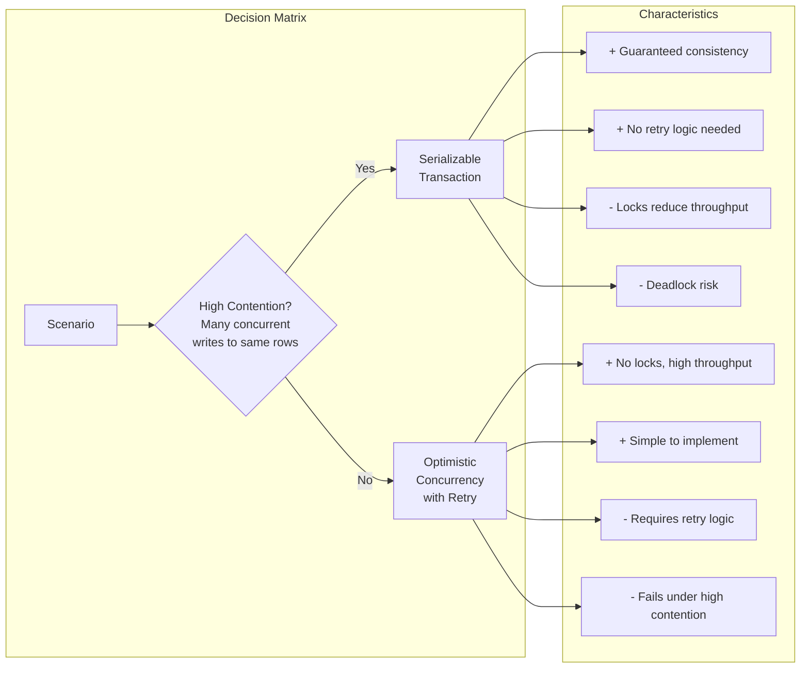
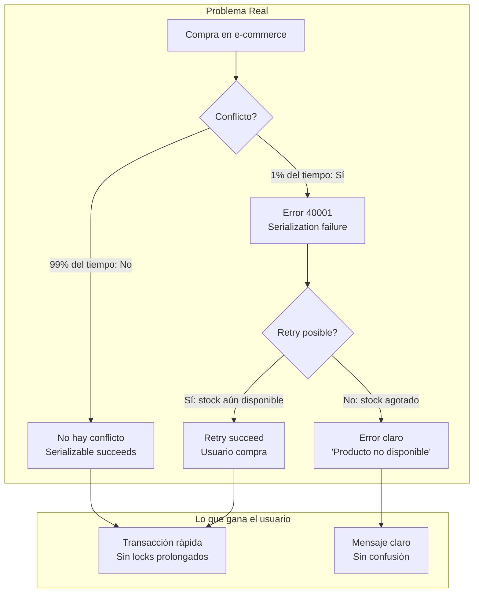
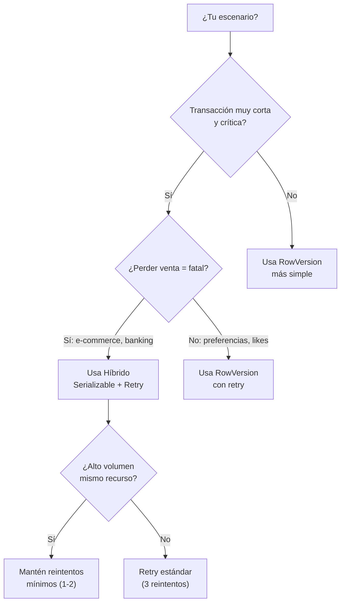
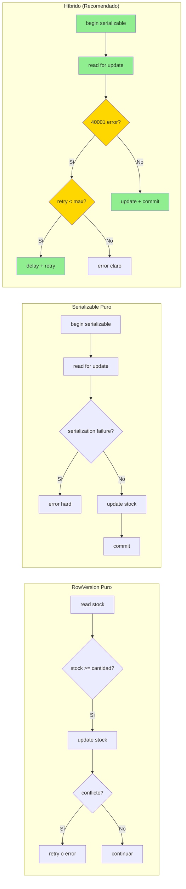
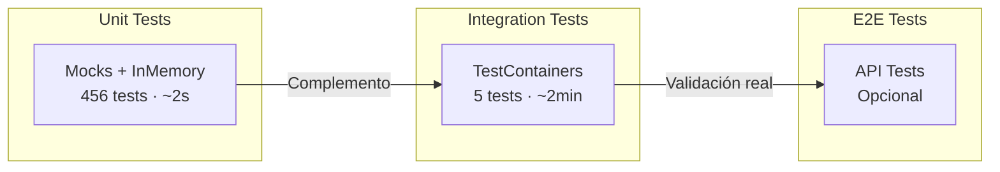
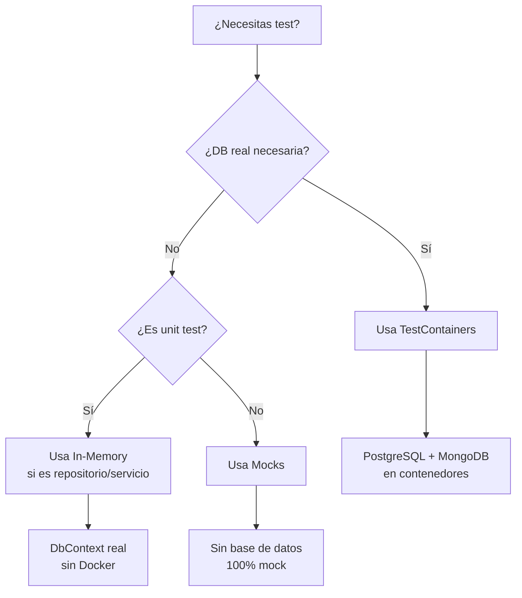

# 03. Entity Framework Core 10 con PostgreSQL

Entity Framework Core 10 es el ORM de Microsoft para .NET. En TiendaDawApi-NetCore gestiona las entidades relacionales: Categorias, Productos y Usuarios.

---

## 1. El DbContext: El Centro del Universo EF

El DbContext representa tu sesion con la base de datos. Es responsable de mapear clases C# a tablas SQL, rastrear cambios y persistirlos.

```mermaid
flowchart TB
    subgraph "Tu Codigo C#"
        ENT["Entidades Producto, Categoria, User"]
    end
    
    subgraph "DbContext"
        CHANGE["Change Tracker"]
        MAPPER["Entity Type Builder"]
    end
    
    subgraph "PostgreSQL"
        SQL["Tablas SQL"]
    end
    
    ENT -->|SaveChanges| CHANGE
    CHANGE -->|INSERT/UPDATE/DELETE| SQL
    SQL -->|SELECT| CHANGE
    CHANGE -->|ToList/First| ENT
 ```

### Diagrama de Entidades Relacionales

```mermaid
classDiagram
    class User {
        +long Id
        +string Username
        +string Email
        +string PasswordHash
        +string Role
        +DateTime CreatedAt
        +DateTime UpdatedAt
        +bool IsDeleted
    }
    
    class Categoria {
        +long Id
        +string Nombre
        +DateTime CreatedAt
        +DateTime UpdatedAt
        +bool IsDeleted
        +List~Producto~ Productos
    }
    
    class Producto {
        +long Id
        +string Nombre
        +decimal Precio
        +int Stock
        +string? Imagen
        +long CategoriaId
        +DateTime CreatedAt
        +DateTime UpdatedAt
        +bool IsDeleted
        +Categoria Categoria
    }
    
    User "1" --> "*" Categoria : relacion
    Categoria "1" --> "*" Producto : tiene
    Producto --> Categoria : pertenece
```

### El DbContext de TiendaApi

```csharp
using Microsoft.EntityFrameworkCore;
using TiendaApi.Apis.Models;

namespace TiendaApi.Apis.Data;

public class TiendaDbContext : DbContext
{
    public TiendaDbContext(DbContextOptions<TiendaDbContext> options) 
        : base(options)
    {
    }

    public DbSet<Categoria> Categorias { get; set; } = null!;
    public DbSet<Producto> Productos { get; set; } = null!;
    public DbSet<User> Users { get; set; } = null!;

    protected override void OnModelCreating(ModelBuilder modelBuilder)
    {
        base.OnModelCreating(modelBuilder);

        modelBuilder.Entity<Categoria>(entity =>
        {
            entity.ToTable("categorias");
            entity.HasKey(c => c.Id);
            entity.Property(c => c.Nombre).IsRequired().HasMaxLength(100);
            entity.HasIndex(c => c.Nombre).IsUnique();
        });

        modelBuilder.Entity<Producto>(entity =>
        {
            entity.ToTable("productos");
            entity.HasKey(p => p.Id);
            entity.Property(p => p.Nombre).IsRequired().HasMaxLength(200);
            entity.Property(p => p.Precio).HasPrecision(10, 2);
            
            entity.HasOne(p => p.Categoria)
                .WithMany(c => c.Productos)
                .HasForeignKey(p => p.CategoriaId)
                .OnDelete(DeleteBehavior.Restrict);
        });

        modelBuilder.Entity<User>(entity =>
        {
            entity.ToTable("users");
            entity.HasKey(u => u.Id);
            entity.Property(u => u.Username).IsRequired().HasMaxLength(50);
            entity.Property(u => u.Email).IsRequired().HasMaxLength(100);
            entity.HasIndex(u => u.Username).IsUnique();
            entity.HasIndex(u => u.Email).IsUnique();
        });
    }
}
```

---

## 2. Configuracion en Program.cs

```csharp
var builder = WebApplication.CreateBuilder(args);

var connectionString = builder.Configuration.GetConnectionString("DefaultConnection")
    ?? throw new InvalidOperationException("Connection string not found");

builder.Services.AddDbContext<TiendaDbContext>(options =>
    options.UseNpgsql(connectionString));

var app = builder.Build();
app.Run();
```

---

## 3. El Patrón Repository

```csharp
public interface ICategoriaRepository
{
    Task<IEnumerable<Categoria>> FindAllAsync();
    Task<Categoria?> FindByIdAsync(long id);
    Task<Categoria> SaveAsync(Categoria categoria);
    Task<Categoria> UpdateAsync(Categoria categoria);
    Task DeleteAsync(long id);
}

public class CategoriaRepository(
    TiendaDbContext context,
    ILogger<CategoriaRepository> logger
) : ICategoriaRepository {

    public async Task<IEnumerable<Categoria>> FindAllAsync()
    {
        return await context.Categorias
            .OrderBy(c => c.Nombre)
            .ToListAsync();
    }

    public async Task<Categoria?> FindByIdAsync(long id)
    {
        return await context.Categorias.FindAsync(id);
    }

    public async Task<Categoria> SaveAsync(Categoria categoria)
    {
        categoria.CreatedAt = DateTime.UtcNow;
        categoria.UpdatedAt = DateTime.UtcNow;
        
        context.Categorias.Add(categoria);
        await context.SaveChangesAsync();
        
        logger.LogInformation("Categoria guardada ID: {Id}", categoria.Id);
        return categoria;
    }

    public async Task<Categoria> UpdateAsync(Categoria categoria)
    {
        categoria.UpdatedAt = DateTime.UtcNow;
        context.Categorias.Update(categoria);
        await context.SaveChangesAsync();
        return categoria;
    }

    public async Task DeleteAsync(long id)
    {
        var categoria = await FindByIdAsync(id);
        if (categoria != null)
        {
            categoria.IsDeleted = true;
            await context.SaveChangesAsync();
        }
    }
}
```

---

## 4. Seed Data

```csharp
protected override void OnModelCreating(ModelBuilder modelBuilder)
{
    base.OnModelCreating(modelBuilder);

    modelBuilder.Entity<User>().HasData(
        new User {
            Id = 1,
            Username = "admin",
            Email = "admin@tienda.com",
            PasswordHash = "$2a$11$...",
            Role = "ADMIN",
            CreatedAt = DateTime.UtcNow
        },
        new User {
            Id = 2,
            Username = "userdaw",
            Email = "userdaw@tienda.com",
            PasswordHash = "$2a$11$...",
            Role = "USER",
            CreatedAt = DateTime.UtcNow
        }
    );

    modelBuilder.Entity<Categoria>().HasData(
        new Categoria { Id = 1, Nombre = "Electronica" },
        new Categoria { Id = 2, Nombre = "Ropa" },
        new Categoria { Id = 3, Nombre = "Libros" }
    );
}
```

---

## 5. Consultas LINQ

```csharp
// Productos con su categoria
var productos = await context.Productos
    .Include(p => p.Categoria)
    .Where(p => p.Stock > 0)
    .OrderBy(p => p.Nombre)
    .ToListAsync();

// Proyeccion
var summary = await context.Productos
    .Where(p => p.CategoriaId == 1)
    .Select(p => new {
        p.Id,
        p.Nombre,
        p.Precio,
        Categoria = p.Categoria.Nombre
    })
    .ToListAsync();

// Conteo eficiente
var count = await context.Productos.CountAsync(p => p.Stock > 0);
```

---

## 6. Soft Delete con Query Filters

```csharp
modelBuilder.Entity<Categoria>(entity =>
{
    entity.HasQueryFilter(c => !c.IsDeleted);
});
```

Ahora FindAllAsync automaticamente filtra categorias no eliminadas.

---

## 7. Control de Concurrencia

### 7.1 El Problema: Condicion de Carrera en Reservas de Stock

Imagina un escenario ficticio en TiendaDawApi:



**El problema**: Sin control de concurrencia, dos lecturas simultaneas pueden 导致 (cheng dao) a:
- **Sobrescritura perdida (Lost Update)**: Ambos decrementan el stock, resultando en stock incorrecto
- **Inventario negativo**: Stock se vuelve negativo
- **Over-selling**: Vendemos mas de lo que tenemos

### 7.2 Solucion 1: Concurrencia Optimista con RowVersion

Esta solucion usa un campo `[Timestamp]` que EF Core actualiza automaticamente en cada UPDATE. Si otro proceso modified el registro, el UPDATE fallara.



**Implementacion en la entidad**:

```csharp
public class Producto
{
    public long Id { get; set; }
    public string Nombre { get; set; } = string.Empty;
    public decimal Precio { get; set; }
    public int Stock { get; set; }
    public DateTime CreatedAt { get; set; } = DateTime.UtcNow;
    public DateTime UpdatedAt { get; set; } = DateTime.UtcNow;
    
    [Timestamp]
    public byte[] RowVersion { get; set; } = null!;
    
    public long CategoriaId { get; set; }
    public Categoria Categoria { get; set; } = null!;
}
```

**Repositorio con metodo atomico**:

```csharp
public async Task<bool> DecrementStockAsync(long productoId, int cantidad, byte[] expectedRowVersion)
{
    var producto = await context.Productos.FindAsync(productoId);
    if (producto == null) return false;
    
    producto.Stock -= cantidad;
    producto.UpdatedAt = DateTime.UtcNow;
    
    try
    {
        await context.SaveChangesAsync();
        return true;
    }
    catch (DbUpdateConcurrencyException ex)
    {
        logger.LogWarning(ex, "Conflicto de concurrencia para producto {ProductoId}", productoId);
        throw;
    }
}
```

**Pros de Concurrencia Optimista**:
- ✅ **Sin bloqueos**: No hay locks que bloqueen otras transacciones
- ✅ **Mejor rendimiento**: Escalable para alta concurrencia
- ✅ **Simplicidad**: EF Core maneja el WHERE automaticamente
- ✅ **Ideal para pocos conflictos**: La mayoria de pedidos no tendran conflictos

**Contras de Concurrencia Optimista**:
- ❌ **Requiere reintentos**: El cliente debe reintentar si hay conflicto
- ❌ **Mas complejo en el cliente**: Necesita logica de reintento
- ❌ **No sirve para alta contention**: Si hay muchos conflictos, el rendimiento cae

### 7.3 Solucion 2: Transaccion Serializable

Esta solucion usa isolation level Serializable para que la base de datos bloquee las filas durante la transaccion, previniendo que otros lean o modifiquen hasta que termine.



**Implementacion con DbContextTransaction**:

```csharp
public async Task<Result<PedidoDto, DomainError>> CreateWithSerializableAsync(
    long userId, 
    PedidoRequestDto dto)
{
    await using var transaction = await context.Database
        .BeginTransactionAsync(IsolationLevel.Serializable);
    
    try
    {
        foreach (var item in dto.Items)
        {
            var producto = await context.Productos
                .FirstOrDefaultAsync(p => p.Id == item.ProductoId);
            
            if (producto == null)
            {
                await transaction.RollbackAsync();
                return Result.Failure<PedidoDto, DomainError>(
                    DomainError.NotFound($"Producto {item.ProductoId} no encontrado"));
            }
            
            if (producto.Stock < item.Cantidad)
            {
                await transaction.RollbackAsync();
                return Result.Failure<PedidoDto, DomainError>(
                    DomainError.BusinessRule($"Stock insuficiente"));
            }
            
            producto.Stock -= item.Cantidad;
        }
        
        // ... crear pedido ...
        
        await transaction.CommitAsync();
        return Result.Success(dto);
    }
    catch (Exception ex)
    {
        await transaction.RollbackAsync();
        throw;
    }
}
```

**Pros de Transaccion Serializable**:
- ✅ **Garantia total**: Nunca hay race conditions
- ✅ **Simplicidad en el cliente**: No necesita reintentos
- ✅ **Ideal para alta contention**: Si hay muchos conflictos, funciona bien

**Contras de Transaccion Serializable**:
- ❌ **Bloqueos**: Las filas quedan bloqueadas durante la transaccion
- ❌ **Deadlocks posibles**: Dos transacciones pueden bloquearse mutuamente
- ❌ **Peor rendimiento**: Los locks reducen la concurrencia
- ❌ **Errores de serializacion**: PostgreSQL puede fallar con error 40001

### 7.4 Comparativa: Optimista vs Serializable



| Criterio | Optimista (RowVersion) | Serializable |
|----------|------------------------|--------------|
| **Rendimiento** | Alto (sin locks) | Bajo (locks) |
| **Escalabilidad** | Excelente | Limitada |
| **Complejidad** | Media (retry logic) | Baja |
| **Consistencia** | Eventual (con reintentos) | Inmediata |
| **Conflictos** | Manejados por aplicacion | Manejados por DB |
| **Best For** | E-commerce tipico | Sistemas financieros |

### 7.5 Implementacion Elegida: Concurrencia Optimista con Reintentos

Para TiendaDawApi-NetCore, usamos **Concurrencia Optimista** porque:

1. **Patron tipico de e-commerce**: Pocos conflictos de stock
2. **Alto throughput**: Sin bloqueos, multiples pedidos simultaneos
3. **EF Core nativo**: `[Timestamp]` esta bien integrado

```csharp
public async Task<Result<PedidoDto, DomainError>> CreateAsync(long userId, PedidoRequestDto dto)
{
    var pedidoItems = new List<PedidoItem>();
    var productosDecrementados = new List<(long ProductoId, int Cantidad)>();
    const int MaxRetries = 3;
    
    foreach (var itemDto in dto.Items)
    {
        var producto = await productoRepository.FindByIdAsync(itemDto.ProductoId);
        
        if (producto == null)
        {
            await CompensarStockAsync(productosDecrementados);
            return Result.Failure(...);
        }
        
        if (producto.Stock < itemDto.Cantidad)
        {
            await CompensarStockAsync(productosDecrementados);
            return Result.Failure(...);
        }
        
        var stockDecremented = await DecrementStockWithRetryAsync(
            producto.Id, 
            itemDto.Cantidad, 
            producto.RowVersion, 
            MaxRetries);
        
        if (!stockDecremented)
        {
            await CompensarStockAsync(productosDecrementados);
            return Result.Failure(
                DomainError.Conflict("No se pudo reservar stock. Reintente."));
        }
        
        productosDecrementados.Add((producto.Id, itemDto.Cantidad));
    }
    
    // ... crear pedido ...
}

private async Task<bool> DecrementStockWithRetryAsync(
    long productoId, 
    int cantidad, 
    byte[] rowVersion, 
    int maxRetries)
{
    for (int attempt = 1; attempt <= maxRetries; attempt++)
    {
        try
        {
            return await productoRepository.DecrementStockAsync(productoId, cantidad, rowVersion);
        }
        catch (DbUpdateConcurrencyException)
        {
            if (attempt == maxRetries) return false;
            
            await Task.Delay(100 * attempt); // Exponential backoff
            rowVersion = (await productoRepository.FindByIdAsync(productoId))?.RowVersion;
        }
    }
    return false;
}
```

### 7.5 Enfoque Híbrido: Serializable + Retry para Operaciones Críticas

El enfoque híbrido combina lo mejor de ambos mundos: usa **Serializable** para operaciones críticas de muy corta duración (como decrementar stock) y maneja errores de serialización con **retry automático**.

#### 7.5.1 ¿Por qué híbrido?



**El problema con purista Optimista:**
```csharp
// En un escenario real, hay una race condition:
// Usuario A: ve stock=1
// Usuario B: ve stock=1
// Ambos intentan comprar
// Optimista: uno falla y debe reintentar
// Resultado: mala experiencia de usuario
```

**El problema con purista Serializable:**
```csharp
// En alto volumen, los locks bloquean demasiado
// Y puede haber deadlocks
// Error 40001 es difícil de manejar elegantemente
```

#### 7.5.2 La solución híbrida

```csharp
public async Task<Result<PedidoDto, DomainError>> CreateAsync(long userId, PedidoRequestDto dto)
{
    // Intentar con retry en caso de conflicto de serialización
    for (int attempt = 1; attempt <= MaxRetries; attempt++)
    {
        try
        {
            return await CreateWithSerializableTransactionAsync(userId, dto);
        }
        catch (DbUpdateException ex) when (ex.InnerException?.Message.Contains("40001") == true)
        {
            if (attempt == MaxRetries)
            {
                logger.LogWarning("Maximos reintentos alcanzados por conflicto de serializacion");
                return Result.Failure<PedidoDto, DomainError>(
                    DomainError.Conflict("El producto fue adquirido por otro usuario. Por favor, reintente."));
            }
            
            await Task.Delay(50 * attempt); // Backoff curto
            logger.LogDebug("Retry {Attempt}/{MaxRetries} tras error de serializacion", attempt, MaxRetries);
        }
    }
    
    return Result.Failure<PedidoDto, DomainError>(
        DomainError.Internal("Error inesperado al procesar el pedido"));
}

private async Task<Result<PedidoDto, DomainError>> CreateWithSerializableTransactionAsync(
    long userId, 
    PedidoRequestDto dto)
{
    await using var transaction = await context.Database
        .BeginTransactionAsync(IsolationLevel.Serializable);
    
    try
    {
        var pedidoItems = new List<PedidoItem>();
        decimal total = 0;
        
        foreach (var item in dto.Items)
        {
            var producto = await context.Productos
                .FirstOrDefaultAsync(p => p.Id == item.ProductoId);
            
            if (producto == null)
            {
                await transaction.RollbackAsync();
                return Result.Failure<PedidoDto, DomainError>(
                    DomainError.NotFound($"Producto {item.ProductoId} no encontrado"));
            }
            
            if (producto.Stock < item.Cantidad)
            {
                await transaction.RollbackAsync();
                return Result.Failure<PedidoDto, DomainError>(
                    DomainError.BusinessRule($"Stock insuficiente para {producto.Nombre}"));
            }
            
            producto.Stock -= item.Cantidad;
            producto.UpdatedAt = DateTime.UtcNow;
            
            pedidoItems.Add(new PedidoItem {
                ProductoId = producto.Id,
                NombreProducto = producto.Nombre,
                Cantidad = item.Cantidad,
                Precio = producto.Precio,
                Subtotal = producto.Precio * item.Cantidad
            });
            
            total += producto.Precio * item.Cantidad;
        }
        
        var pedido = new Pedido {
            UserId = userId,
            Items = pedidoItems,
            Total = total,
            Estado = PedidoEstado.PENDIENTE,
            CreatedAt = DateTime.UtcNow,
            UpdatedAt = DateTime.UtcNow
        };
        
        pedidosRepository.Add(pedido);
        
        await transaction.CommitAsync();
        
        return Result.Success<PedidoDto, DomainError>(pedido.ToDto());
    }
    catch (Exception ex)
    {
        await transaction.RollbackAsync();
        throw;
    }
}
```

#### 7.5.3 ¿Cuándo usar el enfoque híbrido?



| Escenario | Recomendado | Razón |
|-----------|-------------|-------|
| E-commerce con inventario limitado | **Híbrido** | Integridad absoluta, transacción corta |
| Sistema de reservas | **Híbrido** | No puedes reservar dos veces el mismo slot |
| Banking/transferencias | **Híbrido** | Errores de serialización = rollbacks seguros |
| Feed de actividad | RowVersion | Perder un "like" no es crítico |
| Contador de visitas | RowVersion | Exactitud eventual aceptable |
| Carrito de compras (sesión larga) | RowVersion | Tiempo para reintentar |

#### 7.5.4 Pros y Contras del Híbrido

| Aspecto | Valor |
|---------|-------|
| **✅ Integridad** | Garantizada por Serializable para operaciones críticas |
| **✅ UX** | Reintentos transparentes para el 99% de casos |
| **✅ Simplicidad** | Backend simple, el retry es invisible al usuario |
| **✅ Escalabilidad** | Solo hay lock en la fila por milisegundos |
| **❌ Complejidad** | Más complejo que usar solo uno |
| **❌ Error handling** | Necesita manejar error 40001 de PostgreSQL |

#### 7.5.5 Comparativa Final



---

### 7.6 Manejo de Errores de Concurrencia en GlobalExceptionHandler

```csharp
catch (DbUpdateConcurrencyException ex)
{
    var entry = ex.Entries[0];
    var databaseValues = await entry.GetDatabaseValuesAsync();
    
    logger.LogWarning(ex, 
        "Conflicto de concurrencia. Usuario: {UserId}", 
        userId);
    
    return Result.Failure<PedidoDto, DomainError>(
        DomainError.Conflict(
            "El producto fue modificado por otro usuario. Por favor, reintente la operacion."));
}
```

#### 7.6.1 Manejo Específico del Error 40001 de PostgreSQL

Cuando usas Serializable, PostgreSQL puede lanzar el error `40001 - serialization_failure`. Este error debe manejarse específicamente:

```csharp
catch (DbUpdateException ex) when (
    ex.InnerException is NpgsqlException npgsqlEx && 
    npgsqlEx.Message.Contains("40001"))
{
    logger.LogWarning(ex, 
        "Error de serializacion PostgreSQL. Usuario: {UserId}. Reintento: {Attempt}", 
        userId, attempt);
    
    // El caller decide si reintentar
    throw new SerializationFailureException("Conflicto de serializacion, reintentar", ex);
}

public class SerializationFailureException : Exception
{
    public SerializationFailureException(string message, Exception inner) : base(message, inner) { }
}
```

**Identificadores del error 40001:**
- `NpgsqlException.Message.Contains("40001")`
- `NpgsqlException.Message.Contains("serialization")`
- PostgreSQL state: `40001`

---

## 8. Referencia Rapida

| Concepto | Codigo |
|----------|--------|
| Timestamp | `[Timestamp] public byte[] RowVersion { get; set; }` |
| Catch concurrency | `catch (DbUpdateConcurrencyException ex)` |
| Get DB values | `await entry.GetDatabaseValuesAsync()` |
| Refresh entity | `await entry.ReloadAsync()` |
| Serializable | `BeginTransactionAsync(IsolationLevel.Serializable)` |
| Serializable + Retry | Ver sección 7.5 - Enfoque Híbrido |
| Error 40001 | `ex.InnerException.Message.Contains("40001")` |

---

## 9. Testing con Entity Framework Core

### 9.1 Estrategia de Testing

TiendaDawApi-NetCore implementa una estrategia de testing en tres niveles:



### 9.2 Unit Tests con In-Memory Database

**¿Cuándo usarlos?**
- Tests de repositorios y servicios que necesitan EF Core real
- Tests de lógica de negocio que dependen del DbContext
- Tests de consultas LINQ
- Tests de operaciones CRUD

**Ventajas:**
- ✅ No requiere Docker ni base de datos externa
- ✅ Ejecución muy rápida (<5ms por test)
- ✅ Aislamiento completo entre tests
- ✅ Configuración mínima

**Limitaciones:**
- ❌ No testa PostgreSQL real (SQL, funciones, migraciones)
- ❌ No testa MongoDB real
- ❌ No testa transacciones distribuidas
- ❌ No testa características específicas de cada DB

**Ejemplo de test con In-Memory:**

```csharp
using Microsoft.EntityFrameworkCore;
using Microsoft.Extensions.Logging;
using Moq;
using TiendaApi.Apis.Data;
using TiendaApi.Apis.Models;
using TiendaApi.Apis.Repositories.Categorias;

public class CategoriaRepositoryInMemoryTests
{
    private TiendaDbContext CreateContext(string dbName)
    {
        var options = new DbContextOptionsBuilder<TiendaDbContext>()
            .UseInMemoryDatabase(databaseName: dbName)
            .Options;

        return new TiendaDbContext(options);
    }

    [Test]
    public async Task FindAllAsync_ConCategorias_RetornaListaOrdenada()
    {
        using var context = CreateContext(nameof(Guid.NewGuid().ToString()));

        context.Categorias.AddRange(
            new Categoria { Id = 2, Nombre = "Electrónica" },
            new Categoria { Id = 1, Nombre = "Ropa" }
        );
        await context.SaveChangesAsync();

        var repository = new CategoriaRepository(context, Mock.Of<ILogger<CategoriaRepository>>());
        var result = (await repository.FindAllAsync()).ToList();

        result.Should().HaveCount(2);
        result[0].Nombre.Should().Be("Electrónica");
    }
}
```

**Estructura de tests:**

```
TiendaApi.Tests/
├── Unit/
│   ├── Repositories/           ← Tests con In-Memory
│   │   ├── Categorias/
│   │   ├── Productos/
│   │   └── Usuarios/
│   ├── Controllers/
│   ├── Services/
│   └── Validators/
└── Integration/
    └── TestContainers/         ← Tests con Docker
        └── PedidosIntegrationTests.cs
```

### 9.3 Integration Tests con TestContainers

**¿Cuándo usarlos?**
- Tests que requieren PostgreSQL real
- Tests que requieren MongoDB real
- Tests de migraciones
- Tests de transacciones serializables
- Tests de características específicas de la base de datos
- Tests de rendimiento real

**Ventajas:**
- ✅ PostgreSQL real (todas las características)
- ✅ MongoDB real (todas las características)
- ✅ Transacciones distribuidas
- ✅ Validación completa del stack
- ✅ Tests más realistas

**Limitaciones:**
- ❌ Requiere Docker instalado y corriendo
- ❌ Ejecución lenta (~200ms+ por test)
- ❌ Complejidad en CI/CD
- ❌ Recursos del sistema

**Ejemplo de test con TestContainers:**

```csharp
[TestFixture]
public class PedidosIntegrationTests
{
    private MongoDbContainer? _mongoContainer;
    private PostgreSqlContainer? _postgresContainer;

    [OneTimeSetUp]
    public async Task OneTimeSetup()
    {
        _mongoContainer = new MongoDbBuilder()
            .WithImage("mongo:7.0")
            .WithPortBinding(27017, true)
            .Build();

        await _mongoContainer.StartAsync();

        _postgresContainer = new PostgreSqlBuilder()
            .WithImage("postgres:16-alpine")
            .WithDatabase("tienda_test")
            .WithUsername("test")
            .WithPassword("test")
            .Build();

        await _postgresContainer.StartAsync();
    }

    [Test]
    public async Task CreatePedido_ConBasesDeDatosReales_DebePersistirEnMongoDB()
    {
        // Arrange
        var connectionString = _postgresContainer!.GetConnectionString();
        // ... configuración del servicio con conexión real

        // Act & Assert
        var result = await pedidosService.CreateAsync(1, pedidoRequest);
        result.IsSuccess.Should().BeTrue();
    }
}
```

### 9.4 Comparativa: In-Memory vs TestContainers

| Aspecto | In-Memory | TestContainers |
|---------|-----------|----------------|
| **Tiempo ejecución** | <5ms por test | 200ms+ por test |
| **Recursos** | Mínimos | Docker + contenedores |
| **Isolation** | Base de datos nueva por test | Contenedor compartido |
| **PostgreSQL real** | ❌ No | ✅ Sí |
| **MongoDB real** | ❌ No | ✅ Sí |
| **Setup** | Instantáneo | ~10 segundos |
| **CI/CD** | Sin configuración | Requiere Docker |

### 9.5 ¿Cuándo usar cada uno?



| Escenario | Recomendado | Razón |
|-----------|-------------|-------|
| Unit test de repository | **In-Memory** | Rápido, aislamiento total |
| Unit test de controller | **Mocks** | No necesita DB |
| Unit test de servicio | **In-Memory** | Lógica de negocio |
| Test de migración | **TestContainers** | PostgreSQL real |
| Test de concurrencia | **TestContainers** | Serializable isolation |
| Test de MongoDB queries | **TestContainers** | MongoDB real |
| Test de integración completa | **TestContainers** | Stack completo |

### 9.6 Configuración de Tests en el Proyecto

**Paquetes NuGet necesarios:**

```xml
<!-- Para In-Memory -->
<PackageReference Include="Microsoft.EntityFrameworkCore.InMemory" Version="10.0.0" />

<!-- Para TestContainers -->
<PackageReference Include="Testcontainers.MongoDb" Version="4.3.0" />
<PackageReference Include="Testcontainers.PostgreSql" Version="4.3.0" />
```

**Filtrado de tests:**

```bash
# Solo tests sin Docker (rápidos)
dotnet test --filter "FullyQualifiedName!~MongoDB & FullyQualifiedName!~PostgreSQL & FullyQualifiedName!~Container"

# Solo tests de integración (requiere Docker)
dotnet test --filter "FullyQualifiedName~TestContainers"
```

### 9.7 Best Practices

1. **Unit tests primero**: Cubrir lógica de negocio con In-Memory y mocks
2. **Integración selectiva**: Solo tests críticos con TestContainers
3. **Aislamiento**: Cada test debe ser independiente
4. **Coverage balance**: 100% coverage no es el objetivo, sino confianza
5. **Tiempo de ejecución**: Unit tests deben correr en segundos

**Regla general:**
- **456 unit tests** con In-Memory + Mocks → ~2 segundos
- **5 integration tests** con Docker → ~2 minutos

 Ejecutar unit tests en cada commit, integration tests solo en CI o manualmente.
