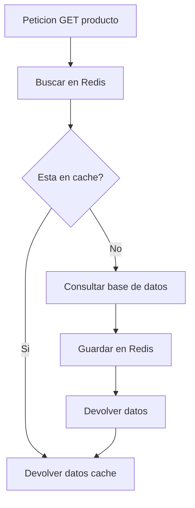

# 05. Redis Caching con StackExchange

Redis es un almacen de datos en memoria de alta velocidad. En TiendaDawApi-NetCore se utiliza para cache de productos y pedidos.

---

## 1. El Patron Cache-Aside



---

## 2. Instalacion

```bash
dotnet add package Microsoft.Extensions.Caching.StackExchangeRedis
dotnet add package StackExchange.Redis
```

---

## 3. Interfaz del Servicio

```csharp
public interface ICacheService
{
    Task<T?> GetAsync<T>(string key) where T : class;
    Task SetAsync<T>(string key, T value, TimeSpan? expiration = null) where T : class;
    Task RemoveAsync(string key);
    Task RemoveByPatternAsync(string pattern);
}
```

---

## 4. Implementacion

```csharp
using Microsoft.Extensions.Caching.Distributed;
using StackExchange.Redis;
using System.Text.Json;

public class RedisCacheService(
    IDistributedCache cache,
    ILogger<RedisCacheService> logger
) : ICacheService {

    public async Task<T?> GetAsync<T>(string key) where T : class
    {
        try
        {
            var json = await cache.GetStringAsync(key);
            if (string.IsNullOrEmpty(json)) return null;
            
            logger.LogDebug("Cache hit: {Key}", key);
            return JsonSerializer.Deserialize<T>(json);
        }
        catch (Exception ex)
        {
            logger.LogWarning(ex, "Error getting from cache: {Key}", key);
            return null;
        }
    }

    public async Task SetAsync<T>(string key, T value, TimeSpan? expiration = null) where T : class
    {
        try
        {
            var json = JsonSerializer.Serialize(value);
            var options = new DistributedCacheEntryOptions();
            
            if (expiration.HasValue)
                options.AbsoluteExpirationRelativeToNow = expiration;
            else
                options.AbsoluteExpirationRelativeToNow = TimeSpan.FromMinutes(5);
            
            await cache.SetStringAsync(key, json, options);
            logger.LogDebug("Cached: {Key}", key);
        }
        catch (Exception ex)
        {
            logger.LogWarning(ex, "Error setting cache: {Key}", key);
        }
    }

    public async Task RemoveAsync(string key)
    {
        try
        {
            await cache.RemoveAsync(key);
            logger.LogDebug("Removed from cache: {Key}", key);
        }
        catch (Exception ex)
        {
            logger.LogWarning(ex, "Error removing from cache: {Key}", key);
        }
    }

    public Task RemoveByPatternAsync(string pattern)
    {
        // Implementacion basica - en produccion usar Redis SCAN
        logger.LogInformation("Pattern removal requested: {Pattern}", pattern);
        return Task.CompletedTask;
    }
}
```

---

## 5. Uso en ProductoService

```csharp
public class ProductoService(
    IProductoRepository productoRepository,
    ICategoriaRepository categoriaRepository,
    ILogger<ProductoService> logger,
    ICacheService cacheService,
    // ...
) : IProductoService {

    public async Task<Result<ProductoDto, DomainError>> FindByIdAsync(long id)
    {
        var cacheKey = $"productos:{id}";
        
        // 1. Verificar cache
        var cached = await cacheService.GetAsync<ProductoDto>(cacheKey);
        if (cached != null)
        {
            logger.LogInformation("Producto {Id} devuelto desde cache", id);
            return Result.Success<ProductoDto, DomainError>(cached);
        }
        
        // 2. Consultar base de datos
        var producto = await productoRepository.FindByIdAsync(id);
        if (producto == null)
            return Result.Failure<ProductoDto, DomainError>(
                DomainError.NotFound($"Producto {id} no encontrado"));
        
        // 3. Guardar en cache
        await cacheService.SetAsync(cacheKey, producto.ToDto(), 
            TimeSpan.FromMinutes(10));
        
        return Result.Success<ProductoDto, DomainError>(producto.ToDto());
    }
}
```

---

## 6. Configuracion en Program.cs

```csharp
builder.Services.AddSingleton<ICacheService, RedisCacheService>();

var redisConnection = builder.Configuration.GetConnectionString("Redis")
    ?? "localhost:6379";

builder.Services.AddStackExchangeRedisCache(options =>
{
    options.Configuration = redisConnection;
    options.InstanceName = "TiendaApi:";
});
```

---

## 7. Beneficios

- **Rendimiento**: Lecturas desde memoria en microsegundos
- **Escalabilidad**: Reduce carga en base de datos
- **Flexibilidad**: TTL configurable por tipo de dato
- **Simplicidad**: API unificada para cache
