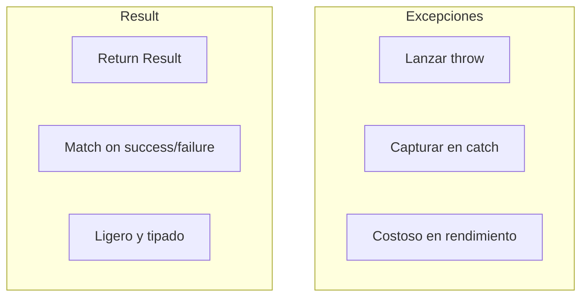
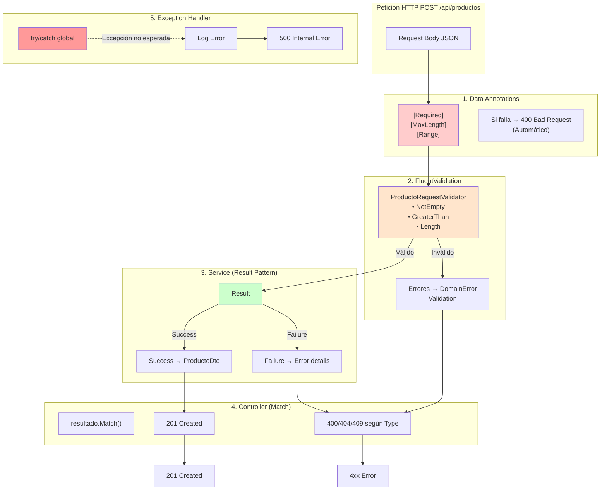
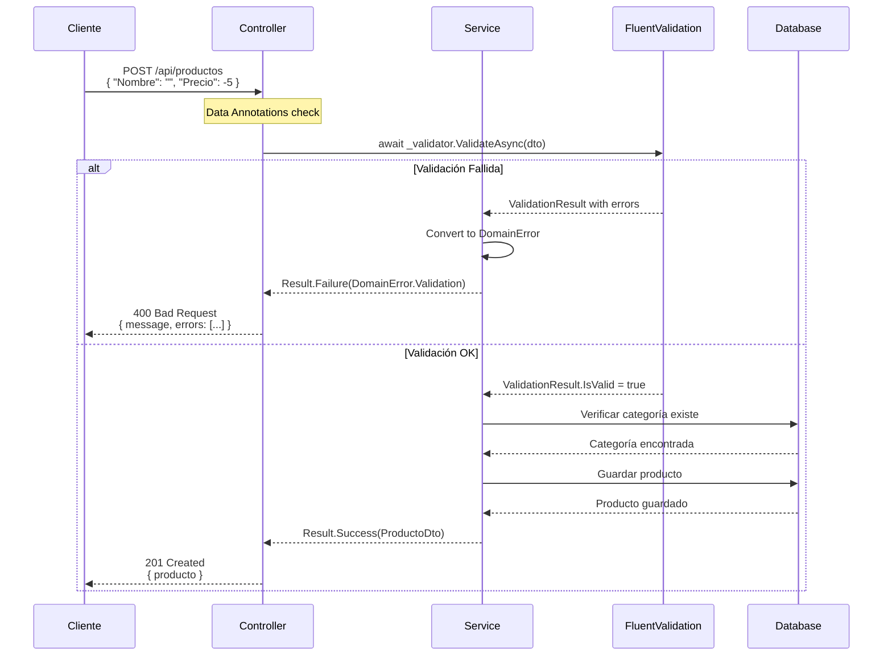
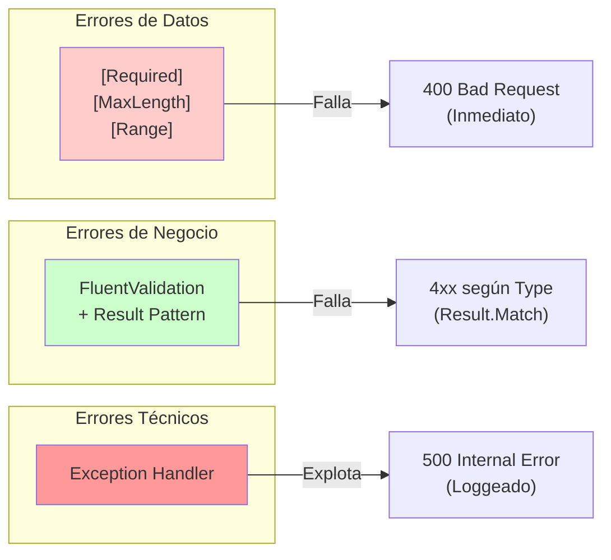

# 06. Patron Result con CSharpFunctionalExtensions

El Patron Result reemplaza excepciones para errores de negocio. Facilita el control de flujo y hace el codigo mas legible.

---

## 1. Por Que Result en Lugar de Excepciones

Las excepciones son para errores excepcionales. Los errores de negocio son esperados y deben manejarse explicitamente.



---

## 2. Instalacion

```bash
dotnet add package CSharpFunctionalExtensions
```

---

## 3. DomainError

```csharp
namespace TiendaApi.Apis.Errors;

public enum ErrorType
{
    Validation,
    NotFound,
    Conflict,
    Unauthorized,
    Forbidden,
    BusinessRule,
    Internal
}

public class DomainError
{
    public string Message { get; }
    public ErrorType Type { get; }
    public List<string>? ValidationErrors { get; }

    private DomainError(string message, ErrorType type, List<string>? validationErrors = null)
    {
        Message = message;
        Type = type;
        ValidationErrors = validationErrors;
    }

    public static DomainError Validation(string message, List<string>? errors = null) =>
        new(message, ErrorType.Validation, errors);

    public static DomainError NotFound(string message) =>
        new(message, ErrorType.NotFound);

    public static DomainError Conflict(string message) =>
        new(message, ErrorType.Conflict);

    public static DomainError Unauthorized(string message) =>
        new(message, ErrorType.Unauthorized);

    public static DomainError BusinessRule(string message) =>
        new(message, ErrorType.BusinessRule);
}
```

---

## 4. Uso en Servicios

```csharp
public class CategoriaService(
    ICategoriaRepository repository,
    ILogger<CategoriaService> logger
) : ICategoriaService {

    public async Task<Result<CategoriaDto, DomainError>> FindByIdAsync(long id)
    {
        logger.LogInformation("Buscando categoria {Id}", id);
        
        var categoria = await repository.FindByIdAsync(id);
        if (categoria == null)
            return Result.Failure<CategoriaDto, DomainError>(
                DomainError.NotFound($"Categoria {id} no encontrada"));
        
        return Result.Success<CategoriaDto, DomainError>(categoria.ToDto());
    }

    public async Task<Result<CategoriaDto, DomainError>> CreateAsync(CategoriaRequestDto dto)
    {
        // Validacion
        if (string.IsNullOrWhiteSpace(dto.Nombre))
            return Result.Failure<CategoriaDto, DomainError>(
                DomainError.Validation("Nombre requerido"));

        if (dto.Nombre.Length < 3)
            return Result.Failure<CategoriaDto, DomainError>(
                DomainError.Validation("Nombre debe tener al menos 3 caracteres"));

        // Verificar duplicados
        if (await repository.ExistsByNombreAsync(dto.Nombre))
            return Result.Failure<CategoriaDto, DomainError>(
                DomainError.Conflict($"Ya existe categoria con nombre '{dto.Nombre}'"));

        // Crear
        var categoria = dto.ToEntity();
        var saved = await repository.SaveAsync(categoria);

        return Result.Success<CategoriaDto, DomainError>(saved.ToDto());
    }

    public async Task<UnitResult<DomainError>> DeleteAsync(long id)
    {
        var categoria = await repository.FindByIdAsync(id);
        if (categoria == null)
            return UnitResult.Failure<DomainError>(
                DomainError.NotFound($"Categoria {id} no encontrada"));

        await repository.DeleteAsync(id);
        return UnitResult.Success<DomainError>();
    }
}
```

---

## 5. Uso en Controladores

```csharp
public class CategoriasController(
    ICategoriaService service,
    ILogger<CategoriasController> logger
) : ControllerBase {

    [HttpGet("{id}")]
    public async Task<IActionResult> GetById(long id)
    {
        var resultado = await service.FindByIdAsync(id);
        
        return resultado.Match(
            onSuccess: categoria => Ok(categoria),
            onFailure: error => error.Type switch {
                ErrorType.NotFound => NotFound(new { message = error.Message }),
                _ => StatusCode(500, new { message = error.Message })
            }
        );
    }

    [HttpPost]
    public async Task<IActionResult> Create([FromBody] CategoriaRequestDto dto)
    {
        var resultado = await service.CreateAsync(dto);
        
        return resultado.Match(
            onSuccess: categoria => CreatedAtAction(nameof(GetById), new { id = categoria.Id }, categoria),
            onFailure: error => error.Type switch {
                ErrorType.Validation => BadRequest(new { message = error.Message }),
                ErrorType.Conflict => Conflict(new { message = error.Message }),
                _ => StatusCode(500, new { message = error.Message })
            }
        );
    }

    [HttpDelete("{id}")]
    public async Task<IActionResult> Delete(long id)
    {
        var resultado = await service.DeleteAsync(id);
        
        if (resultado.IsSuccess)
            return NoContent();
        
        return resultado.Error.Type switch {
            ErrorType.NotFound => NotFound(new { message = resultado.Error.Message }),
            _ => StatusCode(500, new { message = resultado.Error.Message })
        };
    }
}
```

---

## 6. Beneficios

| Aspecto | Excepciones | Result |
|---------|-------------|--------|
| Legibilidad | Baja | Alta |
| Rendimiento | Costoso | Ligero |
| Tipado | Generico | Explicito |
| Control | optional | Obligatorio |

---

## 7. Integración Completa: Validaciones + Result + Exception Handler

Esta sección explica cómo trabajan juntos Data Annotations, FluentValidation, Result Pattern y Global Exception Handler.



---

### 7.1 Flujo del Error de Validación



---

### 7.2 Código de Integración

```csharp
// SERVICIO: Convierte errores de FluentValidation a DomainError
public async Task<Result<ProductoDto, DomainError>> CreateAsync(ProductoRequestDto dto)
{
    // 1️⃣ FluentValidation
    var validationResult = await _validator.ValidateAsync(dto);
    
    if (!validationResult.IsValid)
    {
        var errors = validationResult.Errors
            .Select(e => ErrorMessage)
            .ToList();
            
        return Result.Failure<ProductoDto, DomainError>(
            DomainError.Validation("Errores de validación", errors));
    }

    // 2️⃣ Lógica de negocio
    var categoria = await _categoriaRepo.FindByIdAsync(dto.CategoriaId);
    if (categoria is null)
        return Result.Failure<ProductoDto, DomainError>(
            DomainError.NotFound($"Categoría {dto.CategoriaId} no encontrada"));

    if (await _productoRepo.ExistsByNombreAsync(dto.Nombre))
        return Result.Failure<ProductoDto, DomainError>(
            DomainError.Conflict($"Producto '{dto.Nombre}' ya existe"));

    // 3️⃣ Guardar
    var producto = await _productoRepo.SaveAsync(dto.ToEntity());
    return Result.Success<ProductoDto, DomainError>(producto.ToDto());
}

// CONTROLADOR: Result.Match() mapea errores a HTTP Status Codes
[HttpPost]
public async Task<IActionResult> Create([FromBody] ProductoRequestDto dto)
{
    var resultado = await _productoService.CreateAsync(dto);
    
    return resultado.Match(
        onSuccess: producto => CreatedAtAction(
            nameof(GetById), 
            new { id = producto.Id }, 
            producto),
            
        onFailure: error => error.Type switch
        {
            ErrorType.Validation => BadRequest(new { 
                message = error.Message,
                errors = error.ValidationErrors 
            }),
            ErrorType.NotFound => NotFound(new { message = error.Message }),
            ErrorType.Conflict => Conflict(new { message = error.Message }),
            ErrorType.Unauthorized => Unauthorized(new { message = error.Message }),
            ErrorType.Forbidden => StatusCode(403, new { message = error.Message }),
            ErrorType.BusinessRule => BadRequest(new { message = error.Message }),
            _ => StatusCode(500, new { message = error.Message })
        }
    );
}
```

---

### 7.3 ¿Cuándo Usar Cada Capa?



| Capa | Cuándo Usar | Si Falla | Ejemplo |
|------|-------------|----------|---------|
| **Data Annotations** | Validación básica del modelo JSON | 400 automático | Campo requerido vacío |
| **FluentValidation** | Reglas complejas de negocio | 400 con detalles | Precio > 0, nombre 3-200 chars |
| **Result Pattern** | Errores esperados de lógica | 4xx según Type | Categoría no existe, duplicado |
| **Exception Handler** | Errores inesperados (bugs) | 500 genérico | NullReference, BD offline |

---

### 7.4 Ejemplo de Respuestas

```json
// 400 - Validación de Datos (Data Annotations)
{
  "errors": {
    "Nombre": ["El campo Nombre es obligatorio."],
    "Precio": ["El campo Precio debe ser mayor a 0."]
  }
}

// 400 - Validación de Negocio (FluentValidation → Result)
{
  "message": "Errores de validación",
  "errors": [
    "El nombre es requerido",
    "El precio debe ser mayor a 0"
  ]
}

// 404 - Recurso No Encontrado (Result Pattern)
{
  "message": "Categoría 999 no encontrada"
}

// 409 - Conflicto (Result Pattern)
{
  "message": "Producto 'iPhone 15' ya existe"
}

// 500 - Error Interno (Exception Handler)
{
  "message": "Ha ocurrido un error interno"
}
```
