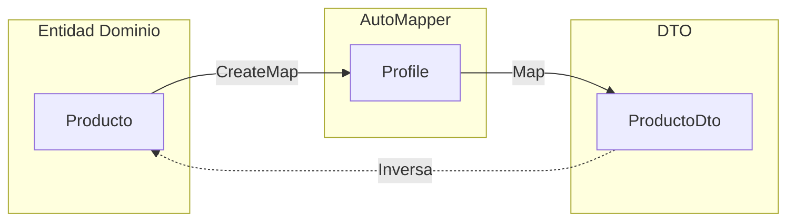

# 07. AutoMapper y Mapeo de Objetos

AutoMapper simplifica la conversion entre objetos de diferentes tipos. En TiendaDawApi-NetCore se usa para convertir entre entidades, DTOs y ViewModels.

---

## 1. Flujo de Mapeo con AutoMapper



---

## 2. El Problema

Sin AutoMapper, las conversiones son tediosas y propensas a errores:

```csharp
// Sin AutoMapper - Tedioso
var dto = new ProductoDto
{
    Id = producto.Id,
    Nombre = producto.Nombre,
    Descripcion = producto.Descripcion,
    Precio = producto.Precio,
    Stock = producto.Stock,
    CategoriaId = producto.CategoriaId,
    CategoriaNombre = producto.Categoria?.Nombre
};
```

---

## 2. Instalacion

```bash
dotnet add package AutoMapper.Extensions.Microsoft.DependencyInjection
```

---

## 3. Perfiles de Mapeo

```csharp
using AutoMapper;
using TiendaApi.Apis.Dtos.Categorias;
using TiendaApi.Apis.Dtos.Productos;
using TiendaApi.Apis.Models;

namespace TiendaApi.Apis.Mappers;

public class MappingProfile : Profile
{
    public MappingProfile()
    {
        // Categoria mappings
        CreateMap<Categoria, CategoriaDto>();
        CreateMap<CategoriaRequestDto, Categoria>();

        // Producto mappings
        CreateMap<Producto, ProductoDto>()
            .ForMember(dest => dest.CategoriaNombre,
                opt => opt.MapFrom(src => src.Categoria!.Nombre));

        CreateMap<ProductoRequestDto, Producto>();

        // Pedido mappings
        CreateMap<Pedido, PedidoDto>();
        CreateMap<PedidoItem, PedidoItemDto>();
    }
}
```

---

## 4. Extension Methods

```csharp
using AutoMapper;

namespace TiendaApi.Apis.Mappers;

public static class MapperExtensions
{
    public static TDestination ToDto<TSource, TDestination>(this TSource source, IMapper mapper)
        where TDestination : class
    {
        return mapper.Map<TDestination>(source);
    }

    public static IEnumerable<TDestination> ToDtoList<TSource, TDestination>(
        this IEnumerable<TSource> sources, IMapper mapper)
        where TDestination : class
    {
        return mapper.Map<IEnumerable<TDestination>>(sources);
    }
}
```

---

## 5. Registro en Program.cs

```csharp
builder.Services.AddAutoMapper(typeof(MappingProfile), typeof(PedidoProfile));
```

---

## 6. Uso en Controladores

```csharp
public class ProductosController(
    IProductoService productoService,
    ILogger<ProductosController> logger
) : ControllerBase {

    [HttpGet("{id}")]
    public async Task<IActionResult> GetById(long id)
    {
        var resultado = await productoService.FindByIdAsync(id);
        
        return resultado.Match(
            onSuccess: producto => Ok(producto),
            onFailure: NotFound
        );
    }

    [HttpPost]
    public async Task<IActionResult> Create([FromBody] ProductoRequestDto dto)
    {
        var resultado = await productoService.CreateAsync(dto);
        
        return resultado.Match(
            onSuccess: producto => CreatedAtAction(nameof(GetById), new { id = producto.Id }, producto),
            onFailure: error => BadRequest(new { message = error.Message })
        );
    }
}
```

---

## 7. Configuracion Avanzada

```csharp
CreateMap<Producto, ProductoDto>()
    .ForMember(dest => dest.PrecioFormateado,
        opt => opt.MapFrom(src => $"${src.Precio:F2}"))
    .ForMember(dest => dest.Disponible,
        opt => opt.MapFrom(src => src.Stock > 0));
```

---

## 8. Beneficios

- **DRY**: No repetir codigo de mapeo
- **Type Safety**: Errores en tiempo de compilacion
- **Mantenible**: Un solo lugar para cambios
- **Legible**: Codigo limpio y expresivo
