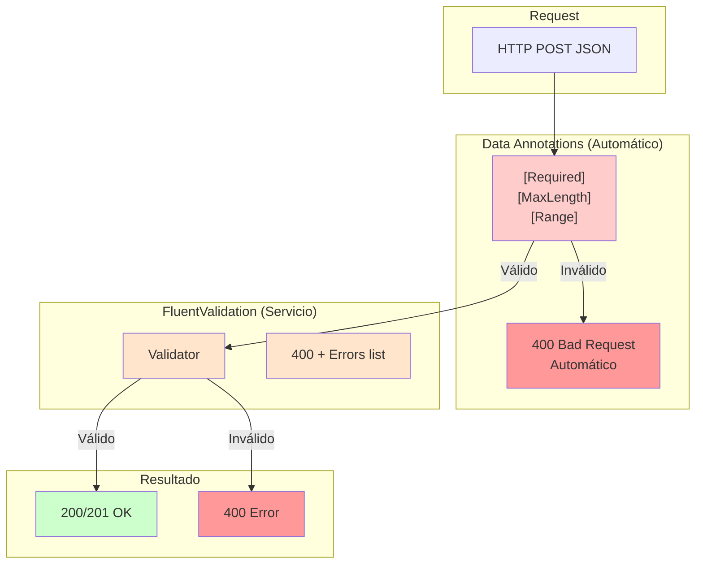
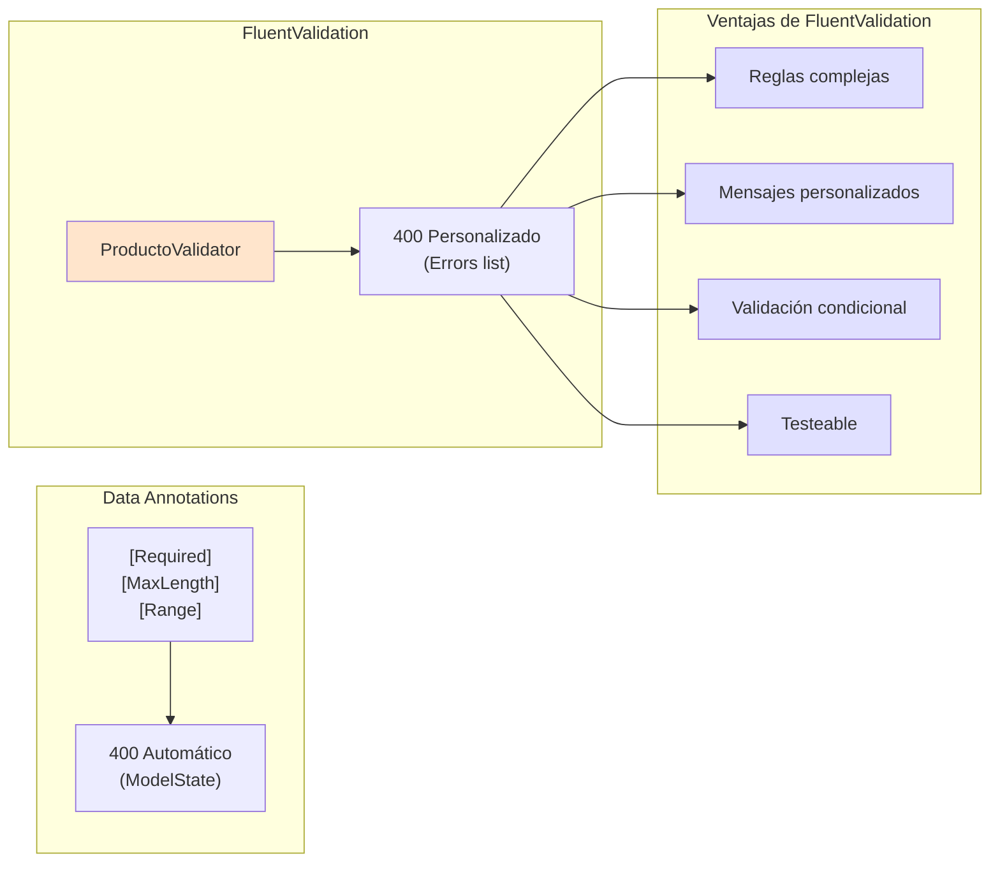
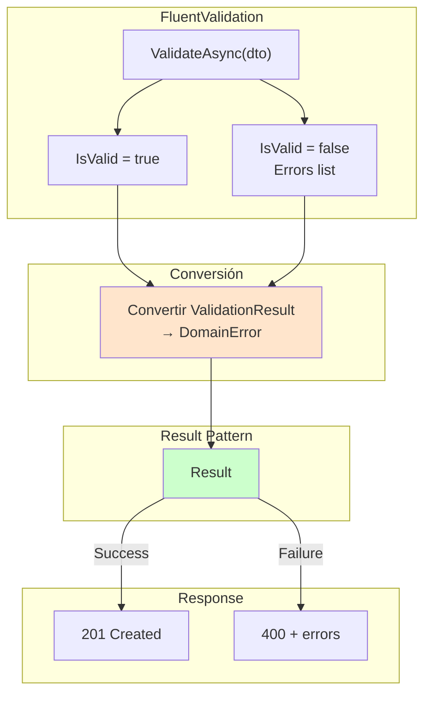
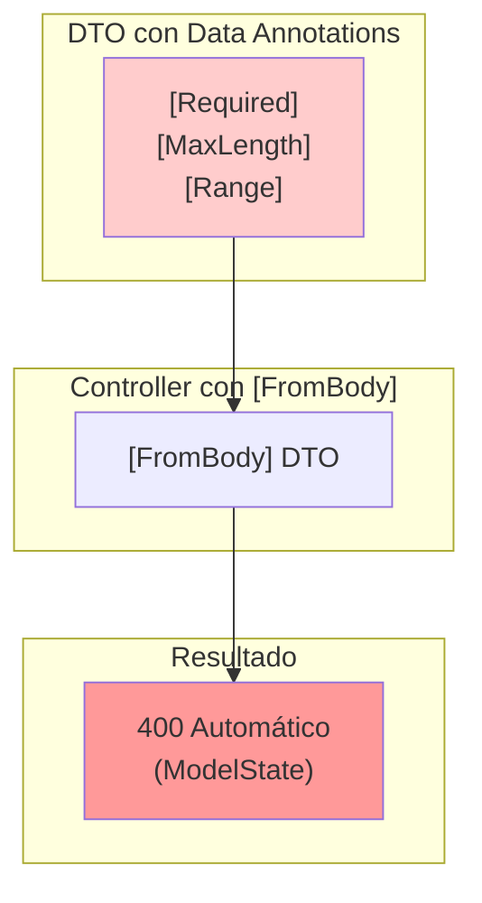

# 08. FluentValidation

FluentValidation es una libreria para construir reglas de validacion fuertemente tipadas y fluidas.

---

## 1. Pipeline de Validacion



---

## 1.1 Validación Automática con [FromBody]

Cuando usas `[FromBody]` con DTOs que tienen Data Annotations, ASP.NET Core valida automáticamente:

```csharp
// DTO con Data Annotations
public record ProductoRequestDto
{
    [Required(ErrorMessage = "El nombre es obligatorio")]
    [MinLength(3)]
    [MaxLength(200)]
    public string Nombre { get; init; } = string.Empty;

    [Required]
    [Range(0.01, double.MaxValue, ErrorMessage = "El precio debe ser mayor a 0")]
    public decimal Precio { get; init; }
}

// Controlador
[HttpPost]
public IActionResult Create([FromBody] ProductoRequestDto dto)
{
    // Si el JSON es inválido, NUNCA llega aquí
    // ASP.NET Core retorna 400 automáticamente
    return Ok();
}
```

### Request/Response

```json
POST /api/productos
Content-Type: application/json

{ "Nombre": "", "Precio": -5 }

-------------------------- RESPUESTA --------------------------

400 Bad Request
{
  "type": "https://tools.ietf.org/html/rfc9110#section-15.5.1",
  "title": "One or more validation errors occurred.",
  "status": 400,
  "errors": {
    "Nombre": ["El nombre es obligatorio"],
    "Precio": ["El precio debe ser mayor a 0"]
  }
}
```

### ¿Por qué funciona automáticamente?

```csharp
// Esto es el DEFAULT (no necesitas configurarlo)
builder.Services.AddControllers(options =>
{
    options.SuppressModelStateInvalidFilter = false; // FALSE por defecto
});
```

| Configuración | Comportamiento |
|---------------|----------------|
| `SuppressModelStateInvalidFilter = false` (default) | Data Annotations → 400 automático |
| `SuppressModelStateInvalidFilter = true` | Pasa al controller, tú decides |

---

## 1.2 Data Annotations vs FluentValidation



### Comparación

| Aspecto | Data Annotations | FluentValidation |
|---------|------------------|------------------|
| **Legibilidad** | Basic | Alta (fluida) |
| **Validación compleja** | Limitada | Completa |
| **Errores detallados** | Básico | Personalizable |
| **Testeable** | Difícil | Fácil con TestHelper |
| **400 automático** | Sí | No (en servicio) |

---

## 2. Instalacion

```bash
dotnet add package FluentValidation.AspNetCore
```

---

## 2. Validadores

### Estructura de Directorios

```
TiendaApi.Apis/Validators/
├── Productos/
│   └── ProductoRequestValidator.cs
├── Categorias/
│   └── CategoriaRequestValidator.cs
├── Pedidos/
│   ├── PedidoRequestValidator.cs
│   └── PedidoItemRequestValidator.cs
└── Usuarios/
    ├── RegisterValidator.cs
    ├── LoginValidator.cs
    └── UserUpdateValidator.cs
```

### Ejemplo de Validador

```csharp
using FluentValidation;
using TiendaApi.Apis.Dtos.Productos;

namespace TiendaApi.Apis.Validators.Productos;

public class ProductoRequestValidator : AbstractValidator<ProductoRequestDto>
{
    public ProductoRequestValidator()
    {
        RuleFor(p => p.Nombre)
            .NotEmpty().WithMessage("El nombre es obligatorio")
            .MinimumLength(3).WithMessage("El nombre debe tener al menos 3 caracteres")
            .MaximumLength(200).WithMessage("El nombre no puede exceder 200 caracteres");

        RuleFor(p => p.Precio)
            .GreaterThan(0).WithMessage("El precio debe ser mayor a 0");

        RuleFor(p => p.Stock)
            .GreaterThanOrEqualTo(0).WithMessage("El stock no puede ser negativo");

        RuleFor(p => p.CategoriaId)
            .GreaterThan(0).WithMessage("Debe seleccionar una categoría válida");

        RuleFor(p => p.Imagen)
            .Must(url => string.IsNullOrEmpty(url) || 
                Uri.TryCreate(url, UriKind.Absolute, out var uri) && 
                (uri.Scheme == Uri.UriSchemeHttp || uri.Scheme == Uri.UriSchemeHttps))
            .WithMessage("Debe ser una URL válida (http:// o https://)")
            .When(p => !string.IsNullOrEmpty(p.Imagen));
    }
}
```

---

## 3. Registro en Program.cs

```csharp
builder.Services.AddValidatorsFromAssemblyContaining<Program>();
```

---

## 4. Uso en Controladores

```csharp
public class ProductosController(
    IProductoService productoService,
    ILogger<ProductosController> logger
) : ControllerBase {

    [HttpPost]
    public async Task<IActionResult> Create([FromBody] ProductoRequestDto dto)
    {
        var resultado = await productoService.CreateAsync(dto);
        
        return resultado.Match(
            onSuccess: producto => CreatedAtAction(nameof(GetById), new { id = producto.Id }, producto),
            onFailure: error => error.Type switch {
                ErrorType.Validation => BadRequest(new { 
                    message = error.Message,
                    errors = error.ValidationErrors 
                }),
                ErrorType.NotFound => NotFound(new { message = error.Message }),
                _ => StatusCode(500, new { message = error.Message })
            }
        );
    }
}
```

---

## 5. Validaciones Avanzadas

```csharp
public class PedidoRequestValidator : AbstractValidator<PedidoRequestDto>
{
    public PedidoRequestValidator()
    {
        RuleFor(p => p.Items)
            .NotEmpty().WithMessage("El pedido debe tener al menos un producto");

        RuleForEach(p => p.Items).SetValidator(new PedidoItemValidator());
    }
}

public class PedidoItemValidator : AbstractValidator<PedidoItemDto>
{
    public PedidoItemValidator()
    {
        RuleFor(i => i.Cantidad)
            .GreaterThan(0).WithMessage("La cantidad debe ser mayor a 0");
    }
}
```

---

## 6. Beneficios

- **Legibilidad**: Reglas como oraciones
- **Reutilizabilidad**: Validadores compartidos
- **Testeabilidad**: Faciles de probar
- **Composicion**: Reglas complejas combinables

---

## 7. Integración con Result Pattern

FluentValidation se integra con Result Pattern para retornar errores de forma consistente.



### 7.1 Servicio con FluentValidation + Result

```csharp
public class ProductoService(
    IProductoRepository productoRepository,
    ICategoriaRepository categoriaRepository,
    IProductoValidator validator,
    IMapper mapper,
    ILogger<ProductoService> logger
) : IProductoService
{
    public async Task<Result<ProductoDto, DomainError>> CreateAsync(ProductoRequestDto dto)
    {
        // 1️⃣ FluentValidation
        var validationResult = await validator.ValidateAsync(dto);
        
        if (!validationResult.IsValid)
        {
            var errors = validationResult.Errors
                .Select(e => e.ErrorMessage)
                .ToList();
                
            return Result.Failure<ProductoDto, DomainError>(
                DomainError.Validation("Errores de validación", errors));
        }

        // 2️⃣ Verificar categoría
        var categoria = await categoriaRepository.FindByIdAsync(dto.CategoriaId);
        if (categoria is null)
            return Result.Failure<ProductoDto, DomainError>(
                DomainError.NotFound($"Categoría {dto.CategoriaId} no encontrada"));

        // 3️⃣ Verificar duplicado
        if (await productoRepository.ExistsByNombreAsync(dto.Nombre))
            return Result.Failure<ProductoDto, DomainError>(
                DomainError.Conflict($"Producto '{dto.Nombre}' ya existe"));

        // 4️⃣ Guardar
        var producto = mapper.Map<Producto>(dto);
        producto = await productoRepository.SaveAsync(producto);
        logger.LogInformation("Producto creado: {Id}", producto.Id);

        return Result.Success<ProductoDto, DomainError>(
            mapper.Map<ProductoDto>(producto));
    }
}
```

### 7.2 Diferencia con Data Annotations

> **Nota**: Data Annotations y FluentValidation NO se excluyen. Se complementan:
> - **Data Annotations**: Validación básica automática con `[FromBody]` → 400 automático
> - **FluentValidation**: Validación compleja de negocio en servicios



### ¿Cuándo usar cada uno?

| Capa | Cuándo | Ejemplo |
|------|--------|---------|
| **Data Annotations** | Validación básica de campos | `[Required]`, `[MaxLength(100)]` |
| **FluentValidation** | Reglas de negocio complejas | "Nombre no puede ser igual a descripción" |

### Ejemplo de combinación

```csharp
// DTO con Data Annotations (validación automática)
public record ProductoRequestDto
{
    [Required]
    [MinLength(3)]
    [MaxLength(200)]
    public string Nombre { get; init; } = string.Empty;

    [Required]
    [Range(0.01, double.MaxValue)]
    public decimal Precio { get; init; }
}

// FluentValidator (validación de negocio)
public class ProductoRequestValidator : AbstractValidator<ProductoRequestDto>
{
    public ProductoRequestValidator()
    {
        RuleFor(p => p.Nombre)
            .Must((dto, nombre) => nombre != dto.Descripcion)
            .WithMessage("El nombre no puede ser igual a la descripción");
    }
}
```
