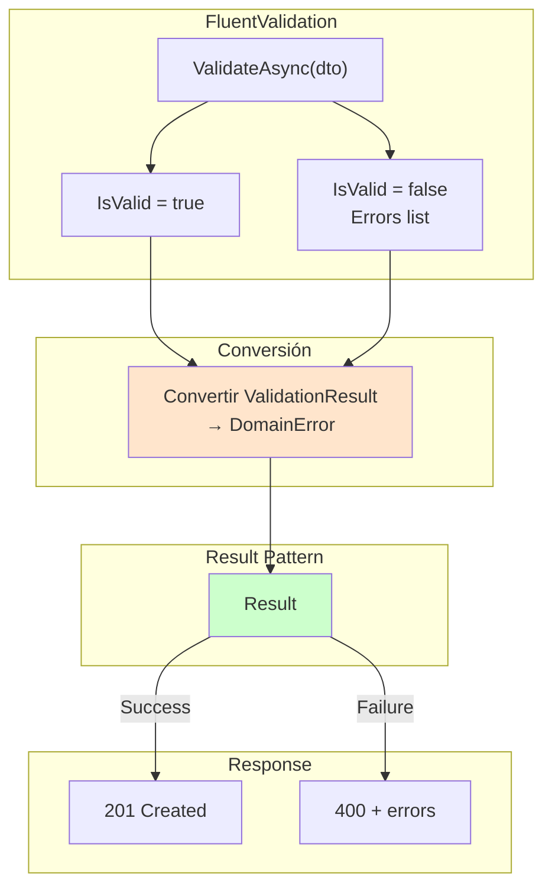
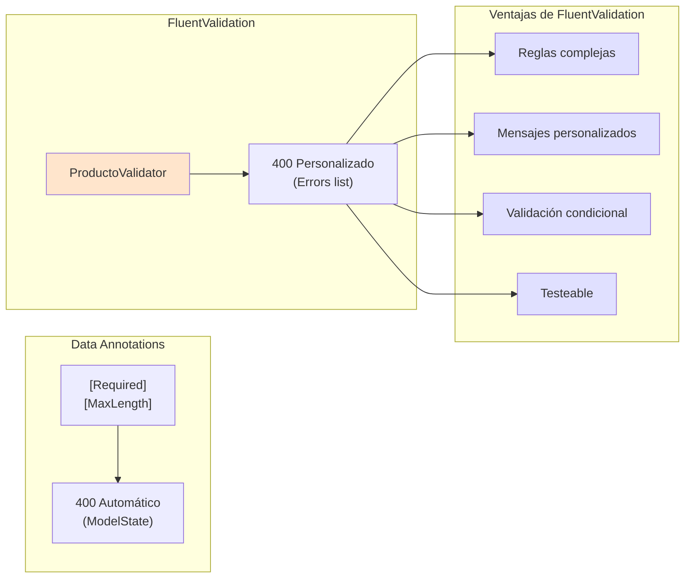

# 08. FluentValidation

FluentValidation es una libreria para construir reglas de validacion fuertemente tipadas y fluidas.

---

## 1. Pipeline de Validacion

```mermaid
flowchart TB
    subgraph "Request"
        REQ[ProductoRequestDto]
    end
    
    subgraph "FluentValidation"
        VAL[Validator]
    end
    
    subgraph "Resultado"
        VALIDO[Valido &#10004;]
        INVALIDO[Invalido &#10006;]
    end
    
    REQ --> VAL
    VAL -->|Pass| VALIDO
    VAL -->|Fail| INVALIDO
```



---

## 2. Instalacion

```bash
dotnet add package FluentValidation.AspNetCore
```

---

## 2. Validadores

```csharp
using FluentValidation;
using TiendaApi.Apis.Dtos.Productos;

namespace TiendaApi.Apis.Services.Productos;

public class ProductoRequestValidator : AbstractValidator<ProductoRequestDto>
{
    public ProductoRequestValidator()
    {
        RuleFor(p => p.Nombre)
            .NotEmpty().WithMessage("El nombre es requerido")
            .Length(3, 200).WithMessage("El nombre debe tener entre 3 y 200 caracteres");

        RuleFor(p => p.Precio)
            .GreaterThan(0).WithMessage("El precio debe ser mayor a 0");

        RuleFor(p => p.Stock)
            .GreaterThanOrEqualTo(0).WithMessage("El stock no puede ser negativo");

        RuleFor(p => p.CategoriaId)
            .GreaterThan(0).WithMessage("Debe seleccionar una categoria valida");
    }
}
```

---

## 3. Registro en Program.cs

```csharp
builder.Services.AddValidatorsFromAssemblyContaining<Program>();
```

---

## 4. Uso en Controladores

```csharp
public class ProductosController(
    IProductoService productoService,
    ILogger<ProductosController> logger
) : ControllerBase {

    [HttpPost]
    public async Task<IActionResult> Create([FromBody] ProductoRequestDto dto)
    {
        var resultado = await productoService.CreateAsync(dto);
        
        return resultado.Match(
            onSuccess: producto => CreatedAtAction(nameof(GetById), new { id = producto.Id }, producto),
            onFailure: error => error.Type switch {
                ErrorType.Validation => BadRequest(new { 
                    message = error.Message,
                    errors = error.ValidationErrors 
                }),
                ErrorType.NotFound => NotFound(new { message = error.Message }),
                _ => StatusCode(500, new { message = error.Message })
            }
        );
    }
}
```

---

## 5. Validaciones Avanzadas

```csharp
public class PedidoRequestValidator : AbstractValidator<PedidoRequestDto>
{
    public PedidoRequestValidator()
    {
        RuleFor(p => p.Items)
            .NotEmpty().WithMessage("El pedido debe tener al menos un producto");

        RuleForEach(p => p.Items).SetValidator(new PedidoItemValidator());
    }
}

public class PedidoItemValidator : AbstractValidator<PedidoItemDto>
{
    public PedidoItemValidator()
    {
        RuleFor(i => i.Cantidad)
            .GreaterThan(0).WithMessage("La cantidad debe ser mayor a 0");
    }
}
```

---

## 6. Beneficios

- **Legibilidad**: Reglas como oraciones
- **Reutilizabilidad**: Validadores compartidos
- **Testeabilidad**: Faciles de probar
- **Composicion**: Reglas complejas combinables

---

## 7. Integración con Result Pattern

FluentValidation se integra con Result Pattern para retornar errores de forma consistente.



### 7.1 Servicio con FluentValidation + Result

```csharp
public class ProductoService(
    IProductoRepository productoRepository,
    ICategoriaRepository categoriaRepository,
    IProductoValidator validator,
    IMapper mapper,
    ILogger<ProductoService> logger
) : IProductoService
{
    public async Task<Result<ProductoDto, DomainError>> CreateAsync(ProductoRequestDto dto)
    {
        // 1️⃣ FluentValidation
        var validationResult = await validator.ValidateAsync(dto);
        
        if (!validationResult.IsValid)
        {
            var errors = validationResult.Errors
                .Select(e => e.ErrorMessage)
                .ToList();
                
            return Result.Failure<ProductoDto, DomainError>(
                DomainError.Validation("Errores de validación", errors));
        }

        // 2️⃣ Verificar categoría
        var categoria = await categoriaRepository.FindByIdAsync(dto.CategoriaId);
        if (categoria is null)
            return Result.Failure<ProductoDto, DomainError>(
                DomainError.NotFound($"Categoría {dto.CategoriaId} no encontrada"));

        // 3️⃣ Verificar duplicado
        if (await productoRepository.ExistsByNombreAsync(dto.Nombre))
            return Result.Failure<ProductoDto, DomainError>(
                DomainError.Conflict($"Producto '{dto.Nombre}' ya existe"));

        // 4️⃣ Guardar
        var producto = mapper.Map<Producto>(dto);
        producto = await productoRepository.SaveAsync(producto);
        logger.LogInformation("Producto creado: {Id}", producto.Id);

        return Result.Success<ProductoDto, DomainError>(
            mapper.Map<ProductoDto>(producto));
    }
}
```

### 7.2 Diferencia con Data Annotations


