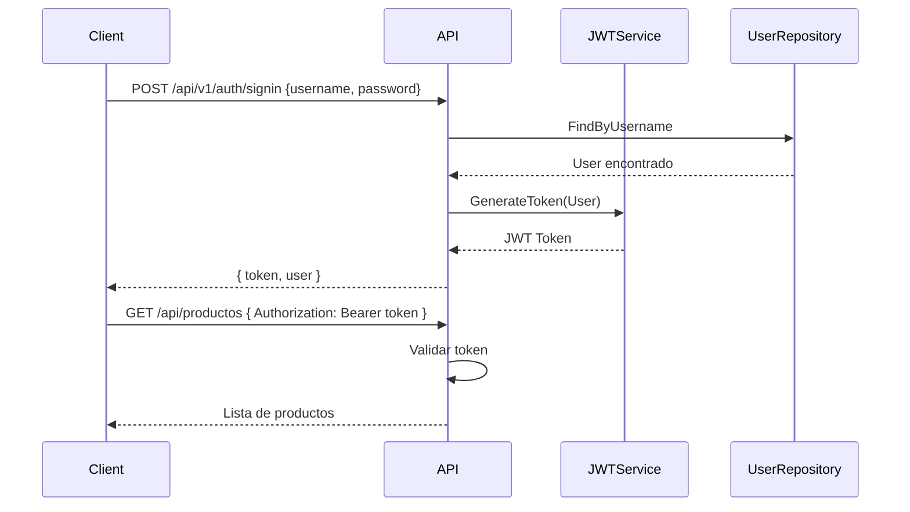

# 09. JWT Authentication

JSON Web Tokens (JWT) es el estandar para autenticacion stateless en APIs REST.

---

## 1. Instalacion

```bash
dotnet add package Microsoft.AspNetCore.Authentication.JwtBearer
dotnet add package System.IdentityModel.Tokens.Jwt
```

---

## 2. Configuracion en Program.cs

```csharp
using Microsoft.AspNetCore.Authentication.JwtBearer;
using Microsoft.IdentityModel.Tokens;
using System.Text;

var builder = WebApplication.CreateBuilder(args);

var jwtKey = builder.Configuration["Jwt:Key"]
    ?? throw new InvalidOperationException("JWT Key no configurada");
var jwtIssuer = builder.Configuration["Jwt:Issuer"] ?? "TiendaApi";
var jwtAudience = builder.Configuration["Jwt:Audience"] ?? "TiendaApi";

builder.Services.AddAuthentication(options =>
{
    options.DefaultAuthenticateScheme = JwtBearerDefaults.AuthenticationScheme;
    options.DefaultChallengeScheme = JwtBearerDefaults.AuthenticationScheme;
})
.AddJwtBearer(options =>
{
    options.TokenValidationParameters = new TokenValidationParameters
    {
        ValidateIssuerSigningKey = true,
        IssuerSigningKey = new SymmetricSecurityKey(Encoding.UTF8.GetBytes(jwtKey)),
        ValidateIssuer = true,
        ValidIssuer = jwtIssuer,
        ValidateAudience = true,
        ValidAudience = jwtAudience,
        ValidateLifetime = true,
        ClockSkew = TimeSpan.Zero
    };
});

builder.Services.AddAuthorizationBuilder()
    .AddPolicy("RequireAdminRole", policy => policy.RequireRole("ADMIN"))
    .AddPolicy("RequireUserRole", policy => policy.RequireRole("USER", "ADMIN"));
```

---

## 3. Generacion de Tokens

```csharp
public interface IJwtService
{
    string GenerateToken(User user);
}

public class JwtService(
    IConfiguration configuration
) : IJwtService {

    public string GenerateToken(User user)
    {
        var key = new SymmetricSecurityKey(Encoding.UTF8.GetBytes(
            configuration["Jwt:Key"] ?? throw new InvalidOperationException()));
        
        var credentials = new SigningCredentials(key, SecurityAlgorithms.HmacSha256);
        
        var claims = new[]
        {
            new Claim(ClaimTypes.NameIdentifier, user.Id.ToString()),
            new Claim(ClaimTypes.Name, user.Username),
            new Claim(ClaimTypes.Email, user.Email),
            new Claim(ClaimTypes.Role, user.Role)
        };
        
        var token = new JwtSecurityToken(
            issuer: configuration["Jwt:Issuer"] ?? "TiendaApi",
            audience: configuration["Jwt:Audience"] ?? "TiendaApi",
            claims: claims,
            expires: DateTime.UtcNow.AddHours(24),
            signingCredentials: credentials
        );
        
        return new JwtSecurityTokenHandler().WriteToken(token);
    }
}
```

---

## 4. Servicio de Auth

```csharp
public class AuthService(
    IUserRepository userRepository,
    IJwtService jwtService,
    ILogger<AuthService> logger
) : IAuthService {

    public async Task<Result<AuthResponseDto, DomainError>> SignUpAsync(RegisterDto dto)
    {
        // Validar
        if (string.IsNullOrWhiteSpace(dto.Username))
            return Result.Failure<AuthResponseDto, DomainError>(
                DomainError.Validation("Username requerido"));

        if (await userRepository.FindByUsernameAsync(dto.Username) != null)
            return Result.Failure<AuthResponseDto, DomainError>(
                DomainError.Conflict("Username ya existe"));

        // Crear usuario
        var passwordHash = BCrypt.Net.BCrypt.HashPassword(dto.Password);
        var user = new User
        {
            Username = dto.Username,
            Email = dto.Email,
            PasswordHash = passwordHash,
            Role = UserRoles.USER
        };
        
        await userRepository.SaveAsync(user);
        
        // Generar token
        var token = jwtService.GenerateToken(user);
        
        return Result.Success<AuthResponseDto, DomainError>(new AuthResponseDto
        {
            Token = token,
            User = user.ToDto()
        });
    }

    public async Task<Result<AuthResponseDto, DomainError>> SignInAsync(LoginDto dto)
    {
        var user = await userRepository.FindByUsernameAsync(dto.Username);
        if (user == null)
            return Result.Failure<AuthResponseDto, DomainError>(
                DomainError.Unauthorized("Credenciales invalidas"));

        if (!BCrypt.Net.BCrypt.Verify(dto.Password, user.PasswordHash))
            return Result.Failure<AuthResponseDto, DomainError>(
                DomainError.Unauthorized("Credenciales invalidas"));

        var token = jwtService.GenerateToken(user);
        
        return Result.Success<AuthResponseDto, DomainError>(new AuthResponseDto
        {
            Token = token,
            User = user.ToDto()
        });
    }
}
```

---

## 5. Proteccion de Endpoints

```csharp
[Authorize(Policy = "RequireUserRole")]
[HttpPost]
public async Task<IActionResult> Create([FromBody] ProductoRequestDto dto)
{
    // Solo usuarios autenticados pueden crear productos
    var resultado = await productoService.CreateAsync(dto);
    return resultado.Match(Created, BadRequest);
}

[Authorize(Roles = "ADMIN")]
[HttpPut("{id}")]
public async Task<IActionResult> Update(long id, [FromBody] ProductoRequestDto dto)
{
    // Solo administradores pueden actualizar
    var resultado = await productoService.UpdateAsync(id, dto);
    return resultado.Match(Ok, NotFound);
}
```

---

## 6. Flujo de Autenticacion


