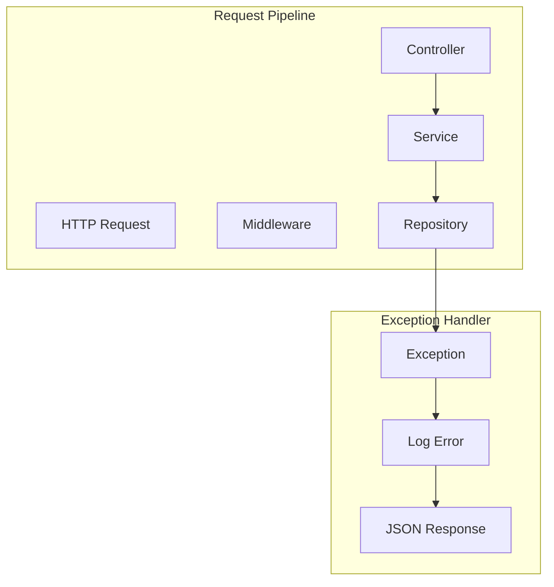
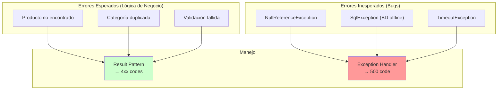
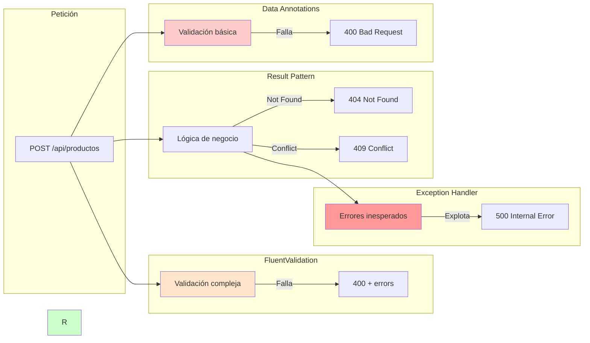
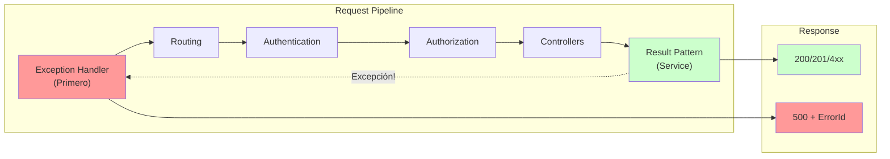

# 10. Global Exception Handling

Un middleware de gestion centralizada de errores asegura respuestas consistentes y profesionales.

---

## 1. Flujo de Exception Handling



---

## 2. Exception Handler Middleware

```csharp
using Microsoft.AspNetCore.Diagnostics;
using System.Text.Json;
using TiendaApi.Apis.Errors;

namespace TiendaApi.Apis.Middleware;

public class GlobalExceptionHandler
{
    private readonly RequestDelegate _next;
    private readonly ILogger<GlobalExceptionHandler> _logger;

    public GlobalExceptionHandler(RequestDelegate next, ILogger<GlobalExceptionHandler> logger)
    {
        _next = next;
        _logger = logger;
    }

    public async Task InvokeAsync(HttpContext context)
    {
        try
        {
            await _next(context);
        }
        catch (Exception ex)
        {
            _logger.LogError(ex, "Unhandled exception occurred");
            await HandleExceptionAsync(context, ex);
        }
    }

    private async Task HandleExceptionAsync(HttpContext context, Exception exception)
    {
        context.Response.ContentType = "application/json";
        
        var (statusCode, message) = exception switch
        {
            ArgumentException => (400, exception.Message),
            KeyNotFoundException => (404, exception.Message),
            UnauthorizedAccessException => (401, "No autorizado"),
            _ => (500, "Error interno del servidor")
        };

        context.Response.StatusCode = statusCode;
        
        var response = new { message };
        await context.Response.WriteAsync(JsonSerializer.Serialize(response));
    }
}
```

---

## 2. Registro en Program.cs

```csharp
app.UseExceptionHandler(errorApp =>
{
    errorApp.Run(async context =>
    {
        var exception = context.Features.Get<IExceptionHandlerPathFeature>();
        
        context.Response.StatusCode = 500;
        context.Response.ContentType = "application/json";
        
        await context.Response.WriteAsync(JsonSerializer.Serialize(new
        {
            message = "Ha ocurrido un error interno"
        }));
    });
});
```

---

## 3. Manejo de DomainError

```csharp
// En el controlador
public IActionResult Create([FromBody] CategoriaRequestDto dto)
{
    var resultado = await _service.CreateAsync(dto);
    
    return resultado.Match(
        onSuccess: categoria => CreatedAtAction(nameof(GetById), new { id = categoria.Id }, categoria),
        onFailure: error => error.Type switch
        {
            ErrorType.Validation => BadRequest(new { message = error.Message }),
            ErrorType.NotFound => NotFound(new { message = error.Message }),
            ErrorType.Conflict => Conflict(new { message = error.Message }),
            ErrorType.Unauthorized => Unauthorized(new { message = error.Message }),
            ErrorType.Forbidden => StatusCode(403, new { message = error.Message }),
            ErrorType.BusinessRule => BadRequest(new { message = error.Message }),
            _ => StatusCode(500, new { message = error.Message })
        }
    );
}
```

---

## 4. Beneficios

- **Consistencia**: Todas las respuestas de error tienen el mismo formato
- **Seguridad**: No exponer detalles de excepciones internas
- **Trazabilidad**: Logging centralizado de errores
- **Mantenibilidad**: Un solo lugar para gestionar errores

---

## 5. Exception Handler vs Result Pattern

El Exception Handler es el "salvavidas" que captura errores inesperados. Result Pattern maneja errores esperados.



### 5.1 ¿Cuándo Captura Cada Uno?



### 5.2 Ejemplo de Exception Handler Completo

```csharp
public class GlobalExceptionHandler
{
    private readonly RequestDelegate _next;
    private readonly ILogger<GlobalExceptionHandler> _logger;

    public GlobalExceptionHandler(RequestDelegate next, ILogger<GlobalExceptionHandler> logger)
    {
        _next = next;
        _logger = logger;
    }

    public async Task InvokeAsync(HttpContext context)
    {
        try
        {
            await _next(context);
        }
        catch (Exception ex)
        {
            await HandleExceptionAsync(context, ex);
        }
    }

    private async Task HandleExceptionAsync(HttpContext context, Exception exception)
    {
        var errorId = Guid.NewGuid();
        
        // Log con correlation ID
        _logger.LogError(exception, "Error no manejado. ErrorId: {ErrorId}", errorId);

        context.Response.ContentType = "application/json";
        
        var (statusCode, message) = exception switch
        {
            // Excepciones de validación
            ValidationException => (400, exception.Message),
            
            // Excepciones de autorización
            UnauthorizedAccessException => (401, "No autorizado"),
            InvalidOperationException => (403, "Operación no permitida"),
            
            // Excepciones de datos
            KeyNotFoundException => (404, "Recurso no encontrado"),
            DbUpdateException => (409, "Conflicto al actualizar datos"),
            
            // Excepciones de argumentos
            ArgumentException => (400, exception.Message),
            ArgumentNullException => (400, "Parámetro requerido"),
            
            // Timeout
            TimeoutException => (408, "Tiempo de espera agotado"),
            
            // Default - Error interno
            _ => (500, "Ha ocurrido un error interno")
        };

        context.Response.StatusCode = statusCode;
        
        var response = new
        {
            message,
            errorId,
            timestamp = DateTime.UtcNow
        };
        
        await context.Response.WriteAsync(JsonSerializer.Serialize(response));
    }
}
```

### 5.3 Registro en Program.cs

```csharp
var builder = WebApplication.CreateBuilder(args);

// Exception Handler como primer middleware
app.UseExceptionHandler(errorApp =>
{
    errorApp.Run(async context =>
    {
        var exception = context.Features.Get<IExceptionHandlerPathFeature>();
        
        context.Response.StatusCode = 500;
        context.Response.ContentType = "application/json";
        
        await context.Response.WriteAsync(JsonSerializer.Serialize(new
        {
            message = "Ha ocurrido un error interno",
            errorId = Guid.NewGuid()
        }));
    });
});

// Otros middlewares
app.UseAuthentication();
app.UseAuthorization();

// Controllers
app.MapControllers();
```

### 5.4 Pipeline Completo de Middlewares


