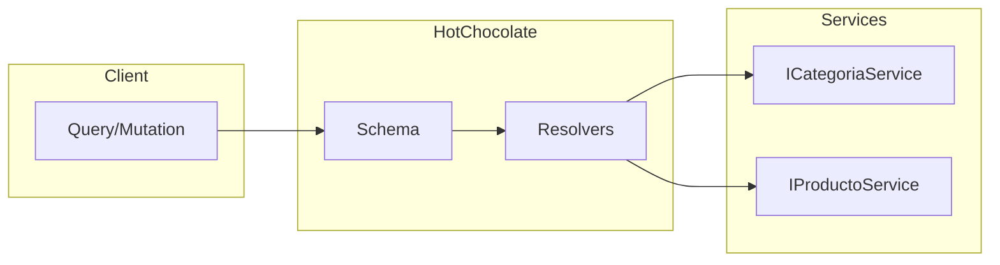

# 11. GraphQL con HotChocolate

GraphQL permite a los clientes solicitar exactamente los datos que necesitan, nada mas y nada menos.

---

## 1. Arquitectura GraphQL



---

## 2. Instalacion

```bash
dotnet add package GraphQL
dotnet add package GraphiQL
```

---

## 2. Schema y Tipos

```csharp
using GraphQL.Types;

namespace TiendaApi.Apis.GraphQL.Types;

public class CategoriaType : ObjectGraphType<CategoriaDto>
{
    public CategoriaType()
    {
        Name = "Categoria";
        Description = "Una categoria de productos";
        
        Field(c => c.Id).Description("ID de la categoria");
        Field(c => c.Nombre).Description("Nombre de la categoria");
    }
}

public class ProductoType : ObjectGraphType<ProductoDto>
{
    public ProductoType()
    {
        Name = "Producto";
        Description = "Un producto en la tienda";
        
        Field(p => p.Id).Description("ID del producto");
        Field(p => p.Nombre).Description("Nombre del producto");
        Field(p => p.Precio).Description("Precio del producto");
        Field(p => p.Stock).Description("Cantidad en stock");
        Field(p => p.CategoriaId).Description("ID de la categoria");
        Field(p => p.CategoriaNombre).Description("Nombre de la categoria");
    }
}
```

---

## 3. Query

```csharp
using GraphQL;
using GraphQL.Types;

namespace TiendaApi.Apis.GraphQL;

public class TiendaQuery : ObjectGraphType
{
    public TiendaQuery(
        ICategoriaService categoriaService,
        IProductoService productoService)
    {
        Name = "Query";

        Field<ListGraphType<ProductoType>>("productos")
            .Description("Obtener todos los productos")
            .ResolveAsync(async context =>
            {
                var resultado = await productoService.FindAllAsync();
                return resultado.Match(
                    onSuccess: productos => productos,
                    onFailure: _ => Enumerable.Empty<ProductoDto>()
                );
            });

        Field<ProductoType>("producto")
            .Description("Obtener un producto por ID")
            .Argument<NonNullGraphType<IdGraphType>>("id")
            .ResolveAsync(async context =>
            {
                var id = context.GetArgument<long>("id");
                var resultado = await productoService.FindByIdAsync(id);
                return resultado.Match(
                    onSuccess: producto => producto,
                    onFailure: _ => null
                );
            });

        Field<ListGraphType<CategoriaType>>("categorias")
            .Description("Obtener todas las categorias")
            .ResolveAsync(async context =>
            {
                var resultado = await categoriaService.FindAllAsync();
                return resultado.Match(
                    onSuccess: categorias => categorias,
                    onFailure: _ => Enumerable.Empty<CategoriaDto>()
                );
            });
    }
}
```

---

## 4. Registro en Program.cs

```csharp
using GraphQL;
using GraphQL.Types;

builder.Services.AddScoped<IDocumentExecuter, DocumentExecuter>();
builder.Services.AddScoped<ISchema, TiendaSchema>();
builder.Services.AddScoped<TiendaQuery>();
builder.Services.AddScoped<ProductoType>();
builder.Services.AddScoped<CategoriaType>();
```

---

## 5. Controlador GraphQL

```csharp
public class GraphQLController(
    IDocumentExecuter documentExecuter,
    ISchema schema,
    ILogger<GraphQLController> logger
) : ControllerBase {

    [HttpPost]
    public async Task<IActionResult> Post([FromBody] GraphQLRequest request)
    {
        if (string.IsNullOrWhiteSpace(request.Query))
            return BadRequest(new { message = "Query es requerida" });

        var result = await documentExecuter.ExecuteAsync(options =>
        {
            options.Schema = schema;
            options.Query = request.Query;
            options.Variables = request.Variables;
            options.OperationName = request.OperationName;
        });

        if (result.Errors?.Any() == true)
            return BadRequest(new { errors = result.Errors.Select(e => e.Message) });

        return Ok(result.Data);
    }
}
```

---

## 6. Ejemplo de Query

```graphql
query {
  productos {
    id
    nombre
    precio
    categoriaNombre
  }
}
```

---

## 7. Beneficios

- **Flexibilidad**: El cliente decide que datos recibir
- **Eficiencia**: Una sola peticion para multiples recursos
- **Tipado**: Schema fuertemente tipado
- **Documentacion**: Auto-documentacion del API
