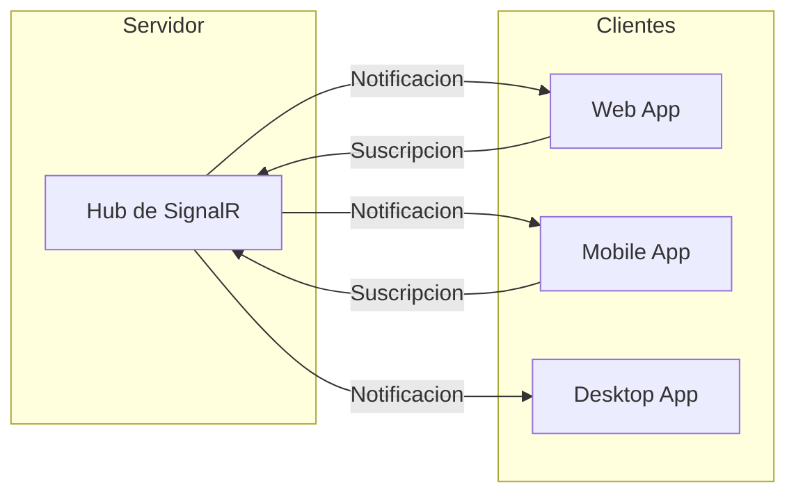

# 12. WebSockets con SignalR

SignalR permite comunicacion bidireccional en tiempo real entre servidor y clientes.

---

## 1. Conceptos



---

## 2. Hub de Productos

```csharp
using Microsoft.AspNetCore.SignalR;

namespace TiendaApi.Apis.WebSockets.Productos;

public class ProductoHub : Hub
{
    public override async Task OnConnectedAsync()
    {
        await base.OnConnectedAsync();
        Console.WriteLine($"Cliente conectado: {Context.ConnectionId}");
    }

    public override async Task OnDisconnectedAsync(Exception? exception)
    {
        await base.OnDisconnectedAsync(exception);
        Console.WriteLine($"Cliente desconectado: {Context.ConnectionId}");
    }
}
```

---

## 3. Handler de Notificaciones

```csharp
public class ProductoWebSocketHandler(
    IHubContext<ProductoHub> hubContext,
    ILogger<ProductoWebSocketHandler> logger
) {

    public async Task NotifyProductoCreatedAsync(ProductoDto producto)
    {
        logger.LogInformation("Notificando producto creado: {Id}", producto.Id);
        
        await hubContext.Clients.All.SendAsync("ProductoCreado", producto);
    }

    public async Task NotifyProductoUpdatedAsync(ProductoDto producto)
    {
        logger.LogInformation("Notificando producto actualizado: {Id}", producto.Id);
        
        await hubContext.Clients.All.SendAsync("ProductoActualizado", producto);
    }

    public async Task NotifyProductoDeletedAsync(long productoId)
    {
        logger.LogInformation("Notificando producto eliminado: {Id}", productoId);
        
        await hubContext.Clients.All.SendAsync("ProductoEliminado", productoId);
    }
}
```

---

## 4. Registro en Program.cs

```csharp
builder.Services.AddSignalR();
builder.Services.AddSingleton<ProductoWebSocketHandler>();

app.MapHub<ProductoHub>("/ws/v1/productos");
app.MapHub<PedidoHub>("/ws/v1/pedidos");
```

---

## 5. Uso desde el Servicio

```csharp
public class ProductoService(
    // ...
    ProductoWebSocketHandler webSocketHandler
) : IProductoService {

    public async Task<Result<ProductoDto, DomainError>> CreateAsync(ProductoRequestDto dto)
    {
        // ... creacion del producto
        
        var saved = await productoRepository.SaveAsync(producto);
        
        // Notificar a clientes conectados
        _ = Task.Run(async () =>
        {
            await webSocketHandler.NotifyProductoCreatedAsync(saved.ToDto());
        });
        
        return Result.Success<ProductoDto, DomainError>(saved.ToDto());
    }
}
```

---

## 6. Cliente JavaScript

```javascript
// Conectar al hub
const connection = new signalR.HubConnectionBuilder()
    .withUrl("/ws/v1/productos")
    .build();

// Recibir notificaciones
connection.on("ProductoCreado", (producto) => {
    console.log("Nuevo producto:", producto);
    // Actualizar UI
});

connection.on("ProductoActualizado", (producto) => {
    console.log("Producto actualizado:", producto);
});

connection.on("ProductoEliminado", (productoId) => {
    console.log("Producto eliminado:", productoId);
});

// Conectar
await connection.start();
```

---

## 7. Beneficios

- **Tiempo Real**: Notificaciones instantaneas
- **Bidireccional**: Servidor puede enviar datos al cliente
- **Escalable**: Soporta multiples clientes simultaneos
- **Simple**: API facil de usar
