# 13. API Versioning

El versionado de API permite evolucionar tu API sin romper clientes existentes.

---

## 1. Versionado de API

```mermaid
flowchart LR
    subgraph "Clientes"
        C1[App v1]
        C2[App v2]
    end
    
    subgraph "API"
        V1[&#47;api&#47;v1&#47;auth]
        V2[&#47;api&#47;v2&#47;auth]
    end
    
    C1 --> V1
    C2 --> V2
    V1 -.->|Backward Compatible| V2
```



---

## 2. Instalacion

```bash
dotnet add package Microsoft.AspNetCore.Mvc.Versioning
```

---

## 2. Configuracion en Program.cs

```csharp
using Microsoft.AspNetCore.Mvc;
using Microsoft.AspNetCore.Mvc.Versioning;

builder.Services.AddApiVersioning(options =>
{
    options.DefaultApiVersion = new ApiVersion(1, 0);
    options.AssumeDefaultVersionWhenUnspecified = true;
    options.ReportApiVersions = true;
});
```

---

## 3. Controlador Versionado

```csharp
using Microsoft.AspNetCore.Mvc;
using TiendaApi.Apis.Dtos.Usuarios;
using TiendaApi.Apis.Errors;
using TiendaApi.Apis.Services.Auth;

namespace TiendaApi.Apis.Controllers;

[ApiController]
[Route("api/v{version:apiVersion}/[controller]")]
[ApiVersion("1.0")]
[Produces("application/json")]
public class AuthController(
    IAuthService authService,
    ILogger<AuthController> logger
) : ControllerBase {

    [HttpPost("signup")]
    [ProducesResponseType(typeof(AuthResponseDto), StatusCodes.Status201Created)]
    public async Task<IActionResult> SignUp([FromBody] RegisterDto dto)
    {
        logger.LogInformation("Signup para: {Username}", dto.Username);
        var resultado = await authService.SignUpAsync(dto);

        return resultado.Match(
            response => CreatedAtAction(nameof(SignUp), response),
            error => error.Type switch {
                ErrorType.Validation => BadRequest(new { message = error.Message }),
                ErrorType.Conflict => Conflict(new { message = error.Message }),
                _ => StatusCode(500, new { message = error.Message })
            }
        );
    }

    [HttpPost("signin")]
    [ProducesResponseType(typeof(AuthResponseDto), StatusCodes.Status200OK)]
    public async Task<IActionResult> SignIn([FromBody] LoginDto dto)
    {
        logger.LogInformation("Signin para: {Username}", dto.Username);
        var resultado = await authService.SignInAsync(dto);

        return resultado.Match(
            response => Ok(response),
            error => error.Type switch {
                ErrorType.Unauthorized => Unauthorized(new { message = error.Message }),
                ErrorType.Validation => BadRequest(new { message = error.Message }),
                _ => StatusCode(500, new { message = error.Message })
            }
        );
    }
}
```

---

## 4. Endpoints Resultantes

```
POST /api/v1/auth/signup
POST /api/v1/auth/signin
```

---

## 5. Parametros de Versionado

```csharp
// Por ruta (recomendado)
[Route("api/v{version:apiVersion}/[controller]")]

// Por query string
builder.Services.AddApiVersioning(options =>
{
    options.ApiVersionReader = new QueryStringApiVersionReader("version");
});

// Por header
builder.Services.AddApiVersioning(options =>
{
    options.ApiVersionReader = new HeaderApiVersionReader("X-Api-Version");
});
```

---

## 6. Beneficios

- **Evolucion**: API puede cambiar sin afectar clientes
- **Claridad**: Clientes saben que version usan
- **Compatibilidad**: Versiones anteriores siguen funcionando
- **Documentacion**: Swagger muestra todas las versiones
