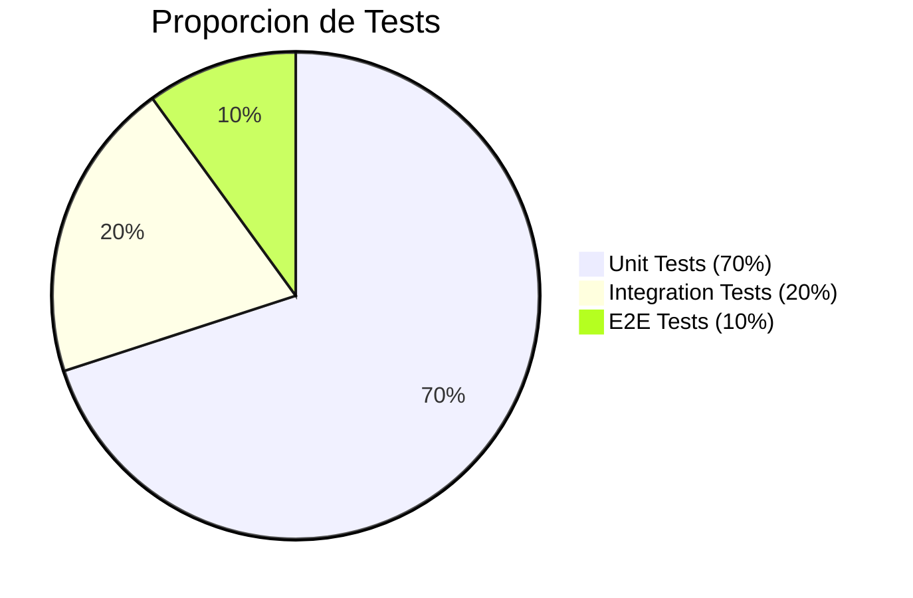

# 14. Unit Testing con NUnit y Moq

Los tests unitarios aseguran que cada componente funciona correctamente de forma aislada.

---

## 1. Piramide de Testing



---

## 2. Instalacion

```bash
dotnet add package NUnit
dotnet add package NUnit3TestAdapter
dotnet add package Moq
dotnet add package FluentAssertions
```

---

## 2. Estructura de Tests

```
TiendaApi.Tests/
├── Unit/
│   ├── Controllers/
│   │   ├── AuthControllerTests.cs
│   │   └── ProductosControllerTests.cs
│   ├── Services/
│   │   ├── CategoriaServiceTests.cs
│   │   └── ProductoServiceTests.cs
│   └── Mappers/
│       └── ProductoMapperTests.cs
```

---

## 3. Test de Controlador

```csharp
using FluentAssertions;
using Microsoft.AspNetCore.Mvc;
using Microsoft.Extensions.Logging;
using Moq;
using TiendaApi.Apis.Controllers;
using TiendaApi.Apis.Dtos.Categorias;
using TiendaApi.Apis.Errors;
using TiendaApi.Apis.Services.Categorias;

namespace TiendaApi.Tests.Unit.Controllers;

public class CategoriasControllerTests
{
    private readonly Mock<ICategoriaService> _mockService;
    private readonly CategoriasController _controller;

    public CategoriasControllerTests()
    {
        _mockService = new Mock<ICategoriaService>();
        _controller = new CategoriasController(_mockService.Object);
    }

    [Test]
    public async Task GetAll_ConCategoriasExistentes_RetornaOkConLista()
    {
        // Arrange
        var categorias = new List<CategoriaDto>
        {
            new() { Id = 1, Nombre = "Electronica" },
            new() { Id = 2, Nombre = "Ropa" }
        };

        _mockService.Setup(s => s.FindAllAsync())
            .ReturnsAsync(Result.Success<IEnumerable<CategoriaDto>, DomainError>(categorias));

        // Act
        var result = await _controller.GetAll();

        // Assert
        var okResult = result.Should().BeOfType<OkObjectResult>().Subject;
        var returnedCategorias = okResult.Value.Should().BeAssignableTo<IEnumerable<CategoriaDto>>().Subject;
        returnedCategorias.Should().HaveCount(2);
    }

    [Test]
    public async Task GetById_ConIdExistente_RetornaOkConCategoria()
    {
        // Arrange
        var categoria = new CategoriaDto { Id = 1, Nombre = "Electronica" };

        _mockService.Setup(s => s.FindByIdAsync(1))
            .ReturnsAsync(Result.Success<CategoriaDto, DomainError>(categoria));

        // Act
        var result = await _controller.GetById(1);

        // Assert
        var okResult = result.Should().BeOfType<OkObjectResult>().Subject;
        okResult.Value.Should().NotBeNull();
    }

    [Test]
    public async Task GetById_ConIdNoExistente_RetornaNotFound()
    {
        // Arrange
        _mockService.Setup(s => s.FindByIdAsync(999))
            .ReturnsAsync(Result.Failure<CategoriaDto, DomainError>(
                DomainError.NotFound("Categoria no encontrada")));

        // Act
        var result = await _controller.GetById(999);

        // Assert
        result.Should().BeOfType<NotFoundObjectResult>();
    }
}
```

---

## 4. Test de Servicio

```csharp
public class CategoriaServiceTests
{
    private readonly Mock<ICategoriaRepository> _mockRepository;
    private readonly Mock<ILogger<CategoriaService>> _mockLogger;
    private readonly CategoriaService _service;

    public CategoriaServiceTests()
    {
        _mockRepository = new Mock<ICategoriaRepository>();
        _mockLogger = new Mock<ILogger<CategoriaService>>();
        _service = new CategoriaService(_mockRepository.Object, _mockLogger.Object);
    }

    [Test]
    public async Task FindById_ConIdExistente_RetornaExito()
    {
        // Arrange
        var categoria = new Categoria { Id = 1, Nombre = "Electronica" };
        _mockRepository.Setup(r => r.FindByIdAsync(1))
            .ReturnsAsync(categoria);

        // Act
        var resultado = await _service.FindByIdAsync(1);

        // Assert
        resultado.IsSuccess.Should().BeTrue();
        resultado.Value.Id.Should().Be(1);
    }

    [Test]
    public async Task FindById_ConIdNoExistente_RetornaFallo()
    {
        // Arrange
        _mockRepository.Setup(r => r.FindByIdAsync(999))
            .ReturnsAsync((Categoria?)null);

        // Act
        var resultado = await _service.FindByIdAsync(999);

        // Assert
        resultado.IsFailure.Should().BeTrue();
        resultado.Error.Type.Should().Be(ErrorType.NotFound);
    }

    [Test]
    public async Task Create_ConNombreDuplicado_RetornaConflicto()
    {
        // Arrange
        var dto = new CategoriaRequestDto { Nombre = "Electronica" };
        _mockRepository.Setup(r => r.ExistsByNombreAsync("Electronica", null))
            .ReturnsAsync(true);

        // Act
        var resultado = await _service.CreateAsync(dto);

        // Assert
        resultado.IsFailure.Should().BeTrue();
        resultado.Error.Type.Should().Be(ErrorType.Conflict);
    }
}
```

---

## 5. Beneficios

- **Confianza**: Cambios seguros
- **Documentacion**: Tests documentan comportamiento esperado
- **Refactorizacion**: Cambios sin miedo
- **Regresion**: Detectar errores rapido
