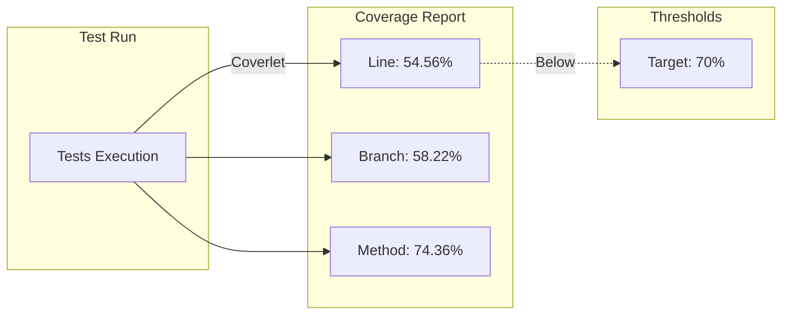

# 15. Code Coverage con Coverlet

El coverage de codigo mide que porcentaje del codigo esta probado por tests.

---

## 1. Metricas de Coverage



### Coverage Actual

| Métrica | Porcentaje | Objetivo |
|---------|------------|----------|
| **Lines** | 54.56% | 70% |
| **Branches** | 58.22% | 60% |
| **Methods** | 74.36% | 80% |

---

## 2. Instalacion

```bash
dotnet add package coverlet.collector
dotnet add package coverlet.msbuild
```

---

## 2. Configuracion en .csproj

```xml
<PropertyGroup>
  <CollectCoverage>true</CollectCoverage>
  <CoverageThreshold>0</CoverageThreshold>
  <CoverletOutputFormat>json,lcov,opencover</CoverletOutputFormat>
  <CoverletOutput>./coverage/</CoverletOutput>
</PropertyGroup>
```

---

## 3. Ejecutar Tests con Coverage

```bash
dotnet test --collect:"XPlat Code Coverage"
```

---

## 4. Reporte de Coverage Actual

```
+----------------+--------+--------+--------+
| Module         | Line   | Branch | Method |
+----------------+--------+--------+--------+
| TiendaApi.Apis | 54.56% | 58.22% | 74.36% |
+----------------+--------+--------+--------+

Total: 350 tests unitarios
```

---

## 5. Interpretar Coverage

| Coverage | Color | Significado |
|----------|-------|-------------|
| < 50% | Rojo | Insuficiente |
| 50-70% | Amarillo | Aceptable |
| 70-90% | Verde | Bueno |
| > 90% | Verde oscuro | Excelente |

---

## 6. Beneficios

- **Calidad**: Identificar codigo no probado
- **Confianza**: Mayor cobertura, mayor confianza
- **Mantenibilidad**: Facilita refactorizacion
- **Estandares**: Cumple requisitos de calidad
