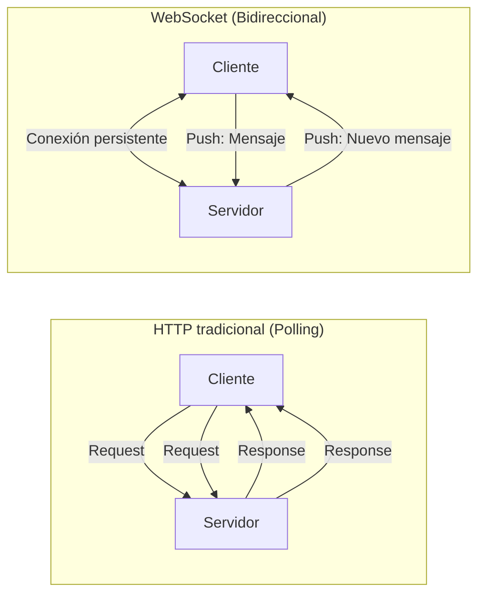
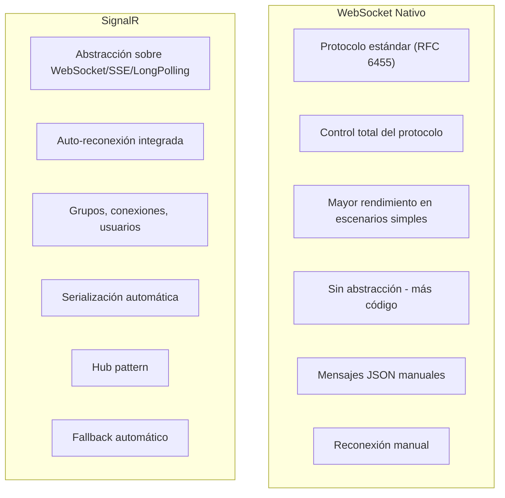
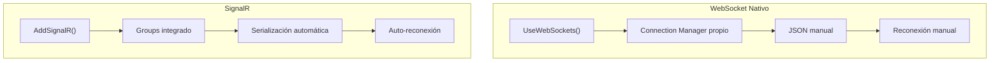

# 16. WebSockets y Comunicación en Tiempo Real

Este documento explica cómo implementar comunicación bidireccional en tiempo real usando WebSockets nativamente en ASP.NET Core, comparando con SignalR como alternativa.

---

## 16.1. ¿Qué es la Comunicación en Tiempo Real?

La comunicación en tiempo real permite que el servidor envíe datos a los clientes sin que estos lo soliciten, eliminando el patrón tradicional de request-response.



### ¿Cuándo Usar WebSockets?

| Caso de uso | Ejemplo | مناسب |
|-------------|---------|--------|
| **Notificaciones push** | "Tu pedido ha sido enviado" | ✅ WebSocket |
| **Chat en tiempo real** | Chat de soporte al cliente | ✅ WebSocket |
| **Live updates** | Dashboard de métricas | ✅ WebSocket |
| **Colaboración** | Editores colaborativos | ✅ WebSocket |
| **Gaming** | Multiplayer en tiempo real | ✅ WebSocket (RAW) |
| **API simple** | Consultas esporádicas | ❌ REST |

---

## 16.2. WebSocket vs SignalR - Comparación

### Diferencias Fundamentales



### Tabla Comparativa

| Aspecto | WebSocket Nativo | SignalR |
|---------|-----------------|---------|
| **Protocolo** | Solo WebSocket | WebSocket + fallback |
| **Conexión persistente** | Manual | Automática |
| **Grupos** | Implementar tú | Integrado |
| **Reconexión** | Manual | Automática |
| **Serialización** | JSON manual | Automática |
| **Rendimiento** | ✅ Mejor | ⚪ Buena |
| **Simplicidad** | ⚠️ Más código | ✅ Más fácil |
| **Escalabilidad** | Redis Pub/Sub manual | Redis backplane |
| **Debugging** | Más difícil | Más fácil |

### Pros y Contras

```mermaid
flowchart TD
    subgraph "WebSocket Nativo - Pros"
        A1["Rendimiento máximo"]
        A2["Control total"]
        A3["Sin dependencias adicionales"]
        A4["Protocolo estándar"]
    end
    
    subgraph "WebSocket Nativo - Contras"
        A5["Más código boilerplate"]
        A6["Reconexión manual"]
        A7["Grupos manuales"]
        A8["Serialización manual"]
    end
    
    subgraph "SignalR - Pros"
        B1["Fácil de usar"]
        B2["Auto-reconexión"]
        B3["Grup B4["Typeos integrados"]
       -safe con Hub"]
    end
    
    subgraph "SignalR - Contras"
        B5["Overhead adicional"]
        B6["Dependencia de Microsoft"]
        B7["Menos control"]
        B8["Solo .NET/JS clients"]
    end
    
    A1 --> A2 --> A3 --> A4
    A5 --> A6 --> A7 --> A8
    B1 --> B2 --> B3 --> B4
    B5 --> B6 --> B7 --> B8
```

---

## 16.3. WebSocket Nativo en ASP.NET Core

### Configuración de WebSockets

```csharp
var builder = WebApplication.CreateBuilder(args);

// Configurar CORS para WebSockets
builder.Services.AddCors(options =>
{
    options.AddPolicy("AllowWebSocketClients", policy =>
    {
        policy.WithOrigins("http://localhost:3000")
              .AllowAnyHeader()
              .AllowAnyMethod()
              .AllowCredentials();
    });
});

var app = builder.Build();

app.UseCors("AllowWebSocketClients");

// Configurar WebSocket middleware
app.UseWebSockets(new WebSocketOptions
{
    KeepAliveInterval = TimeSpan.FromMinutes(2),
    ReceiveBufferSize = 4096
});

// Endpoint WebSocket
app.Map("/ws", async context =>
{
    if (context.WebSocket.IsWebSocketRequest)
    {
        using var webSocket = await context.WebSocket.AcceptWebSocketAsync();
        await HandleWebSocketConnection(webSocket);
    }
    else
    {
        context.Response.StatusCode = StatusCodes.Status400BadRequest;
    }
});

app.Run();
```

---

## 16.4. Connection Manager

```csharp
using System.Collections.Concurrent;
using System.Net.WebSockets;
using System.Text;
using System.Text.Json;

namespace TiendaApi.Core.WebSockets;

public class WebSocketConnectionManager
{
    private readonly ConcurrentDictionary<string, WebSocket> _connections = new();
    private readonly ConcurrentDictionary<string, HashSet<string>> _userConnections = new();

    public string AddConnection(WebSocket webSocket)
    {
        var connectionId = Guid.NewGuid().ToString();
        _connections.TryAdd(connectionId, webSocket);
        return connectionId;
    }

    public void RemoveConnection(string connectionId)
    {
        _connections.TryRemove(connectionId, out _);
        
        foreach (var kvp in _userConnections)
        {
            kvp.Value.Remove(connectionId);
        }
    }

    public async Task SendMessageAsync(string connectionId, string message)
    {
        if (_connections.TryGetValue(connectionId, out var webSocket) && 
            webSocket.State == WebSocketState.Open)
        {
            var bytes = Encoding.UTF8.GetBytes(message);
            await webSocket.SendAsync(
                new ArraySegment<byte>(bytes),
                WebSocketMessageType.Text,
                true,
                CancellationToken.None);
        }
    }

    public async Task BroadcastAsync(string message)
    {
        var tasks = _connections
            .Where(kvp => kvp.Value.State == WebSocketState.Open)
            .Select(kvp => SendMessageAsync(kvp.Key, message));

        await Task.WhenAll(tasks);
    }

    public async Task SendToGroupAsync(string groupName, string message)
    {
        if (_userConnections.TryGetValue(groupName, out var connections))
        {
            var tasks = connections
                .Where(id => _connections.TryGetValue(id, out var ws) && ws.State == WebSocketState.Open)
                .Select(id => SendMessageAsync(id, message));

            await Task.WhenAll(tasks);
        }
    }

    public void AddToGroup(string connectionId, string groupName)
    {
        _userConnections.GetOrAdd(groupName, _ => new HashSet<string>()).Add(connectionId);
    }

    public void RemoveFromGroup(string connectionId, string groupName)
    {
        if (_userConnections.TryGetValue(groupName, out var connections))
        {
            connections.Remove(connectionId);
        }
    }
}

public class WebSocketMessage
{
    public string Type { get; set; } = string.Empty;
    public string? Payload { get; set; }
    public DateTime Timestamp { get; set; } = DateTime.UtcNow;
}
```

---

## 16.5. WebSocket Handler

```csharp
public class WebSocketHandler
{
    private readonly WebSocketConnectionManager _manager;
    private readonly ILogger<WebSocketHandler> _logger;
    private const int BufferSize = 4096;

    public WebSocketHandler(
        WebSocketConnectionManager manager,
        ILogger<WebSocketHandler> logger)
    {
        _manager = manager;
        _logger = logger;
    }

    public async Task HandleWebSocketConnection(WebSocket webSocket)
    {
        var connectionId = _manager.AddConnection(webSocket);
        _logger.LogInformation("WebSocket conectado: {ConnectionId}", connectionId);

        var buffer = new byte[BufferSize];

        try
        {
            while (webSocket.State == WebSocketState.Open)
            {
                var result = await webSocket.ReceiveAsync(
                    new ArraySegment<byte>(buffer),
                    CancellationToken.None);

                if (result.MessageType == WebSocketMessageType.Close)
                {
                    _logger.LogInformation(
                        "WebSocket cerrado: {ConnectionId}, Reason: {Reason}",
                        connectionId, result.CloseStatusDescription);
                    break;
                }

                if (result.MessageType == WebSocketMessageType.Text)
                {
                    var message = Encoding.UTF8.GetString(buffer, 0, result.Count);
                    await ProcessMessageAsync(connectionId, message);
                }
            }
        }
        catch (WebSocketException ex)
        {
            _logger.LogError(ex, "Error en WebSocket: {ConnectionId}", connectionId);
        }
        finally
        {
            _manager.RemoveConnection(connectionId);
            if (webSocket.State == WebSocketState.Open)
            {
                await webSocket.CloseAsync(
                    WebSocketCloseStatus.NormalClosure,
                    "Connection closed",
                    CancellationToken.None);
            }
        }
    }

    private async Task ProcessMessageAsync(string connectionId, string message)
    {
        try
        {
            var wsMessage = JsonSerializer.Deserialize<WebSocketMessage>(
                message, 
                new JsonSerializerOptions { PropertyNameCaseInsensitive = true });

            if (wsMessage == null) return;

            switch (wsMessage.Type.ToLower())
            {
                case "subscribe":
                    await HandleSubscriptionAsync(connectionId, wsMessage.Payload);
                    break;
                    
                case "unsubscribe":
                    await HandleUnsubscriptionAsync(connectionId, wsMessage.Payload);
                    break;
                    
                case "ping":
                    await SendPongAsync(connectionId);
                    break;
                    
                case "message":
                    await BroadcastMessageAsync(wsMessage.Payload);
                    break;
            }
        }
        catch (JsonException ex)
        {
            _logger.LogError(ex, "Error parseando mensaje WebSocket");
        }
    }

    private async Task HandleSubscriptionAsync(string connectionId, string? topic)
    {
        if (string.IsNullOrEmpty(topic)) return;
        
        _manager.AddToGroup(connectionId, topic);
        
        await SendMessageAsync(connectionId, JsonSerializer.Serialize(new
        {
            type = "subscribed",
            topic = topic,
            timestamp = DateTime.UtcNow
        }));
    }

    private async Task HandleUnsubscriptionAsync(string connectionId, string? topic)
    {
        if (string.IsNullOrEmpty(topic)) return;
        
        _manager.RemoveFromGroup(connectionId, topic);
        
        await SendMessageAsync(connectionId, JsonSerializer.Serialize(new
        {
            type = "unsubscribed",
            topic = topic,
            timestamp = DateTime.UtcNow
        }));
    }

    private async Task SendPongAsync(string connectionId)
    {
        await SendMessageAsync(connectionId, JsonSerializer.Serialize(new
        {
            type = "pong",
            timestamp = DateTime.UtcNow
        }));
    }

    private async Task BroadcastMessageAsync(string? payload)
    {
        if (string.IsNullOrEmpty(payload)) return;
        
        await _manager.BroadcastAsync(payload);
    }
}
```

---

## 16.6. Servicio de Notificaciones WebSocket

```csharp
namespace TiendaApi.Core.Services;

public interface IWebSocketNotificationService
{
    Task NotifyPedidoUpdateAsync(long pedidoId, PedidoUpdateDto update);
    Task NotifyProductoStockChangeAsync(long productoId, int nuevoStock);
    Task NotifyUserAsync(long userId, NotificacionDto notificacion);
    Task BroadcastAsync(string message);
}

public class WebSocketNotificationService : IWebSocketNotificationService
{
    private readonly WebSocketConnectionManager _manager;

    public WebSocketNotificationService(WebSocketConnectionManager manager)
    {
        _manager = manager;
    }

    public async Task NotifyPedidoUpdateAsync(long pedidoId, PedidoUpdateDto update)
    {
        var message = JsonSerializer.Serialize(new WebSocketMessage
        {
            Type = "pedido_update",
            Payload = JsonSerializer.Serialize(update),
            Timestamp = DateTime.UtcNow
        });

        await _manager.SendToGroupAsync($"pedido_{pedidoId}", message);
        await _manager.SendToGroupAsync($"user_{update.UsuarioId}", message);
    }

    public async Task NotifyProductoStockChangeAsync(long productoId, int nuevoStock)
    {
        var message = JsonSerializer.Serialize(new WebSocketMessage
        {
            Type = "producto_stock",
            Payload = JsonSerializer.Serialize(new
            {
                productoId,
                stock = nuevoStock
            }),
            Timestamp = DateTime.UtcNow
        });

        await _manager.SendToGroupAsync($"producto_{productoId}", message);
    }

    public async Task NotifyUserAsync(long userId, NotificacionDto notificacion)
    {
        var message = JsonSerializer.Serialize(new WebSocketMessage
        {
            Type = "notificacion",
            Payload = JsonSerializer.Serialize(notificacion),
            Timestamp = DateTime.UtcNow
        });

        await _manager.SendToGroupAsync($"user_{userId}", message);
    }

    public async Task BroadcastAsync(string message)
    {
        await _manager.BroadcastAsync(message);
    }
}
```

---

## 16.7. Integración con Servicios de Negocio

```csharp
public class PedidoService(
    IPedidoRepository pedidoRepository,
    IWebSocketNotificationService notificationService,
    IValidator<CreatePedidoRequest> validator)
{
    public async Task<Result<Pedido, Error>> CreateAsync(CreatePedidoRequest request)
    {
        var validationResult = await validator.ValidateAsync(request);
        if (!validationResult.IsValid)
        {
            return Result.Failure<Pedido, Error>(
                Errors.Pedidos.DatosInvalidos(validationResult.Errors));
        }

        var pedido = new Pedido
        {
            UsuarioId = request.UsuarioId,
            Estado = PedidoEstado.Pendiente,
            CreatedAt = DateTime.UtcNow
        };

        var result = await pedidoRepository.AddAsync(pedido);

        if (result.IsSuccess)
        {
            // Notificar por WebSocket
            await notificationService.NotifyUserAsync(
                request.UsuarioId,
                new NotificacionDto
                {
                    Titulo = "Pedido creado",
                    Mensaje = $"Tu pedido #{pedido.Id} ha sido creado",
                    Tipo = "pedido",
                    Fecha = DateTime.UtcNow
                });
        }

        return result;
    }

    public async Task<Result<Pedido, Error>> UpdateEstadoAsync(long pedidoId, string nuevoEstado)
    {
        var result = await pedidoRepository.UpdateEstadoAsync(pedidoId, nuevoEstado);

        if (result.IsSuccess)
        {
            await notificationService.NotifyPedidoUpdateAsync(
                pedidoId,
                new PedidoUpdateDto
                {
                    PedidoId = pedidoId,
                    Estado = nuevoEstado,
                    FechaActualizacion = DateTime.UtcNow
                });
        }

        return result;
    }
}
```

---

## 16.8. Cliente JavaScript WebSocket

```html
<script>
class WebSocketClient {
    constructor(url) {
        this.url = url;
        this.socket = null;
        this.reconnectInterval = 5000;
        this.maxReconnectAttempts = 10;
        this.reconnectAttempts = 0;
        this.handlers = new Map();
    }

    connect() {
        this.socket = new WebSocket(this.url);

        this.socket.onopen = () => {
            console.log('WebSocket conectado');
            this.reconnectAttempts = 0;
            this.emit('connected');
        };

        this.socket.onmessage = (event) => {
            try {
                const message = JSON.parse(event.data);
                this.handleMessage(message);
            } catch (error) {
                console.error('Error parseando mensaje:', error);
            }
        };

        this.socket.onclose = (event) => {
            console.log('WebSocket cerrado:', event.code, event.reason);
            this.emit('disconnected', event);
            this.scheduleReconnect();
        };

        this.socket.onerror = (error) => {
            console.error('Error WebSocket:', error);
            this.emit('error', error);
        };
    }

    scheduleReconnect() {
        if (this.reconnectAttempts >= this.maxReconnectAttempts) {
            console.error('Máximo intentos de reconexión alcanzados');
            this.emit('maxReconnectAttemptsReached');
            return;
        }

        this.reconnectAttempts++;
        setTimeout(() => this.connect(), this.reconnectInterval);
    }

    handleMessage(message) {
        const handler = this.handlers.get(message.type);
        if (handler) {
            handler(message);
        }
        this.emit('message', message);
    }

    send(type, payload) {
        if (this.socket && this.socket.readyState === WebSocket.OPEN) {
            const message = JSON.stringify({
                type: type,
                payload: payload,
                timestamp: new Date().toISOString()
            });
            this.socket.send(message);
        } else {
            console.warn('WebSocket no conectado');
        }
    }

    subscribe(topic) {
        this.send('subscribe', topic);
    }

    unsubscribe(topic) {
        this.send('unsubscribe', topic);
    }

    on(event, handler) {
        if (!this.handlers.has(event)) {
            this.handlers.set(event, []);
        }
        this.handlers.get(event).push(handler);
    }

    emit(event, data) {
        const handlers = this.handlers.get(event);
        if (handlers) {
            handlers.forEach(handler => handler(data));
        }
    }

    disconnect() {
        if (this.socket) {
            this.socket.close();
        }
    }
}

// Uso
const wsClient = new WebSocketClient('ws://localhost:5000/ws');

wsClient.on('connected', () => {
    wsClient.subscribe('pedido_1');
    wsClient.subscribe('user_123');
});

wsClient.on('pedido_update', (message) => {
    console.log('Pedido actualizado:', message);
});

wsClient.on('notificacion', (message) => {
    console.log('Nueva notificación:', message);
});

wsClient.connect();
</script>
```

---

## 16.9. SignalR como Alternativa

SignalR proporciona una abstracción con características adicionales:

```csharp
// SignalR Hub
public class NotificacionesHub : Hub
{
    public override async Task OnConnectedAsync()
    {
        await base.OnConnectedAsync();
    }

    public async Task SubscribeToPedido(long pedidoId)
    {
        await Groups.AddToGroupAsync(Context.ConnectionId, $"pedido_{pedidoId}");
    }
}

// Configuración SignalR
builder.Services.AddSignalR();
app.MapHub<NotificacionesHub>("/hubs/notificaciones");
```

### Comparación de Implementación



---

## 16.10. Resumen y Buenas Prácticas

### Cuándo Usar Qué

| Escenario | Recomendación | Razón |
|-----------|---------------|-------|
| Chat simple | WebSocket nativo | Menos overhead |
| Chat complejo | SignalR | Groups, history |
| Notificaciones | SignalR | Auto-reconexión |
| Gaming | WebSocket nativo | Máximo rendimiento |
| Dashboard | SignalR | Facilidad |

### Buenas Prácticas

```mermaid
flowchart TB
    subgraph "Seguridad"
        A1["WSS (WebSocket Secure)"]
        A2["Autenticación JWT"]
        A3["Validar mensajes"]
    end
    
    subgraph "Rendimiento"
        B1["Compresión"]
        B2["Heartbeat"]
        B3["Límite de conexiones"]
    end
    
    subgraph "Escalabilidad"
        C1["Redis Pub/Sub"]
        C2["Sticky sessions"]
        C3["Connection limits"]
    end
    
    subgraph "Monitoring"
        D1["Conexiones activas"]
        D2["Métricas de mensajes"]
        D3["Logs de desconexión"]
    end
    
    A1 --> A2 --> A3
    B1 --> B2 --> B3
    C1 --> C2 --> C3
    D1 --> D2 --> D3
```



### Siguientes Pasos

Con comunicación en tiempo real dominada, el siguiente paso es aprender sobre logging y monitoreo.

### Recursos Adicionales

- WebSocket API: https://docs.microsoft.com/aspnet/core/fundamentals/websockets
- SignalR: https://docs.microsoft.com/aspnet/core/signalr
- WebSocket Protocol RFC: https://tools.ietf.org/html/rfc6455
