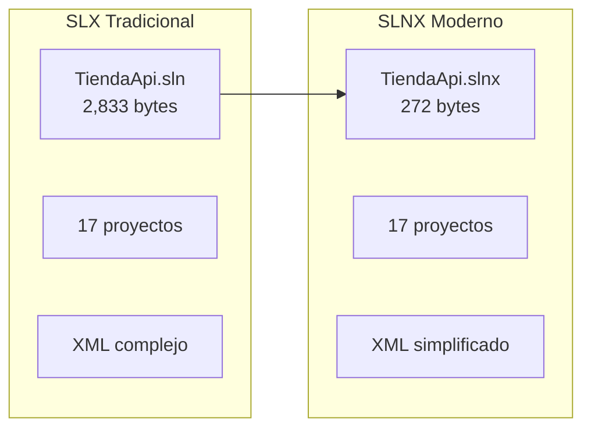
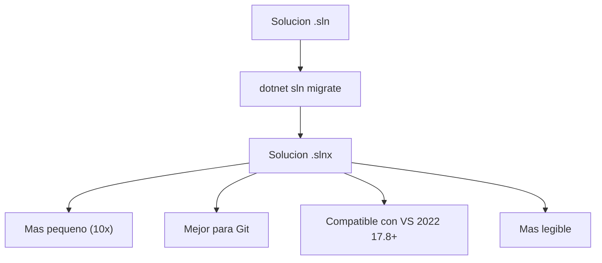

# 17. Formato de Solucion .slnx

El formato .slnx es el nuevo formato de solucion de .NET que reemplaza al tradicional .sln.

---

## 1. Comparacion de Formatos



| Aspecto | .sln | .slnx |
|---------|------|-------|
| Tamanio | 2.8 KB | 0.27 KB |
| Legibilidad | Media | Alta |
| Versionado | Git frecuente | Git estable |
| Editor | Solo VS | Any editor |

---

## 2. Formato .slnx

```xml
<Solution>
  <Configurations>
    <Platform Name="Any CPU" />
    <Platform Name="x64" />
    <Platform Name="x86" />
  </Configurations>
  <Project Path="TiendaApi.Apis/TiendaApi.csproj" />
  <Project Path="TiendaApi.Tests/TiendaApi.Tests.csproj" />
</Solution>
```

---

## 3. Generar .slnx desde .sln

```bash
dotnet sln migrate
```

---

## 4. Beneficios del .slnx



- **Eficiencia**: Archivos 10x mas pequenos
- **Git**: Mejor manejo de merge conflicts
- **Portabilidad**: Facil edicion en cualquier editor
- **Futuro**: Direccion de Microsoft

---

## 5. Comandos .slnx

```bash
# Migrar a slnx
dotnet sln migrate

# Listar proyectos
dotnet slnx list

# Agregar proyecto
dotnet slnx add TiendaApi.Apis/TiendaApi.csproj

# Remover proyecto
dotnet slnx remove TiendaApi.Apis/TiendaApi.csproj
```

---

## 6. Estructura del Proyecto

```
TiendaDawApi-NetCore/
├── TiendaApi.slnx          ← Nuevo formato
├── TiendaApi.Apis/         ← API REST
│   ├── Controllers/
│   ├── Services/
│   ├── Repositories/
│   ├── Dtos/
│   ├── Models/
│   ├── Mappers/
│   ├── Dockerfile
│   └── TiendaApi.csproj
│
├── TiendaApi.Tests/         ← Tests Unitarios
│   ├── Unit/
│   ├── Integration/
│   └── TiendaApi.Tests.csproj
│
├── doc/                      ← Documentacion
│   ├── 01-arquitectura-pipeline-di.md
│   ├── 02-constructores-primarios.md
│   └── ...
│
├── docker-compose.yml
└── .gitignore
```
