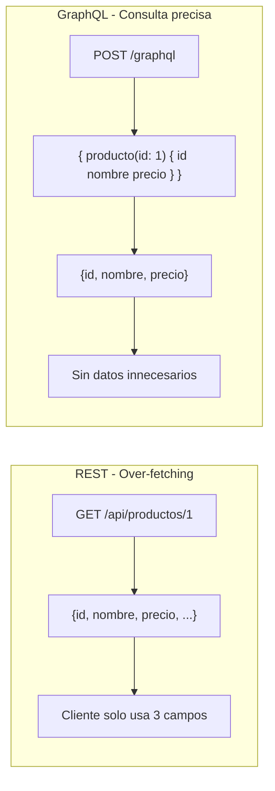
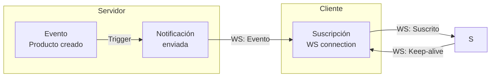
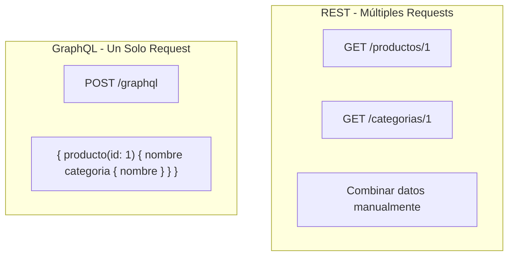
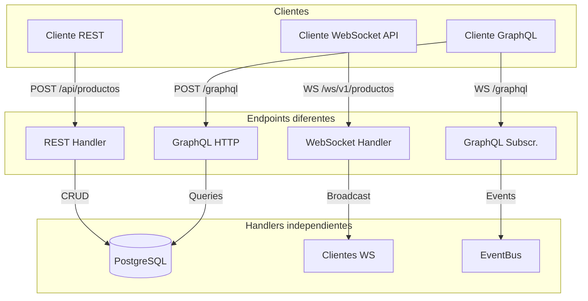
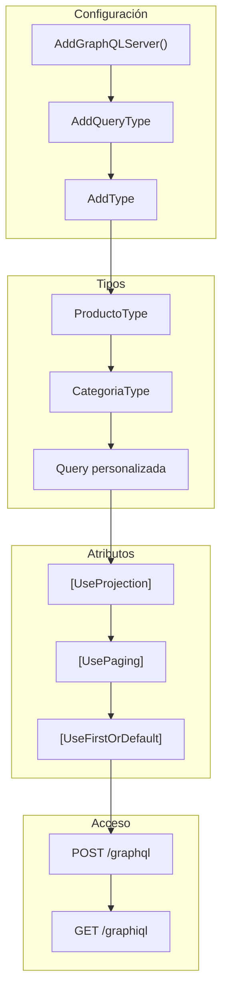

# 20. GraphQL con HotChocolate

Este documento explica cómo implementar una API GraphQL en .NET usando **HotChocolate**, la biblioteca más popular para GraphQL en el ecosistema .NET. Se describe la configuración, tipos, queries, y comparación con REST.

---

## 20.1. ¿Qué es GraphQL?

**GraphQL** es un lenguaje de consulta para APIs desarrollado por Facebook. A diferencia de REST, GraphQL permite al cliente especificar exactamente qué datos necesita, evitando el over-fetching y under-fetching.



### Comparación REST vs GraphQL

| Aspecto | REST | GraphQL |
|---------|------|---------|
| **Endpoint** | Multiple endpoints | Un solo endpoint |
| **Datos** | Respuesta fija | Consulta flexible |
| **Over-fetching** | Sí | No |
| **Under-fetching** | Sí | No |
| **Versionado** | En URL (/v1/) | Sin versionado típico |
| **Documentación** | Swagger/OpenAPI | Introspection |
| **Curva aprendizaje** | Baja | Media |

---

## 20.2. Instalación de HotChocolate

### Paquetes Necesarios

```bash
# Paquete principal de HotChocolate
dotnet add package HotChocolate.AspNetCore

# Paquetes adicionales útiles
dotnet add package HotChocolate.Data        # Para filtrado y paginación
dotnet add package HotChocolate.Stitching   # Para federar esquemas
```

### Dependencias en el Proyecto

Del archivo `Program.cs`:

```csharp
// GraphQL
Log.Information("🔍 Configurando GraphQL con HotChocolate...");
builder.Services
    .AddGraphQLServer()
    .AddQueryType<TiendaQuery>()
    .AddType<ProductoType>()
    .AddType<CategoriaType>()
    .ModifyRequestOptions(opt => opt.IncludeExceptionDetails = builder.Environment.IsDevelopment());
```

### Endpoint de GraphQL

```csharp
// GraphQL Endpoint
Log.Information("🔍 Configurando endpoint GraphQL: /graphql");
app.MapGraphQL();
```

---

## 20.3. Configuración en Program.cs

### Configuración Básica

```csharp
using HotChocolate;

var builder = WebApplication.CreateBuilder(args);

// Agregar GraphQL
builder.Services
    .AddGraphQLServer()
    .AddQueryType<Query>();
```

### Configuración Completa

```csharp
builder.Services
    .AddGraphQLServer()
    .AddQueryType<Query>()                    // Tipo de consulta raíz
    .AddType<ProductoType>()                  // Tipos personalizados
    .AddType<CategoriaType>()
    .AddMutationType<Mutation>()              // Mutaciones (opcional)
    .AddSubscriptionType<Subscription>()      // Suscripciones (opcional)
    
    // Configuración de errores
    .ModifyRequestOptions(opt => 
        opt.IncludeExceptionDetails = builder.Environment.IsDevelopment())
    
    // Introspection habilitada por defecto
    .AddIntrospectionTypes()
    
    // Formateo de errores
    .AddErrorFilter(error => 
    {
        // Personalizar errores según el entorno
        return error;
    });
```

### Diferentes Entornos

```csharp
// Desarrollo: Mostrar detalles de errores
.ModifyRequestOptions(opt => opt.IncludeExceptionDetails = true)

// Producción: Ocultar detalles
.ModifyRequestOptions(opt => opt.IncludeExceptionDetails = false)
```

---

## 20.4. TiendaQuery: Consultas del Proyecto

Del archivo `TiendaQuery.cs`:

### Query Raíz

```csharp
namespace TiendaApi.Apis.GraphQL.Types;

public class TiendaQuery
{
    // Consulta básica: Obtener todos los productos
    [UseFirstOrDefault]
    [UseProjection]
    public IQueryable<Producto> GetProductos(
        [Service] IProductoRepository productoRepository)
    {
        return productoRepository.FindAllAsNoTracking();
    }

    // Obtener producto por ID
    [UseFirstOrDefault]
    public async Task<Producto?> GetProducto(
        long id,
        [Service] IProductoRepository productoRepository)
    {
        return await productoRepository.FindByIdAsync(id);
    }

    // Paginación
    [UsePaging(MaxPageSize = 100, DefaultPageSize = 10)]
    public IQueryable<Producto> GetProductosPaged(
        [Service] IProductoRepository productoRepository)
    {
        return productoRepository.FindAllAsNoTracking();
    }

    // Categorías
    [UseFirstOrDefault]
    [UseProjection]
    public IQueryable<Categoria> GetCategorias(
        [Service] ICategoriaRepository categoriaRepository)
    {
        return categoriaRepository.FindAllAsNoTracking();
    }

    [UseFirstOrDefault]
    public async Task<Categoria?> GetCategoria(
        long id,
        [Service] ICategoriaRepository categoriaRepository)
    {
        return await categoriaRepository.FindByIdAsync(id);
    }

    [UsePaging(MaxPageSize = 100, DefaultPageSize = 10)]
    public IQueryable<Categoria> GetCategoriasPaged(
        [Service] ICategoriaRepository categoriaRepository)
    {
        return categoriaRepository.FindAllAsNoTracking();
    }
}
```

### Atributos de HotChocolate

| Atributo | Descripción |
|----------|-------------|
| `[UseFirstOrDefault]` | Convierte IQueryable a elemento único |
| `[UseProjection]` | Permite seleccionar campos específicos |
| `[UsePaging]` | Añade paginación automática |
| `[UseFiltering]` | Añade filtrado automático |
| `[UseSorting]` | Añade ordenamiento automático |
| `[Service]` | Inyecta dependencias |

---

## 20.5. Tipos de GraphQL

### ProductoType

Del archivo `ProductoType.cs`:

```csharp
using HotChocolate.Types;
using TiendaApi.Apis.Models;

namespace TiendaApi.Apis.GraphQL.Types;

public class ProductoType : ObjectType<Producto>
{
    protected override void Configure(IObjectTypeDescriptor<Producto> descriptor)
    {
        descriptor.Name("Producto");
        descriptor.Description("Entidad Producto");

        // Definir campos disponibles
        descriptor.Field(p => p.Id)
            .Type<NonNullType<IdType>>()
            .Description("El ID del producto");

        descriptor.Field(p => p.Nombre)
            .Type<NonNullType<StringType>>()
            .Description("El nombre del producto");

        descriptor.Field(p => p.Descripcion)
            .Type<StringType>()
            .Description("La descripción del producto");

        descriptor.Field(p => p.Precio)
            .Type<NonNullType<DecimalType>>()
            .Description("El precio del producto");

        descriptor.Field(p => p.Stock)
            .Type<NonNullType<IntType>>()
            .Description("Cantidad en stock");

        descriptor.Field(p => p.Imagen)
            .Type<StringType>()
            .Description("URL de la imagen");

        descriptor.Field(p => p.CategoriaId)
            .Type<NonNullType<IntType>>()
            .Description("El ID de la categoría");

        descriptor.Field(p => p.CreatedAt)
            .Type<NonNullType<DateTimeType>>()
            .Description("Fecha de creación");

        descriptor.Field(p => p.UpdatedAt)
            .Type<NonNullType<DateTimeType>>()
            .Description("Fecha de última actualización");

        descriptor.Field(p => p.IsDeleted)
            .Type<NonNullType<BooleanType>>()
            .Description("Si el producto está eliminado");

        // Campo con relación a otra entidad
        descriptor.Field(p => p.Categoria)
            .Type<CategoriaType>()
            .Description("La categoría del producto");
    }
}
```

### CategoriaType

Del archivo `CategoriaType.cs`:

```csharp
using HotChocolate.Types;
using TiendaApi.Apis.Models;

namespace TiendaApi.Apis.GraphQL.Types;

public class CategoriaType : ObjectType<Categoria>
{
    protected override void Configure(IObjectTypeDescriptor<Categoria> descriptor)
    {
        descriptor.Name("Categoria");
        descriptor.Description("Entidad Categoria");

        descriptor.Field(c => c.Id)
            .Type<NonNullType<IdType>>()
            .Description("El ID de la categoría");

        descriptor.Field(c => c.Nombre)
            .Type<NonNullType<StringType>>()
            .Description("El nombre de la categoría");

        descriptor.Field(c => c.CreatedAt)
            .Type<NonNullType<DateTimeType>>()
            .Description("Fecha de creación");

        descriptor.Field(c => c.UpdatedAt)
            .Type<NonNullType<DateTimeType>>()
            .Description("Fecha de última actualización");

        descriptor.Field(c => c.IsDeleted)
            .Type<NonNullType<BooleanType>>()
            .Description("Si la categoría está eliminada");
    }
}
```

---

## 20.6. Tipos de Datos en GraphQL

### Escalares

| GraphQL | .NET | Descripción |
|---------|------|-------------|
| `ID` | `string` | Identificador único |
| `String` | `string` | Cadena de texto |
| `Int` | `int` | Entero de 32 bits |
| `Float` | `double` | Número decimal |
| `Boolean` | `bool` | Verdadero/Falso |
| `DateTime` | `DateTime` | Fecha y hora |
| `Decimal` | `decimal` | Decimal preciso |

### Tipos No Nulos

```csharp
// Campo obligatorio (NonNull)
descriptor.Field(p => p.Nombre)
    .Type<NonNullType<StringType>>()

// Campo opcional
descriptor.Field(p => p.Descripcion)
    .Type<StringType>()
```

---

## 20.7. GraphiQL: Herramienta de Desarrollo

El proyecto incluye una interfaz GraphiQL para probar las consultas:

```csharp
app.MapGet("/graphiql", async context =>
{
    context.Response.ContentType = "text/html";
    await context.Response.WriteAsync(@"
<!DOCTYPE html>
<html>
<head>
    <title>GraphiQL</title>
    <link href=""https://unpkg.com/graphiql/graphiql.min.css"" rel=""stylesheet"" />
</head>
<body style=""margin: 0;"">
    <div id=""graphiql"" style=""height: 100vh;""></div>
    <script crossorigin src=""https://unpkg.com/react/umd/react.production.min.js""></script>
    <script crossorigin src=""https://unpkg.com/react-dom/umd/react-dom.production.min.js""></script>
    <script crossorigin src=""https://unpkg.com/graphiql/graphiql.min.js""></script>
    <script>
        const fetcher = GraphiQL.createFetcher({ url: '/graphql' });
        ReactDOM.render(
            React.createElement(GraphiQL, { fetcher: fetcher }),
            document.getElementById('graphiql')
        );
    </script>
</body>
</html>");
});
```

### Acceso a GraphiQL

```
Desarrollo: http://localhost:5000/graphiql
Producción: http://tu-dominio/graphiql
```

---

## 20.8. Consultas de Ejemplo

### Obtener Todos los Productos

```graphql
query {
  productos {
    id
    nombre
    precio
    stock
  }
}
```

### Obtener Producto Específico

```graphql
query {
  producto(id: 1) {
    id
    nombre
    descripcion
    precio
    categoria {
      nombre
    }
  }
}
```

### Con Paginación

```graphql
query {
  productosPaged(first: 10) {
    nodes {
      id
      nombre
      precio
    }
    pageInfo {
      hasNextPage
      hasPreviousPage
    }
    totalCount
  }
}
```

### Con Filtrado

```graphql
query {
  productos(where: { precio: { gt: 100 } }) {
    id
    nombre
    precio
  }
}
```

### Con Ordenamiento

```graphql
query {
  productos(order: [{ precio: DESC }]) {
    id
    nombre
    precio
  }
}
```

---

## 20.9. Mutations (Crear, Actualizar, Eliminar)

Las mutations son operaciones que modifican datos en el servidor. Son el equivalente a los métodos POST, PUT, PATCH y DELETE en REST. En GraphQL, las mutations se definen en una clase separada llamada `Mutation` y se registran en el esquema.

### Estructura de una Mutation

Una mutation típica sigue el patrón de entrada-salida: recibe un input, procesa la operación, y devuelve un resultado. Esto permite al cliente saber si la operación fue exitosa y obtener los datos actualizados.

```csharp
public class Mutation
{
    public async Task<Producto> CreateProducto(
        CreateProductoInput input,
        [Service] IProductoRepository repository)
    {
        var producto = new Producto
        {
            Nombre = input.Nombre,
            Descripcion = input.Descripcion,
            Precio = input.Precio,
            Stock = input.Stock,
            CategoriaId = input.CategoriaId
        };

        return await repository.AddAsync(producto);
    }

    public async Task<Producto?> UpdateProducto(
        long id,
        UpdateProductoInput input,
        [Service] IProductoRepository repository)
    {
        var producto = await repository.FindByIdAsync(id);
        if (producto == null) return null;

        producto.Nombre = input.Nombre ?? producto.Nombre;
        producto.Descripcion = input.Descripcion ?? producto.Descripcion;
        producto.Precio = input.Precio ?? producto.Precio;
        producto.Stock = input.Stock ?? producto.Stock;

        return await repository.UpdateAsync(producto);
    }

    public async Task<bool> DeleteProducto(
        long id,
        [Service] IProductoRepository repository)
    {
        return await repository.DeleteAsync(id);
    }
}
```

### Input Types para Mutations

Los input types son objetos que agrupan los parámetros de una mutation. Usar input types es preferible a pasar muchos parámetros sueltos porque facilita la evolución del esquema sin romper consultas existentes.

```csharp
// Input para crear producto
public record CreateProductoInput(
    string Nombre,
    string? Descripcion,
    decimal Precio,
    int Stock,
    long CategoriaId
);

// Input para actualizar producto (todos los campos son opcionales)
public record UpdateProductoInput(
    string? Nombre,
    string? Descripcion,
    decimal? Precio,
    int? Stock
);
```

### Mutation Completa con Validación

Esta implementación muestra cómo integrar validación y manejo de errores en las mutations, siguiendo el patrón de Result que usa el proyecto.

```csharp
public class ProductoMutation
{
    public async Task<Result<Producto, DomainError>> CreateProducto(
        CreateProductoInput input,
        [Service] IProductoService productoService)
    {
        var dto = new ProductoCreateDto
        {
            Nombre = input.Nombre,
            Descripcion = input.Descripcion,
            Precio = input.Precio,
            Stock = input.Stock,
            CategoriaId = input.CategoriaId
        };

        return await productoService.CreateAsync(dto);
    }

    public async Task<Result<bool, DomainError>> DeleteProducto(
        long id,
        [Service] IProductoService productoService)
    {
        return await productoService.DeleteAsync(id);
    }
}
```

### Registrar Mutations en el Servidor

```csharp
builder.Services
    .AddGraphQLServer()
    .AddQueryType<Query>()
    .AddMutationType<ProductoMutation>()  // Añadir mutations
    .AddType<ProductoType>()
    .AddType<CategoriaType>();
```

### Ejemplos de Mutations en GraphQL

**Crear producto:**

```graphql
mutation CreateProducto($input: CreateProductoInput!) {
  createProducto(input: $input) {
    id
    nombre
    precio
    stock
  }
}
```

**Variables:**

```json
{
  "input": {
    "nombre": "Nuevo Producto",
    "descripcion": "Descripción del producto",
    "precio": 99.99,
    "stock": 50,
    "categoriaId": 1
  }
}
```

**Respuesta:**

```json
{
  "data": {
    "createProducto": {
      "id": 10,
      "nombre": "Nuevo Producto",
      "precio": 99.99,
      "stock": 50
    }
  }
}
```

**Actualizar producto:**

```graphql
mutation UpdateProducto($id: Long!, $input: UpdateProductoInput!) {
  updateProducto(id: $id, input: $input) {
    id
    nombre
    precio
    stock
  }
}
```

**Variables:**

```json
{
  "id": 1,
  "input": {
    "precio": 1199.99,
    "stock": 15
  }
}
```

**Eliminar producto:**

```graphql
mutation DeleteProducto($id: Long!) {
  deleteProducto(id: $id)
}
```

**Respuesta:**

```json
{
  "data": {
    "deleteProducto": true
  }
}
```

---

## 20.10. Subscriptions (Tiempo Real)

Las subscriptions permiten recibir actualizaciones en tiempo real cuando ocurren eventos en el servidor. Son ideales para notificaciones, dashboards en vivo, y aplicaciones que requieren datos actualizados instantáneamente. HotChocolate usa WebSockets para implementar subscriptions.

### Concepto de Subscriptions

A diferencia de las queries y mutations que siguen el patrón request-response, las subscriptions mantienen una conexión abierta y el servidor envía datos cuando ocurren eventos. El cliente se suscribe a eventos específicos y recibe notificaciones cuando estos ocurren.



### Implementación de Suscripciones

```csharp
public class ProductoSubscription
{
    [Subscribe]
    [Topic]
    public EventProductoCreated OnProductoCreated(
        [EventMessage] EventProductoCreated message)
    {
        return message;
    }
}

public record EventProductoCreated(
    long ProductoId,
    string Nombre,
    decimal Precio,
    DateTime CreatedAt
);
```

### Registro de Suscripciones

```csharp
builder.Services
    .AddGraphQLServer()
    .AddQueryType<Query>()
    .AddMutationType<Mutation>()
    .AddSubscriptionType<ProductoSubscription>()
    .AddWebSocketTransport()
    .AddInMemorySubscriptions();
```

### Configuración del Endpoint WebSocket

```csharp
app.UseWebSockets(new WebSocketOptions
{
    KeepAliveInterval = TimeSpan.FromMinutes(2)
});

app.MapGraphQL();
```

### Ejemplo de Suscripción en Cliente

**Suscribirse a nuevos productos:**

```graphql
subscription OnProductoCreado {
  onProductoCreated {
    productoId
    nombre
    precio
    createdAt
  }
}
```

**Respuesta cuando se crea un producto:**

```json
{
  "data": {
    "onProductoCreated": {
      "productoId": 11,
      "nombre": "Producto en Tiempo Real",
      "precio": 49.99,
      "createdAt": "2026-01-17T10:30:00Z"
    }
  }
}
```

### Subscription para Notificaciones por Rol

```csharp
public class PedidoSubscription
{
    [Subscribe]
    [Topic]
    public EventPedidoEstadoChanged OnPedidoEstadoChanged(
        [Topic] long usuarioId,
        [EventMessage] EventPedidoEstadoChanged message)
    {
        return message;
    }
}

public record EventPedidoEstadoChanged(
    long PedidoId,
    long UsuarioId,
    string NuevoEstado,
    DateTime UpdatedAt
);
```

### Suscripción Filtrada por Usuario

```graphql
subscription OnPedidoUpdate($userId: Long!) {
  onPedidoEstadoChanged(usuarioId: $userId) {
    pedidoId
    nuevoEstado
    updatedAt
  }
}
```

---

## 20.11. Comparación REST vs GraphQL



### Cuándo Usar GraphQL

| Escenario | Recomendación |
|-----------|---------------|
| **Clientes móviles** | ✅ GraphQL (menos datos, mejor rendimiento) |
| **Dashboards complejos** | ✅ GraphQL (una sola query) |
| **API pública** | ✅ GraphQL (flexibilidad para clientes) |
| **CRUD simple** | ⚪ REST (más simple) |
| **Arquitectura de microservicios** | ✅ GraphQL (stitching) |
| **Streaming en tiempo real** | ✅ GraphQL + Subscriptions |

### Cuándo Usar REST

| Escenario | Recomendación |
|-----------|---------------|
| **Endpoints simples** | ✅ REST (más directo) |
| **Documentación con Swagger** | ✅ REST (integración nativa) |
| **Cacheo con CDNs** | ✅ REST (URLs únicas) |
| **Equipo nuevo** | ✅ REST (mayor familiaridad) |

---

## 20.12. Estado Actual del Proyecto

### Queries Implementadas ✅

El proyecto actualmente soporta las siguientes queries de solo lectura:

```graphql
# Productos
productos                    # Todos los productos con proyección
producto(id: Long!)          # Producto por ID
productos(first: Int)        # Productos paginados

# Categorías
categorias                   # Todas las categorías
categoria(id: Long!)         # Categoría por ID
categorias(first: Int)       # Categorías paginadas
```

### Mutations NO Implementadas ❌

Las siguientes mutations están documentadas como ejemplo pero NO están implementadas en el proyecto:

```graphql
# Productos (usa API REST: POST/PUT/DELETE /api/productos)
createProducto(input: ProductoInput!): Producto
updateProducto(id: Long!, input: ProductoInput!): Producto
deleteProducto(id: Long!): Boolean

# Categorías (usa API REST: POST/PUT/DELETE /api/categorias)
createCategoria(input: CategoriaInput!): Categoria
updateCategoria(id: Long!, input: CategoriaInput!): Categoria
deleteCategoria(id: Long!): Boolean
```

### Subscriptions NO Implementadas ❌

Las subscriptions requieren configuración adicional de WebSockets y no están implementadas:

```graphql
# Tiempo real (usa WebSockets en /ws/v1/productos)
subscription OnProductoCreado { ... }
subscription OnPedidoUpdate { ... }
```

### Cómo Usar la API REST para Mutations

Dado que GraphQL solo tiene queries implementadas, usa la API REST para operaciones de escritura:

| Operación | Método | Endpoint | Ejemplo |
|-----------|--------|----------|---------|
| Crear producto | POST | `/api/productos` | `{"nombre": "Nuevo", "precio": 99.99, ...}` |
| Actualizar producto | PUT | `/api/productos/{id}` | `{"nombre": "Actualizado", ...}` |
| Eliminar producto | DELETE | `/api/productos/{id}` | - |
| Crear categoría | POST | `/api/categorias` | `{"nombre": "Nueva"}` |
| Actualizar categoría | PUT | `/api/categorias/{id}` | `{"nombre": "Actualizada"}` |
| Eliminar categoría | DELETE | `/api/categorias/{id}` | - |

---

## 20.12. Endpoints: ¿Hay Solape con WebSockets?

Una pregunta frecuente es si GraphQL entra en conflicto con los WebSockets existentes del proyecto (`/ws/v1/productos`, `/ws/v1/pedidos`). La respuesta es **no**: los endpoints son completamente independientes.

### Endpoints del Proyecto

```
┌─────────────────────────────────────────────────────────────────────┐
│                     ENDPOINTS DEL PROYECTO                           │
├─────────────────────────────────────────────────────────────────────┤
│                                                                      │
│  🌐 REST (HTTP)                                                      │
│  ├── POST /api/v1/auth/signup    → Autenticación                     │
│  ├── POST /api/v1/auth/signin    → Login JWT                         │
│  ├── GET  /api/productos         → Listar productos                  │
│  ├── POST /api/productos         → Crear producto                    │
│  └── ... (más endpoints REST)                                     │
│                                                                      │
│  🔌 WebSockets Existentes (tiempo real)                              │
│  ├── WS /ws/v1/productos         → Broadcast a todos                 │
│  └── WS /ws/v1/pedidos?token=JWT → Notificaciones por usuario        │
│                                                                      │
│  📊 GraphQL                                                          │
│  ├── POST /graphql               → Queries y Mutations (HTTP)        │
│  └── WS   /graphql               → Subscriptions (WebSocket) ⬅️     │
│                                                                      │
└─────────────────────────────────────────────────────────────────────┘
```

### Comparación de Endpoints

| Endpoint | Protocolo | Uso | Estado |
|----------|-----------|-----|--------|
| `/api/productos` | HTTP | REST CRUD | ✅ Implementado |
| `/ws/v1/productos` | WebSocket | Notificaciones broadcast | ✅ Implementado |
| `/graphql` (HTTP) | HTTP | Queries + Mutations | ✅ Implementado |
| `/graphql` (WS) | WebSocket | Subscriptions | ❌ No implementado |

### ¿Por qué no hay solape?

Los endpoints usan **rutas diferentes** y **protocolos diferentes**, por lo que cada request va a su propio handler:



### Cómo Funciona GraphQL con WebSocket

El endpoint `/graphql` puede operar de dos formas:

**1. Query/Mutation (HTTP):**
```http
POST /graphql HTTP/1.1
Content-Type: application/json

{"query": "{ productos { id nombre } }"}
```
Respuesta inmediata con JSON.

**2. Subscription (WebSocket Upgrade):**
```
WS /graphql
Authorization: Bearer <JWT_TOKEN>

# El cliente envía:
{"type": "subscribe", "payload": {"query": "subscription { onProductoCreado { id nombre } }"}}

# El servidor responde cuando ocurre el evento:
{"type": "next", "payload": {"data": {"onProductoCreado": {"id": 1, "nombre": "Producto"}}}}
```

### Diferencias Clave con WebSockets Actuales

| Aspecto | WebSockets API (`/ws/v1/...`) | GraphQL Subscriptions (`/graphql`) |
|---------|------------------------------|-----------------------------------|
| **Ruta** | `/ws/v1/productos` | `/graphql` (misma ruta, diferente protocolo) |
| **Mensajes** | JSON personalizado `{type, data}` | Formato GraphQL `{data: {...}}` |
| **Tipado** | Por convención | Schema define tipos exactos |
| **Herramientas** | Ninguna (manual) | GraphiQL playground |
| **Autenticación** | JWT en query string | JWT en header o connection params |
| **Filtrado** | Por código | Por tipo de subscription |

### Resumen: No Hay Conflicto

- **Rutas diferentes**: `/ws/v1/productos` ≠ `/graphql`
- **Protocolos diferentes**: WebSocket raw vs GraphQL over WebSocket
- **Handlers diferentes**: Cada endpoint tiene su propio processor
- **Pueden coexistir**: La API REST usa HTTP, GraphQL usa HTTP/WS

Si decides implementar GraphQL Subscriptions en el futuro, simplemente añadirás soporte WebSocket al endpoint `/graphql` sin afectar los WebSockets existentes en `/ws/v1/...`.

---

## 20.12. Endpoints: ¿Hay Solape con WebSockets?

Una pregunta frecuente es si GraphQL entra en conflicto con los WebSockets existentes del proyecto (`/ws/v1/productos`, `/ws/v1/pedidos`). La respuesta es **no**: los endpoints son completamente independientes.

### Endpoints del Proyecto

```
┌─────────────────────────────────────────────────────────────────────┐
│                     ENDPOINTS DEL PROYECTO                           │
├─────────────────────────────────────────────────────────────────────┤
│                                                                      │
│  🌐 REST (HTTP)                                                      │
│  ├── POST /api/v1/auth/signup    → Autenticación                     │
│  ├── POST /api/v1/auth/signin    → Login JWT                         │
│  ├── GET  /api/productos         → Listar productos                  │
│  ├── POST /api/productos         → Crear producto                    │
│  └── ... (más endpoints REST)                                     │
│                                                                      │
│  🔌 WebSockets Existentes (tiempo real)                              │
│  ├── WS /ws/v1/productos         → Broadcast a todos                 │
│  └── WS /ws/v1/pedidos?token=JWT → Notificaciones por usuario        │
│                                                                      │
│  📊 GraphQL                                                          │
│  ├── POST /graphql               → Queries y Mutations (HTTP)        │
│  └── WS   /graphql               → Subscriptions (WebSocket) ⬅️     │
│                                                                      │
└─────────────────────────────────────────────────────────────────────┘
```

### Comparación de Endpoints

| Endpoint | Protocolo | Uso | Estado |
|----------|-----------|-----|--------|
| `/api/productos` | HTTP | REST CRUD | ✅ Implementado |
| `/ws/v1/productos` | WebSocket | Notificaciones broadcast | ✅ Implementado |
| `/graphql` (HTTP) | HTTP | Queries + Mutations | ✅ Implementado |
| `/graphql` (WS) | WebSocket | Subscriptions | ❌ No implementado |

### ¿Por qué no hay solape?

Los endpoints usan **rutas diferentes** y **protocolos diferentes**, por lo que cada request va a su propio handler:


### Cómo Funciona GraphQL con WebSocket

El endpoint `/graphql` puede operar de dos formas:

**1. Query/Mutation (HTTP):**
```http
POST /graphql HTTP/1.1
Content-Type: application/json

{"query": "{ productos { id nombre } }"}
```
Respuesta inmediata con JSON.

**2. Subscription (WebSocket Upgrade):**
```
WS /graphql
Authorization: Bearer <JWT_TOKEN>

# El cliente envía:
{"type": "subscribe", "payload": {"query": "subscription { onProductoCreado { id nombre } }"}}

# El servidor responde cuando ocurre el evento:
{"type": "next", "payload": {"data": {"onProductoCreado": {"id": 1, "nombre": "Producto"}}}}
```

### Diferencias Clave con WebSockets Actuales

| Aspecto | WebSockets API (`/ws/v1/...`) | GraphQL Subscriptions (`/graphql`) |
|---------|------------------------------|-----------------------------------|
| **Ruta** | `/ws/v1/productos` | `/graphql` (misma ruta, diferente protocolo) |
| **Mensajes** | JSON personalizado `{type, data}` | Formato GraphQL `{data: {...}}` |
| **Tipado** | Por convención | Schema define tipos exactos |
| **Herramientas** | Ninguna (manual) | GraphiQL playground |
| **Autenticación** | JWT en query string | JWT en header o connection params |
| **Filtrado** | Por código | Por tipo de subscription |

### Resumen: No Hay Conflicto

- **Rutas diferentes**: `/ws/v1/productos` ≠ `/graphql`
- **Protocolos diferentes**: WebSocket raw vs GraphQL over WebSocket
- **Handlers diferentes**: Cada endpoint tiene su propio processor
- **Pueden coexistir**: La API REST usa HTTP, GraphQL usa HTTP/WS

Si decides implementar GraphQL Subscriptions en el futuro, simplemente añadirás soporte WebSocket al endpoint `/graphql` sin afectar los WebSockets existentes en `/ws/v1/...`.

---

## 20.13. Resumen

### Arquitectura GraphQL del Proyecto



### Operaciones GraphQL

| Operación | Tipo | Implementada | Endpoint |
|-----------|------|--------------|----------|
| **Queries** | Lectura | ✅ Sí | `/graphql` |
| **Mutations** | Escritura | ❌ No | Usa REST |
| **Subscriptions** | Tiempo real | ❌ No | Usa WebSockets |

### Registro en DI (Program.cs)

```csharp
// Configuración actual (solo queries)
builder.Services
    .AddGraphQLServer()
    .AddQueryType<TiendaQuery>()
    .AddType<ProductoType>()
    .AddType<CategoriaType>()
    .ModifyRequestOptions(opt => 
        opt.IncludeExceptionDetails = builder.Environment.IsDevelopment());

// Endpoint
app.MapGraphQL();
```

### Siguientes Pasos

Con GraphQL dominado, el siguiente paso es aprender sobre mapeadores y transformación de datos en el documento de Mapeadores.

### Recursos Adicionales

- HotChocolate: https://chillicream.com/docs/hotchocolate
- GraphQL.org: https://graphql.org
- GraphQL SDL: https://www.apollographql.com/docs/graphql-tools/schema-definitions
- HotChocolate Subscriptions: https://chillicream.com/docs/hotchocolate/v13/server/subscriptions
