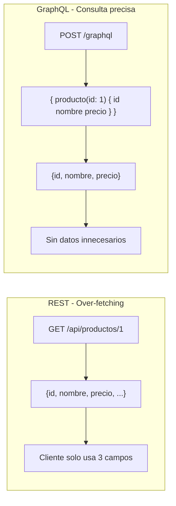
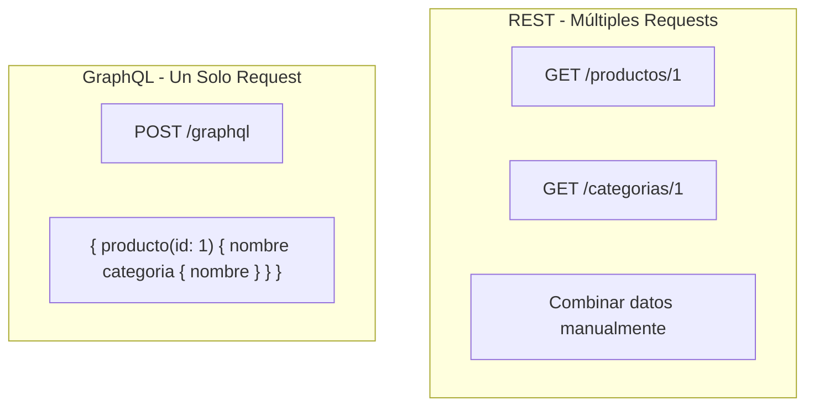
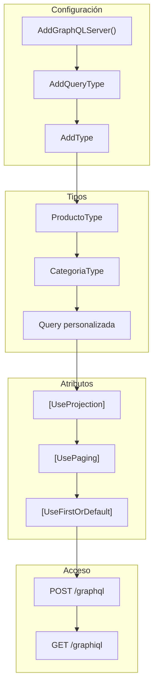

# 20. GraphQL con HotChocolate

Este documento explica cómo implementar una API GraphQL en .NET usando **HotChocolate**, la biblioteca más popular para GraphQL en el ecosistema .NET. Se describe la configuración, tipos, queries, y comparación con REST.

---

## 20.1. ¿Qué es GraphQL?

**GraphQL** es un lenguaje de consulta para APIs desarrollado por Facebook. A diferencia de REST, GraphQL permite al cliente especificar exactamente qué datos necesita, evitando el over-fetching y under-fetching.



### Comparación REST vs GraphQL

| Aspecto | REST | GraphQL |
|---------|------|---------|
| **Endpoint** | Multiple endpoints | Un solo endpoint |
| **Datos** | Respuesta fija | Consulta flexible |
| **Over-fetching** | Sí | No |
| **Under-fetching** | Sí | No |
| **Versionado** | En URL (/v1/) | Sin versionado típico |
| **Documentación** | Swagger/OpenAPI | Introspection |
| **Curva aprendizaje** | Baja | Media |

---

## 20.2. Instalación de HotChocolate

### Paquetes Necesarios

```bash
# Paquete principal de HotChocolate
dotnet add package HotChocolate.AspNetCore

# Paquetes adicionales útiles
dotnet add package HotChocolate.Data        # Para filtrado y paginación
dotnet add package HotChocolate.Stitching   # Para federar esquemas
```

### Dependencias en el Proyecto

Del archivo `Program.cs`:

```csharp
// GraphQL
Log.Information("🔍 Configurando GraphQL con HotChocolate...");
builder.Services
    .AddGraphQLServer()
    .AddQueryType<TiendaQuery>()
    .AddType<ProductoType>()
    .AddType<CategoriaType>()
    .ModifyRequestOptions(opt => opt.IncludeExceptionDetails = builder.Environment.IsDevelopment());
```

### Endpoint de GraphQL

```csharp
// GraphQL Endpoint
Log.Information("🔍 Configurando endpoint GraphQL: /graphql");
app.MapGraphQL();
```

---

## 20.3. Configuración en Program.cs

### Configuración Básica

```csharp
using HotChocolate;

var builder = WebApplication.CreateBuilder(args);

// Agregar GraphQL
builder.Services
    .AddGraphQLServer()
    .AddQueryType<Query>();
```

### Configuración Completa

```csharp
builder.Services
    .AddGraphQLServer()
    .AddQueryType<Query>()                    // Tipo de consulta raíz
    .AddType<ProductoType>()                  // Tipos personalizados
    .AddType<CategoriaType>()
    .AddMutationType<Mutation>()              // Mutaciones (opcional)
    .AddSubscriptionType<Subscription>()      // Suscripciones (opcional)
    
    // Configuración de errores
    .ModifyRequestOptions(opt => 
        opt.IncludeExceptionDetails = builder.Environment.IsDevelopment())
    
    // Introspection habilitada por defecto
    .AddIntrospectionTypes()
    
    // Formateo de errores
    .AddErrorFilter(error => 
    {
        // Personalizar errores según el entorno
        return error;
    });
```

### Diferentes Entornos

```csharp
// Desarrollo: Mostrar detalles de errores
.ModifyRequestOptions(opt => opt.IncludeExceptionDetails = true)

// Producción: Ocultar detalles
.ModifyRequestOptions(opt => opt.IncludeExceptionDetails = false)
```

---

## 20.4. TiendaQuery: Consultas del Proyecto

Del archivo `TiendaQuery.cs`:

### Query Raíz

```csharp
namespace TiendaApi.Apis.GraphQL.Types;

public class TiendaQuery
{
    // Consulta básica: Obtener todos los productos
    [UseFirstOrDefault]
    [UseProjection]
    public IQueryable<Producto> GetProductos(
        [Service] IProductoRepository productoRepository)
    {
        return productoRepository.FindAllAsNoTracking();
    }

    // Obtener producto por ID
    [UseFirstOrDefault]
    public async Task<Producto?> GetProducto(
        long id,
        [Service] IProductoRepository productoRepository)
    {
        return await productoRepository.FindByIdAsync(id);
    }

    // Paginación
    [UsePaging(MaxPageSize = 100, DefaultPageSize = 10)]
    public IQueryable<Producto> GetProductosPaged(
        [Service] IProductoRepository productoRepository)
    {
        return productoRepository.FindAllAsNoTracking();
    }

    // Categorías
    [UseFirstOrDefault]
    [UseProjection]
    public IQueryable<Categoria> GetCategorias(
        [Service] ICategoriaRepository categoriaRepository)
    {
        return categoriaRepository.FindAllAsNoTracking();
    }

    [UseFirstOrDefault]
    public async Task<Categoria?> GetCategoria(
        long id,
        [Service] ICategoriaRepository categoriaRepository)
    {
        return await categoriaRepository.FindByIdAsync(id);
    }

    [UsePaging(MaxPageSize = 100, DefaultPageSize = 10)]
    public IQueryable<Categoria> GetCategoriasPaged(
        [Service] ICategoriaRepository categoriaRepository)
    {
        return categoriaRepository.FindAllAsNoTracking();
    }
}
```

### Atributos de HotChocolate

| Atributo | Descripción |
|----------|-------------|
| `[UseFirstOrDefault]` | Convierte IQueryable a elemento único |
| `[UseProjection]` | Permite seleccionar campos específicos |
| `[UsePaging]` | Añade paginación automática |
| `[UseFiltering]` | Añade filtrado automático |
| `[UseSorting]` | Añade ordenamiento automático |
| `[Service]` | Inyecta dependencias |

---

## 20.5. Tipos de GraphQL

### ProductoType

Del archivo `ProductoType.cs`:

```csharp
using HotChocolate.Types;
using TiendaApi.Apis.Models;

namespace TiendaApi.Apis.GraphQL.Types;

public class ProductoType : ObjectType<Producto>
{
    protected override void Configure(IObjectTypeDescriptor<Producto> descriptor)
    {
        descriptor.Name("Producto");
        descriptor.Description("Entidad Producto");

        // Definir campos disponibles
        descriptor.Field(p => p.Id)
            .Type<NonNullType<IdType>>()
            .Description("El ID del producto");

        descriptor.Field(p => p.Nombre)
            .Type<NonNullType<StringType>>()
            .Description("El nombre del producto");

        descriptor.Field(p => p.Descripcion)
            .Type<StringType>()
            .Description("La descripción del producto");

        descriptor.Field(p => p.Precio)
            .Type<NonNullType<DecimalType>>()
            .Description("El precio del producto");

        descriptor.Field(p => p.Stock)
            .Type<NonNullType<IntType>>()
            .Description("Cantidad en stock");

        descriptor.Field(p => p.Imagen)
            .Type<StringType>()
            .Description("URL de la imagen");

        descriptor.Field(p => p.CategoriaId)
            .Type<NonNullType<IntType>>()
            .Description("El ID de la categoría");

        descriptor.Field(p => p.CreatedAt)
            .Type<NonNullType<DateTimeType>>()
            .Description("Fecha de creación");

        descriptor.Field(p => p.UpdatedAt)
            .Type<NonNullType<DateTimeType>>()
            .Description("Fecha de última actualización");

        descriptor.Field(p => p.IsDeleted)
            .Type<NonNullType<BooleanType>>()
            .Description("Si el producto está eliminado");

        // Campo con relación a otra entidad
        descriptor.Field(p => p.Categoria)
            .Type<CategoriaType>()
            .Description("La categoría del producto");
    }
}
```

### CategoriaType

Del archivo `CategoriaType.cs`:

```csharp
using HotChocolate.Types;
using TiendaApi.Apis.Models;

namespace TiendaApi.Apis.GraphQL.Types;

public class CategoriaType : ObjectType<Categoria>
{
    protected override void Configure(IObjectTypeDescriptor<Categoria> descriptor)
    {
        descriptor.Name("Categoria");
        descriptor.Description("Entidad Categoria");

        descriptor.Field(c => c.Id)
            .Type<NonNullType<IdType>>()
            .Description("El ID de la categoría");

        descriptor.Field(c => c.Nombre)
            .Type<NonNullType<StringType>>()
            .Description("El nombre de la categoría");

        descriptor.Field(c => c.CreatedAt)
            .Type<NonNullType<DateTimeType>>()
            .Description("Fecha de creación");

        descriptor.Field(c => c.UpdatedAt)
            .Type<NonNullType<DateTimeType>>()
            .Description("Fecha de última actualización");

        descriptor.Field(c => c.IsDeleted)
            .Type<NonNullType<BooleanType>>()
            .Description("Si la categoría está eliminada");
    }
}
```

---

## 20.6. Tipos de Datos en GraphQL

### Escalares

| GraphQL | .NET | Descripción |
|---------|------|-------------|
| `ID` | `string` | Identificador único |
| `String` | `string` | Cadena de texto |
| `Int` | `int` | Entero de 32 bits |
| `Float` | `double` | Número decimal |
| `Boolean` | `bool` | Verdadero/Falso |
| `DateTime` | `DateTime` | Fecha y hora |
| `Decimal` | `decimal` | Decimal preciso |

### Tipos No Nulos

```csharp
// Campo obligatorio (NonNull)
descriptor.Field(p => p.Nombre)
    .Type<NonNullType<StringType>>()

// Campo opcional
descriptor.Field(p => p.Descripcion)
    .Type<StringType>()
```

---

## 20.7. GraphiQL: Herramienta de Desarrollo

El proyecto incluye una interfaz GraphiQL para probar las consultas:

```csharp
app.MapGet("/graphiql", async context =>
{
    context.Response.ContentType = "text/html";
    await context.Response.WriteAsync(@"
<!DOCTYPE html>
<html>
<head>
    <title>GraphiQL</title>
    <link href=""https://unpkg.com/graphiql/graphiql.min.css"" rel=""stylesheet"" />
</head>
<body style=""margin: 0;"">
    <div id=""graphiql"" style=""height: 100vh;""></div>
    <script crossorigin src=""https://unpkg.com/react/umd/react.production.min.js""></script>
    <script crossorigin src=""https://unpkg.com/react-dom/umd/react-dom.production.min.js""></script>
    <script crossorigin src=""https://unpkg.com/graphiql/graphiql.min.js""></script>
    <script>
        const fetcher = GraphiQL.createFetcher({ url: '/graphql' });
        ReactDOM.render(
            React.createElement(GraphiQL, { fetcher: fetcher }),
            document.getElementById('graphiql')
        );
    </script>
</body>
</html>");
});
```

### Acceso a GraphiQL

```
Desarrollo: http://localhost:5000/graphiql
Producción: http://tu-dominio/graphiql
```

---

## 20.8. Consultas de Ejemplo

### Obtener Todos los Productos

```graphql
query {
  productos {
    id
    nombre
    precio
    stock
  }
}
```

### Obtener Producto Específico

```graphql
query {
  producto(id: 1) {
    id
    nombre
    descripcion
    precio
    categoria {
      nombre
    }
  }
}
```

### Con Paginación

```graphql
query {
  productosPaged(first: 10) {
    nodes {
      id
      nombre
      precio
    }
    pageInfo {
      hasNextPage
      hasPreviousPage
    }
    totalCount
  }
}
```

### Con Filtrado

```graphql
query {
  productos(where: { precio: { gt: 100 } }) {
    id
    nombre
    precio
  }
}
```

### Con Ordenamiento

```graphql
query {
  productos(order: [{ precio: DESC }]) {
    id
    nombre
    precio
  }
}
```

---

## 20.9. Mutations (Crear, Actualizar, Eliminar)

```csharp
public class Mutation
{
    public async Task<Producto> CreateProducto(
        CreateProductoInput input,
        [Service] IProductoRepository repository)
    {
        var producto = new Producto
        {
            Nombre = input.Nombre,
            Descripcion = input.Descripcion,
            Precio = input.Precio,
            Stock = input.Stock,
            CategoriaId = input.CategoriaId
        };

        return await repository.AddAsync(producto);
    }

    public async Task<bool> DeleteProducto(
        long id,
        [Service] IProductoRepository repository)
    {
        return await repository.DeleteAsync(id);
    }
}

public record CreateProductoInput(
    string Nombre,
    string? Descripcion,
    decimal Precio,
    int Stock,
    long CategoriaId
);
```

### Registrar Mutations

```csharp
builder.Services
    .AddGraphQLServer()
    .AddQueryType<Query>()
    .AddMutationType<Mutation>()  // Añadir mutations
```

---

## 20.10. Comparación REST vs GraphQL



### Cuándo Usar GraphQL

| Escenario | Recomendación |
|-----------|---------------|
| **Clientes móviles** | ✅ GraphQL (menos datos, mejor rendimiento) |
| **Dashboards complejos** | ✅ GraphQL (una sola query) |
| **API pública** | ✅ GraphQL (flexibilidad para clientes) |
| **CRUD simple** | ⚪ REST (más simple) |
| **Arquitectura de microservicios** | ✅ GraphQL ( stitching) |
| **Streaming en tiempo real** | ⚪ REST + WebSockets |

### Cuándo Usar REST

| Escenario | Recomendación |
|-----------|---------------|
| **Endpoints simples** | ✅ REST (más directo) |
| **Documentación con Swagger** | ✅ REST (integración nativa) |
| **Cacheo con CDNs** | ✅ REST (URLs únicas) |
| **Equipo nuevo** | ✅ REST (mayor familiaridad) |

---

## 20.11. Resumen

### Arquitectura GraphQL del Proyecto



### Registro en DI (Program.cs)

```csharp
// Configuración completa
builder.Services
    .AddGraphQLServer()
    .AddQueryType<TiendaQuery>()
    .AddType<ProductoType>()
    .AddType<CategoriaType>()
    .ModifyRequestOptions(opt => 
        opt.IncludeExceptionDetails = builder.Environment.IsDevelopment());

// Endpoint
app.MapGraphQL();
```

### Siguientes Pasos

Con GraphQL dominado, el siguiente paso es aprender sobre mapeadores y transformación de datos.

### Recursos Adicionales

- HotChocolate: https://chillicream.com/docs/hotchocolate
- GraphQL.org: https://graphql.org
- GraphQL SDL: https://www.apollographql.com/docs/graphql-tools/schema-definitions
