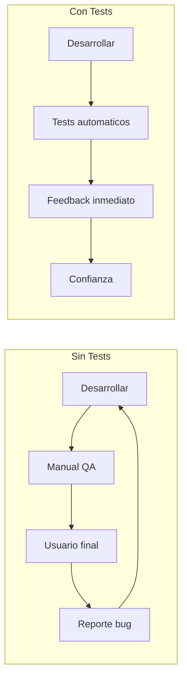
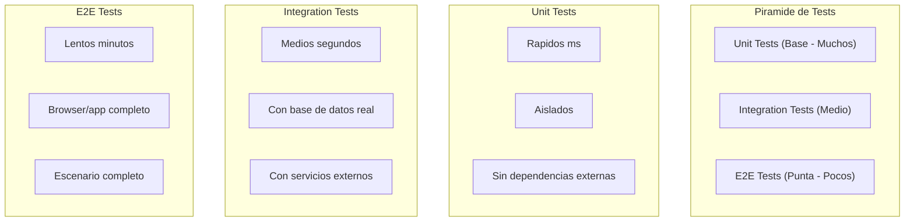
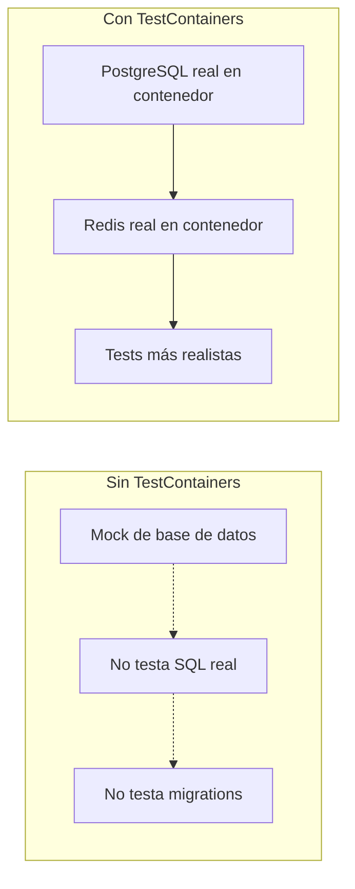
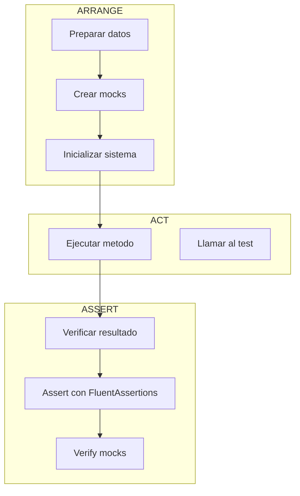
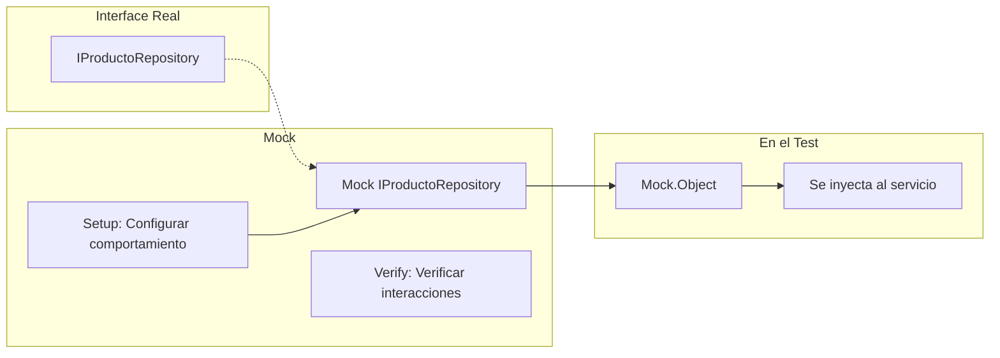
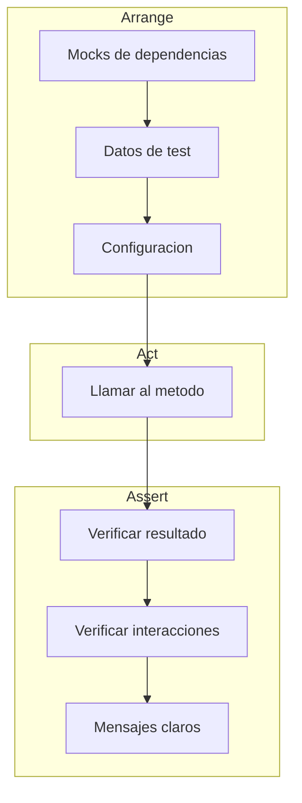

# 21. Testing con NUnit

Este documento explica cómo implementar tests unitarios y de integración en una API .NET usando NUnit, FluentAssertions, Moq y TestContainers.

---

## 21.1. ¿Qué es Testing?

**Testing** es el proceso de verificar que el código funciona correctamente. En lugar de esperar a que los usuarios encuentren errores, los tests automatizados detectan problemas antes de llegar a producción.

### ¿Por qué hacer Testing?



| Problema sin Tests | Solución con Tests |
|-------------------|-------------------|
| Errores detectados tarde | Detección inmediata |
| Miedo a refactorizar | Refactorización segura |
| Regresiones no detectadas | Tests regresivos automáticos |
| Deploys arriesgados | Confianza en el código |

---

## 21.2. Tipos de Tests

No todos los tests son iguales. Cada tipo tiene un propósito diferente:



| Tipo | Qué testea | Velocidad | Aislamiento | Cantidad |
|------|------------|-----------|-------------|----------|
| **Unit** | Una unidad de código (método/clase) | Rápido (~ms) | Alto | Muchos |
| **Integration** | Múltiples componentes juntos | Medio (~s) | Medio | Medio |
| **E2E** | Flujo completo de usuario | Lento (~min) | Bajo | Pocos |

### ¿Qué es un Test Unitario?

Un test unitario verifica que una **única unidad** de código funciona correctamente. Esta unidad suele ser un método. Un buen test unitario:

1. **Es rápido**: Se ejecuta en milisegundos
2. **Es aislada**: No depende de bases de datos, redes o archivos
3. **Es determinista**: Siempre da el mismo resultado
4. **Es independiente**: No depende de otros tests

---

## 21.3. Frameworks de Testing en .NET

.NET tiene tres frameworks principales de testing:

| Framework | Características |
|-----------|-----------------|
| **NUnit** | Popular, sintaxis elegante, attributes ricos |
| **xUnit** | Moderno, creado por ASP.NET Core team |
| **MSTest** | De Microsoft, menos flexible |

En este proyecto usamos **NUnit** por su sintaxis clara y atributos descriptivos.

### Librerías Principales

| Librería | Propósito |
|----------|-----------|
| **NUnit** | Framework de testing (assertions, attributes) |
| **FluentAssertions** | Assertions más legibles |
| **Moq** | Crear mocks (objetos falsos) |
| **TestContainers** | Contenedores Docker para tests de integración |
| **coverlet** | Medir cobertura de código |

---

## 21.4. Estructura del Proyecto de Tests

```
TiendaApi.Tests/
├── Unit/
│   ├── Services/
│   │   ├── ProductoServiceTests.cs
│   │   └── CategoriaServiceTests.cs
│   ├── Validators/
│   │   └── ProductoValidatorTests.cs
│   └── Repositories/
│       └── ProductoRepositoryTests.cs
├── Integration/
│   ├── Controllers/
│   │   └── ProductosControllerTests.cs
│   ├── Repositories/
│   │   └── ProductoRepositoryIntegrationTests.cs
│   └── Services/
│       └── ProductoServiceIntegrationTests.cs
├── Fixtures/
│   ├── TiendaApiWebApplicationFactory.cs
│   └── TestContainersFixture.cs
├── Helpers/
│   ├── TestDataFactory.cs
│   └── AssertionHelpers.cs
└── TiendaApi.Tests.csproj
```

### Archivo de Proyecto (.csproj)

```xml
<Project Sdk="Microsoft.NET.Sdk">

  <PropertyGroup>
    <TargetFramework>net8.0</TargetFramework>
    <ImplicitUsings>enable</ImplicitUsings>
    <IsPackable>false</IsPackable>
    <IsTestProject>true</IsTestProject>
    <TreatWarningsAsErrors>false</TreatWarningsAsErrors>
  </PropertyGroup>

  <!-- Paquetes de testing -->
  <ItemGroup>
    <PackageReference Include="Microsoft.NET.Test.Sdk" Version="17.8.0" />
    <PackageReference Include="NUnit" Version="3.14.0" />
    <PackageReference Include="NUnit3TestAdapter" Version="4.5.0" />
    <PackageReference Include="FluentAssertions" Version="6.12.0" />
    <PackageReference Include="FluentAssertions.Mvc" Version="6.0.0" />
    <PackageReference Include="Moq" Version="4.20.70" />
    <PackageReference Include="TestContainers" Version="3.8.0" />
    <PackageReference Include="TestContainers.PostgreSql" Version="3.8.0" />
    <PackageReference Include="TestContainers.Redis" Version="3.8.0" />
    <PackageReference Include="coverlet.collector" Version="6.0.0" />
    <PackageReference Include="Microsoft.AspNetCore.Mvc.Testing" Version="8.0.0" />
    <PackageReference Include="Microsoft.EntityFrameworkCore.InMemory" Version="8.0.0" />
    <PackageReference Include="Microsoft.EntityFrameworkCore.Sqlite" Version="8.0.0" />
  </ItemGroup>

  <!-- Referencia al proyecto principal -->
  <ItemGroup>
    <ProjectReference Include="..\TiendaApi.Core\TiendaApi.Core.csproj" />
    <ProjectReference Include="..\TiendaApi.Apis\TiendaApi.Apis.csproj" />
  </ItemGroup>

</Project>
```

---

## 21.5. Tests en Paralelo vs Secuenciales

NUnit puede ejecutar tests en paralelo para acelerar el tiempo de ejecución.

### Configuración de Paralelismo

```csharp
using NUnit.Framework;

namespace TiendaApi.Tests;

[assembly: LevelOfParallelism(4)]  // Máximo 4 threads paralelos
[assembly: Parallelizable(ParallelScope.Children)]  // Tests a nivel de clase

namespace TiendaApi.Tests.Unit.Services;

[TestFixture]  // Indica que la clase contiene tests
[Parallelizable(ParallelScope.All)]  // Todos los tests de esta clase son paralelos
public class ProductoServiceTests
{
    private Mock<IProductoRepository> _repositoryMock = null!;
    private ProductoService _service = null!;

    [SetUp]
    public void SetUp()
    {
        _repositoryMock = new Mock<IProductoRepository>();
        _service = new ProductoService(_repositoryMock.Object);
    }

    [Test]
    public void GetById_ProductoExistente_ReturnSuccess()
    {
        // Arrange
        var productoId = 1L;
        var producto = new Producto { Id = productoId, Nombre = "Laptop" };
        
        _repositoryMock.Setup(r => r.GetByIdAsync(productoId))
            .ReturnsAsync(producto);

        // Act
        var result = _service.GetByIdAsync(productoId);

        // Assert
        result.Should().NotBeNull();
        result.Result.IsSuccess.Should().BeTrue();
    }

    [Test]
    public void GetById_ProductoNoExistente_ReturnFailure()
    {
        // Arrange
        var productoId = 999L;
        
        _repositoryMock.Setup(r => r.GetByIdAsync(productoId))
            .ReturnsAsync((Producto?)null);

        // Act
        var result = _service.GetByIdAsync(productoId);

        // Assert
        result.Result.IsFailure.Should().BeTrue();
    }
}
```

### Niveles de Paralelismo

```csharp
// Diferentes niveles de paralelismo
[Parallelizable(ParallelScope.None)]           // No paralelizable
[Parallelizable(ParallelScope.Self)]            // Solo esta clase
[Parallelizable(ParallelScope.Children)]        // Tests dentro de la clase
[Parallelizable(ParallelScope.All)]             // Todo (clase + descendientes)
```

### Cuando Usar Paralelismo vs Secuencial

| Escenario | Recomendación | Razón |
|-----------|---------------|-------|
| Tests unitarios con mocks | **Paralelo** | Rápidos, sin estado compartido |
| Tests que comparten base de datos | **Secuencial** | Evitar conflictos |
| Tests con TestContainers | **Limitado** | Cada contenedor es pesado |
| Tests de integración | **Limitado** | Recursos externos limitados |
| Tests que modifican archivos | **Secuencial** | Evitar condiciones de carrera |

### Fixture con Paralelismo Controlado

```csharp
using NUnit.Framework;

namespace TiendaApi.Tests.Integration;

[TestFixture]  // Tests en paralelo dentro de esta clase
[Parallelizable(ParallelScope.None)]  // Esta clase NO es paralelizable
public class SequentialIntegrationTests
{
    private static readonly object[] LockObject = new object();
    private static PostgreSqlContainer? _sharedContainer;

    [OneTimeSetUp]
    public void OneTimeSetUp()
    {
        // Solo un thread crea el contenedor
        lock (LockObject)
        {
            if (_sharedContainer == null)
            {
                _sharedContainer = new PostgreSqlBuilder()
                    .WithImage("postgres:15-alpine")
                    .WithDatabase("TestDb")
                    .WithUsername("test")
                    .WithPassword("test")
                    .Build();
                _sharedContainer.StartAsync().Wait();
            }
        }
    }

    [OneTimeTearDown]
    public void OneTimeTearDown()
    {
        _sharedContainer?.DisposeAsync().AsTask().Wait();
    }

    [Test]
    public void TestQueComparteContenedor()
    {
        // Este test usa el mismo contenedor que los otros
        var connectionString = _sharedContainer!.GetConnectionString();
        // ...
    }
}
```

---

## 21.6. TestContainers

**TestContainers** es una librería que permite crear contenedores Docker durante los tests de integración. Esto proporciona bases de datos reales y otros servicios en entornos aislados.

### ¿Por qué usar TestContainers?



| Aspecto | Base de datos en memoria | TestContainers |
|---------|-------------------------|----------------|
| **Realismo** | Bajo | Alto |
| **SQL features** | Limitado | Completo |
| **Migrations** | No testeadas | Testeadas |
| **Velocidad** | Rápido | Más lento |
| **Aislamiento** | Por proceso | Por contenedor |
| **Setup** | Easy | Requiere Docker |

### Configuración de TestContainers

```csharp
using TestContainers.PostgreSql;
using TestContainers.Redis;

namespace TiendaApi.Tests.Fixtures;

public class TestContainersFixture : IDisposable
{
    public PostgreSqlContainer? PostgresContainer { get; private set; }
    public RedisContainer? RedisContainer { get; private set; }
    public string? ConnectionString { get; private set; }
    public string? RedisConnectionString { get; private set; }

    public TestContainersFixture()
    {
        StartContainersAsync().Wait();
    }

    private async Task StartContainersAsync()
    {
        // Iniciar PostgreSQL
        PostgresContainer = new PostgreSqlBuilder()
            .WithImage("postgres:15-alpine")
            .WithDatabase("tiendadb_test")
            .WithUsername("test")
            .WithPassword("test")
            .WithCleanUp(true)  // Limpiar después del test
            .Build();

        await PostgresContainer.StartAsync();
        ConnectionString = PostgresContainer.GetConnectionString();

        // Iniciar Redis
        RedisContainer = new RedisBuilder()
            .WithImage("redis:7-alpine")
            .WithCleanUp(true)
            .Build();

        await RedisContainer.StartAsync();
        RedisConnectionString = RedisContainer.GetConnectionString();
    }

    public void Dispose()
    {
        PostgresContainer?.DisposeAsync().AsTask().Wait();
        RedisContainer?.DisposeAsync().AsTask().Wait();
    }
}
```

### Fixture Collection para Tests Compartidos

```csharp
using NUnit.Framework;

namespace TiendaApi.Tests.Fixtures;

[FixtureLifeCycle(LifeCycle.InstancePerTestCase)]
[Parallelizable(ParallelScope.None)]  // No paralelizable por usar TestContainers
public class IntegrationTestBase : IDisposable
{
    protected PostgreSqlContainer _postgresContainer = null!;
    protected TiendaDbContext _context = null!;
    protected IServiceScopeFactory _scopeFactory = null!;

    [SetUp]
    public async Task SetUpAsync()
    {
        // Crear contenedor para cada test
        _postgresContainer = new PostgreSqlBuilder()
            .WithImage("postgres:15-alpine")
            .WithDatabase("tiendadb_test")
            .WithUsername("test")
            .WithPassword("test")
            .WithCleanUp(true)
            .Build();

        await _postgresContainer.StartAsync();

        // Configurar DbContext
        var options = new DbContextOptionsBuilder<TiendaDbContext>()
            .UseNpgsql(_postgresContainer.GetConnectionString())
            .Options;

        _context = new TiendaDbContext(options);
        _context.Database.EnsureCreated();

        // Configurar servicios (simplificado)
        var services = new ServiceCollection();
        services.AddDbContext<TiendaDbContext>(options => options.UseNpgsql(_postgresContainer.GetConnectionString()));
        services.AddScoped<TiendaDbContext>(sp => _context);
        _scopeFactory = services.BuildServiceProvider().GetRequiredService<IServiceScopeFactory>();
    }

    [TearDown]
    public async Task TearDownAsync()
    {
        await _context.DisposeAsync();
        await _postgresContainer.DisposeAsync();
    }

    protected async Task SeedDataAsync(params object[] entities)
    {
        foreach (var entity in entities)
        {
            _context.Add(entity);
        }
        await _context.SaveChangesAsync();
    }
}
```

### Test de Repository con TestContainers

```csharp
using FluentAssertions;
using Microsoft.EntityFrameworkCore;
using NUnit.Framework;
using TiendaApi.Core.Data;
using TiendaApi.Core.Models;
using TiendaApi.Tests.Fixtures;

namespace TiendaApi.Tests.Integration.Repositories;

public class ProductoRepositoryIntegrationTests : IntegrationTestBase
{
    private ProductoRepository _repository = null!;

    [SetUp]
    public override async Task SetUpAsync()
    {
        await base.SetUpAsync();
        _repository = new ProductoRepository(_context);
    }

    [Test]
    public async Task AddAsync_ProductoValido_ReturnSuccess()
    {
        // Arrange
        var producto = new Producto
        {
            Nombre = "Laptop Gaming",
            Descripcion = "Potente laptop para gaming",
            Precio = 1499.99m,
            Stock = 10,
            CategoriaId = 1
        };

        // Act
        var result = await _repository.AddAsync(producto);

        // Assert
        result.IsSuccess.Should().BeTrue();
        producto.Id.Should().BeGreaterThan(0);
    }

    [Test]
    public async Task GetByIdAsync_ProductoExistente_ReturnProducto()
    {
        // Arrange
        var producto = new Producto
        {
            Nombre = "Mouse Inalambrico",
            Precio = 29.99m,
            Stock = 100,
            CategoriaId = 1
        };

        await SeedDataAsync(producto);

        // Act
        var result = await _repository.GetByIdAsync(producto.Id);

        // Assert
        result.IsSuccess.Should().BeTrue();
        result.Value.Nombre.Should().Be("Mouse Inalambrico");
    }

    [Test]
    public async Task GetByCategoriaIdAsync_ReturnProductos()
    {
        // Arrange
        var categoria = new Categoria { Nombre = "Electronica" };
        await SeedDataAsync(categoria);

        var producto1 = new Producto
        {
            Nombre = "Teclado",
            Precio = 79.99m,
            CategoriaId = categoria.Id
        };

        var producto2 = new Producto
        {
            Nombre = "Mouse",
            Precio = 29.99m,
            CategoriaId = categoria.Id
        };

        await SeedDataAsync(producto1, producto2);

        // Act
        var result = await _repository.GetByCategoriaIdAsync(categoria.Id);

        // Assert
        result.Should().HaveCount(2);
    }

    [Test]
    public async Task DeleteAsync_ProductoExistente_ReturnTrue()
    {
        // Arrange
        var producto = new Producto
        {
            Nombre = "Producto a eliminar",
            Precio = 10m,
            Stock = 5
        };

        await SeedDataAsync(producto);

        // Act
        var result = await _repository.DeleteAsync(producto.Id);

        // Assert
        result.IsSuccess.Should().BeTrue();
        
        var verifyResult = await _repository.GetByIdAsync(producto.Id);
        verifyResult.IsFailure.Should().BeTrue();
    }
}
```

### Configuración Global con NUnit SetUpFixture

```csharp
using NUnit.Framework;
using TestContainers.PostgreSql;

namespace TiendaApi.Tests.Fixtures;

[SetUpFixture]
public class GlobalTestFixture
{
    public static PostgreSqlContainer? SharedPostgresContainer { get; private set; }
    public static RedisContainer? SharedRedisContainer { get; private set; }

    [OneTimeSetUp]
    public async Task GlobalSetUp()
    {
        // Crear contenedores compartidos para todos los tests
        SharedPostgresContainer = new PostgreSqlBuilder()
            .WithImage("postgres:15-alpine")
            .WithDatabase("tiendadb_global")
            .WithUsername("test")
            .WithPassword("test")
            .WithCleanUp(true)
            .Build();

        await SharedPostgresContainer.StartAsync();

        SharedRedisContainer = new RedisBuilder()
            .WithImage("redis:7-alpine")
            .WithCleanUp(true)
            .Build();

        await SharedRedisContainer.StartAsync();

        Console.WriteLine("TestContainers iniciados");
    }

    [OneTimeTearDown]
    public async Task GlobalTearDown()
    {
        await SharedPostgresContainer?.DisposeAsync()!;
        await SharedRedisContainer?.DisposeAsync()!;
        
        Console.WriteLine("TestContainers destruidos");
    }
}
```

---

## 21.7. Anatomy de un Test Unitario

Un test unitario sigue el patrón **Arrange-Act-Assert**:

```csharp
using FluentAssertions;
using Moq;
using NUnit.Framework;
using TiendaApi.Core.Interfaces;
using TiendaApi.Core.Models;
using TiendaApi.Core.Services;

namespace TiendaApi.Tests.Unit.Services;

public class ProductoServiceTests
{
    [Test]  // Attribute que indica que es un test
    public void GetById_ProductoExistente_ReturnSuccess()
    {
        // =====================================
        // ARRANGE: Preparar el escenario
        // =====================================
        var productoId = 1L;
        var productoEsperado = new Producto
        {
            Id = productoId,
            Nombre = "Laptop",
            Precio = 999.99m
        };

        // Crear mock del repositorio
        var repositoryMock = new Mock<IProductoRepository>();
        repositoryMock.Setup(r => r.GetByIdAsync(productoId))
            .ReturnsAsync(productoEsperado);

        // Crear el servicio con el mock
        var service = new ProductoService(repositoryMock.Object);

        // =====================================
        // ACT: Ejecutar la accion a testear
        // =====================================
        var resultado = service.GetByIdAsync(productoId);

        // =====================================
        // ASSERT: Verificar el resultado
        // =====================================
        resultado.Should().NotBeNull();
        resultado.Result.Should().BeSuccess();
        resultado.Result.Value.Should().NotBeNull();
        resultado.Result.Value.Nombre.Should().Be("Laptop");
        resultado.Result.Value.Precio.Should().Be(999.99m);
    }
}
```

### Partes del Test



---

## 21.8. NUnit Basics

### Atributos Principales

| Atributo | Propósito | Ejemplo |
|----------|-----------|---------|
| `[Test]` | Método de test | `public void Test() {}` |
| `[TestCase]` | Test con parametros | `[TestCase(1, 2, 3)]` |
| `[TestCaseSource]` | Fuente externa de casos | `[TestCaseSource(typeof(TestData))]` |
| `[SetUp]` | Se ejecuta antes de cada test | `SetUp() {}` |
| `[TearDown]` | Se ejecuta después de cada test | `TearDown() {}` |
| `[OneTimeSetUp]` | Una vez antes de todos | `OneTimeSetUp() {}` |
| `[OneTimeTearDown]` | Una vez después de todos | `OneTimeTearDown() {}` |
| `[Category]` | Categorizar tests | `[Category("Slow")]` |
| `[NonParallelizable]` | No paralelizable | `[NonParallelizable]` |
| `[Ignore]` | Omitir test | `[Ignore("Pendiente de implementar")]` |
| `[Retry]` | Reintentar test | `[Retry(3)]` |
| `[Timeout]` | Límite de tiempo | `[Timeout(5000)]` |

### Ejemplo Completo

```csharp
using FluentAssertions;
using Moq;
using NUnit.Framework;
using TiendaApi.Core.Interfaces;
using TiendaApi.Core.Models;
using TiendaApi.Core.Services;

namespace TiendaApi.Tests.Unit.Services;

[TestFixture]
public class ProductoServiceTests
{
    private Mock<IProductoRepository> _repositoryMock = null!;
    private ProductoService _service = null!;

    [SetUp]
    public void SetUp()
    {
        _repositoryMock = new Mock<IProductoRepository>();
        _service = new ProductoService(_repositoryMock.Object);
    }

    [TearDown]
    public void TearDown()
    {
        _repositoryMock.VerifyAll();
    }

    [Test]
    public void GetById_ProductoExistente_ReturnSuccess()
    {
        // Arrange
        var productoId = 1L;
        var producto = new Producto { Id = productoId, Nombre = "Laptop" };
        
        _repositoryMock.Setup(r => r.GetByIdAsync(productoId))
            .ReturnsAsync(producto);

        // Act
        var result = _service.GetByIdAsync(productoId);

        // Assert
        result.Should().NotBeNull();
        result.Result.IsSuccess.Should().BeTrue();
    }

    [Test]
    public void GetById_ProductoNoExistente_ReturnFailure()
    {
        // Arrange
        var productoId = 999L;
        
        _repositoryMock.Setup(r => r.GetByIdAsync(productoId))
            .ReturnsAsync((Producto?)null);

        // Act
        var result = _service.GetByIdAsync(productoId);

        // Assert
        result.Result.IsFailure.Should().BeTrue();
    }

    [TestCase(1L)]
    [TestCase(2L)]
    [TestCase(100L)]
    public void GetById_DiferentesIds_ReturnCorrecto(long productoId)
    {
        // Arrange
        var producto = new Producto { Id = productoId, Nombre = "Producto" };
        
        _repositoryMock.Setup(r => r.GetByIdAsync(productoId))
            .ReturnsAsync(producto);

        // Act
        var result = _service.GetByIdAsync(productoId);

        // Assert
        result.Result.IsSuccess.Should().BeTrue();
        result.Result.Value.Id.Should().Be(productoId);
    }
}
```

---

## 21.9. FluentAssertions

**FluentAssertions** permite escribir assertions de forma más legible y con mensajes de error claros.

### Assertions Comunes

```csharp
using FluentAssertions;

public class FluentAssertionsExamples
{
    [Test]
    public void StringExamples()
    {
        var nombre = "Laptop Gaming";

        nombre.Should().NotBeNull();
        nombre.Should().Be("Laptop Gaming");
        nombre.Should().NotBeEmpty();
        nombre.Should().HaveLength(14);
        nombre.Should().StartWith("Laptop");
        nombre.Should().EndWith("Gaming");
        nombre.Should().Contain("Gaming");
        nombre.Should().Match("* *"); // Regex
    }

    [Test]
    public void NumericExamples()
    {
        var precio = 999.99m;

        precio.Should().Be(999.99m);
        precio.Should().BeGreaterThan(100);
        precio.Should().BeLessThan(1000);
        precio.Should().BeInRange(100, 1000);
        precio.Should().BePositive();
        precio.Should().NotBe(0);
    }

    [Test]
    public void CollectionExamples()
    {
        var productos = new List<Producto>
        {
            new() { Id = 1, Nombre = "A" },
            new() { Id = 2, Nombre = "B" }
        };

        productos.Should().NotBeNull();
        productos.Should().HaveCount(2);
        productos.Should().Contain(p => p.Nombre == "A");
        productos.Should().ContainSingle(p => p.Id == 1);
        productos.Should().BeInAscendingOrder(p => p.Id);
    }

    [Test]
    public void ObjectExamples()
    {
        var producto = new Producto { Id = 1, Nombre = "Laptop" };

        producto.Should().NotBeNull();
        producto.Should().BeOfType<Producto>();
        producto.Should().Match<Producto>(p => p.Id > 0);
    }

    [Test]
    public void ResultExamples()
    {
        var successResult = Result.Success<int, Error>(42);
        var failureResult = Result.Failure<int, Error>(Errors.Productos.NoEncontrados);

        successResult.IsSuccess.Should().BeTrue();
        successResult.IsFailure.Should().BeFalse();
        successResult.Value.Should().Be(42);

        failureResult.IsFailure.Should().BeTrue();
        failureResult.Error.Should().Be(Errors.Productos.NoEncontrados);
    }

    [Test]
    public void ExceptionExamples()
    {
        Action action = () => throw new ArgumentException("Error");

        action.Should().Throw<ArgumentException>();
        action.Should().Throw<ArgumentException>().WithMessage("Error");
    }
}
```

---

## 21.10. Moq - Creando Mocks

**Moq** es una librería que permite crear objetos falsos (mocks) para aislar el código bajo test.

### Conceptos de Moq



### Ejemplos de Moq

```csharp
using Moq;
using NUnit.Framework;
using TiendaApi.Core.Interfaces;
using TiendaApi.Core.Models;

public class MoqExamples
{
    [Test]
    public void Setup_ReturnValue()
    {
        // Arrange
        var producto = new Producto { Id = 1, Nombre = "Laptop" };
        
        var mockRepo = new Mock<IProductoRepository>();
        mockRepo.Setup(r => r.GetByIdAsync(1))
            .ReturnsAsync(producto);

        // El mock se usa como la interfaz real
        IProductoRepository repo = mockRepo.Object;
        
        // Act
        var result = repo.GetByIdAsync(1);

        // Assert
        result.Result.Should().NotBeNull();
        result.Result.Id.Should().Be(1);
    }

    [Test]
    public void Setup_AnyParameter()
    {
        // Arrange
        var mockRepo = new Mock<IProductoRepository>();
        
        // It.IsAny: Cualquier parámetro
        mockRepo.Setup(r => r.GetByIdAsync(It.IsAny<long>()))
            .ReturnsAsync((long id) => new Producto { Id = id });

        // Act
        var result = mockRepo.Object.GetByIdAsync(999);

        // Assert
        result.Result.Id.Should().Be(999);
    }

    [Test]
    public void Setup_Condition()
    {
        // Arrange
        var mockRepo = new Mock<IProductoRepository>();
        
        // It.Is: Condición específica
        mockRepo.Setup(r => r.GetByIdAsync(It.Is<long>(id => id > 0)))
            .ReturnsAsync((long id) => new Producto { Id = id });

        // Act & Assert
        mockRepo.Object.GetByIdAsync(1).Result.Id.Should().Be(1);
        mockRepo.Object.GetByIdAsync(-1).Result.Should().BeNull();
    }

    [Test]
    public void Verify_Interactions()
    {
        // Arrange
        var mockRepo = new Mock<IProductoRepository>();
        var service = new ProductoService(mockRepo.Object);
        var producto = new Producto { Id = 1, Nombre = "Laptop" };

        mockRepo.Setup(r => r.GetByIdAsync(1))
            .ReturnsAsync(producto);

        // Act
        service.GetByIdAsync(1);

        // Verify: Verificar que se llamó al método
        mockRepo.Verify(r => r.GetByIdAsync(1), Times.Once);
        mockRepo.Verify(r => r.GetByIdAsync(999), Times.Never);
    }

    [Test]
    public void SetupSequence()
    {
        // Arrange
        var mockRepo = new Mock<IProductoRepository>();
        
        mockRepo.SetupSequence(r => r.GetCountAsync())
            .ReturnsAsync(0)
            .ReturnsAsync(1)
            .ReturnsAsync(2);

        // Act & Assert
        mockRepo.Object.GetCountAsync().Result.Should().Be(0);
        mockRepo.Object.GetCountAsync().Result.Should().Be(1);
        mockRepo.Object.GetCountAsync().Result.Should().Be(2);
    }

    [Test]
    public void ThrowsException()
    {
        // Arrange
        var mockRepo = new Mock<IProductoRepository>();
        
        mockRepo.Setup(r => r.GetByIdAsync(It.IsAny<long>()))
            .ThrowsAsync(new InvalidOperationException("Producto no encontrado"));

        // Act & Assert
        Assert.ThrowsAsync<InvalidOperationException>(
            () => mockRepo.Object.GetByIdAsync(1));
    }
}
```

---

## 21.11. Tests de Controladores

Los tests de controladores verifican que los endpoints de la API funcionan correctamente usando `HttpClient` para simular requests.

### WebApplicationFactory

```csharp
using Microsoft.AspNetCore.Mvc.Testing;
using Microsoft.EntityFrameworkCore;
using Microsoft.Extensions.DependencyInjection;
using TiendaApi.Core.Data;

namespace TiendaApi.Tests.Integration;

public class TiendaApiWebApplicationFactory : WebApplicationFactory<Program>
{
    protected override void ConfigureWebHost(IWebHostBuilder builder)
    {
        builder.ConfigureServices(services =>
        {
            // Remover DbContext real
            var descriptor = services.SingleOrDefault(
                d => d.ServiceType == typeof(DbContextOptions<TiendaDbContext>));
            if (descriptor != null)
                services.Remove(descriptor);

            // Añadir DbContext en memoria
            services.AddDbContext<TiendaDbContext>(options =>
            {
                options.UseInMemoryDatabase("TestDatabase");
            });

            // Configurar autenticación falsa
            services.AddAuthentication("Test")
                .AddScheme<TestAuthSchemeOptions, TestAuthHandler>(
                    "Test", options => { });
        });
    }
}
```

### Test Auth Handler

```csharp
using Microsoft.AspNetCore.Authentication;
using Microsoft.Extensions.Options;
using System.Security.Claims;
using System.Text.Encodings.Web;

namespace TiendaApi.Tests.Helpers;

public class TestAuthSchemeOptions : AuthenticationSchemeOptions
{
    public string DefaultUserId { get; set; } = "1";
    public string DefaultEmail { get; set; } = "test@tienda.com";
    public string[] DefaultRoles { get; set; } = Array.Empty<string>();
}

public class TestAuthHandler : AuthenticationHandler<AuthenticationSchemeOptions>
{
    public TestAuthHandler(
        IOptionsMonitor<TestAuthSchemeOptions> options,
        ILoggerFactory logger,
        UrlEncoder encoder)
        : base(options, logger, encoder)
    {
    }

    protected override Task<AuthenticateResult> HandleAuthenticateAsync()
    {
        var claims = new[]
        {
            new Claim(ClaimTypes.NameIdentifier, Options.DefaultUserId),
            new Claim(ClaimTypes.Email, Options.DefaultEmail),
            new Claim(ClaimTypes.Name, "Test User"),
        };

        foreach (var role in Options.DefaultRoles)
        {
            claims = claims.Append(new Claim(ClaimTypes.Role, role)).ToArray();
        }

        var identity = new ClaimsIdentity(claims, "Test");
        var principal = new ClaimsPrincipal(identity);
        var ticket = new AuthenticationTicket(principal, "Test");

        return Task.FromResult(AuthenticateResult.Success(ticket));
    }
}
```

### Tests de Controlador Completos

```csharp
using FluentAssertions;
using Microsoft.AspNetCore.Mvc.Testing;
using NUnit.Framework;
using System.Net;
using System.Net.Http.Json;
using TiendaApi.Core.Models.Dto;

namespace TiendaApi.Tests.Integration.Controllers;

public class ProductosControllerTests
{
    private WebApplicationFactory<Program> _factory = null!;
    private HttpClient _client = null!;

    [SetUp]
    public void SetUp()
    {
        _factory = new TiendaApiWebApplicationFactory();
        _client = _factory.CreateClient();
    }

    [TearDown]
    public void TearDown()
    {
        _factory.Dispose();
        _client.Dispose();
    }

    // =====================================
    // Tests de Lectura (GET)
    // =====================================

    [Test]
    public async Task Get_Productos_ReturnsOkWithLista()
    {
        // Act
        var response = await _client.GetAsync("/api/productos");

        // Assert
        response.StatusCode.Should().Be(HttpStatusCode.OK);
        
        var productos = await response.Content.ReadFromJsonAsync<List<Producto>>();
        productos.Should().NotBeNull();
    }

    [Test]
    public async Task Get_ProductoExistente_ReturnsOk()
    {
        // Arrange
        var productoId = 1L;

        // Act
        var response = await _client.GetAsync($"/api/productos/{productoId}");

        // Assert
        response.StatusCode.Should().BeOneOf(HttpStatusCode.OK, HttpStatusCode.NotFound);
    }

    [Test]
    public async Task Get_ProductoNoExistente_ReturnsNotFound()
    {
        // Arrange
        var productoId = 99999L;

        // Act
        var response = await _client.GetAsync($"/api/productos/{productoId}");

        // Assert
        response.StatusCode.Should().Be(HttpStatusCode.NotFound);
    }

    // =====================================
    // Tests de Escritura (POST)
    // =====================================

    [Test]
    public async Task Post_ProductoValido_ReturnsCreated()
    {
        // Arrange
        var request = new CreateProductoRequest
        {
            Nombre = "Teclado Mecanico",
            Descripcion = "Teclado con switches rojos",
            Precio = 149.99m,
            Stock = 10,
            CategoriaId = 1
        };

        // Act
        var response = await _client.PostAsJsonAsync("/api/productos", request);

        // Assert
        response.StatusCode.Should().Be(HttpStatusCode.Created);
        
        var producto = await response.Content.ReadFromJsonAsync<Producto>();
        producto.Should().NotBeNull();
        producto.Id.Should().BeGreaterThan(0);
        producto.Nombre.Should().Be("Teclado Mecanico");
    }

    [Test]
    public async Task Post_ProductoInvalido_ReturnsBadRequest()
    {
        // Arrange
        var request = new CreateProductoRequest
        {
            Nombre = "",  // Inválido: requerido
            Precio = -10, // Inválido: positivo
            CategoriaId = 0  // Inválido: requerido
        };

        // Act
        var response = await _client.PostAsJsonAsync("/api/productos", request);

        // Assert
        response.StatusCode.Should().Be(HttpStatusCode.BadRequest);
    }

    // =====================================
    // Tests de Modificación (PUT)
    // =====================================

    [Test]
    public async Task Put_ProductoValido_ReturnsOk()
    {
        // Arrange
        var productoId = 1L;
        var request = new UpdateProductoRequest
        {
            Nombre = "Laptop Actualizada",
            Precio = 1099.99m
        };

        // Act
        var response = await _client.PutAsJsonAsync($"/api/productos/{productoId}", request);

        // Assert
        response.StatusCode.Should().BeOneOf(HttpStatusCode.OK, HttpStatusCode.NotFound);
    }

    // =====================================
    // Tests de Eliminación (DELETE)
    // =====================================

    [Test]
    public async Task Delete_ProductoExistente_ReturnsNoContent()
    {
        // Arrange
        var productoId = 1L;

        // Act
        var response = await _client.DeleteAsync($"/api/productos/{productoId}");

        // Assert
        response.StatusCode.Should().BeOneOf(HttpStatusCode.NoContent, HttpStatusCode.NotFound);
    }

    // =====================================
    // Tests de Autorización
    // =====================================

    [Test]
    public async Task Get_SinAutenticacion_ReturnsUnauthorized()
    {
        // Arrange
        var clientWithoutAuth = _factory.CreateClient();

        // Act
        var response = await clientWithoutAuth.GetAsync("/api/productos");

        // Assert
        response.StatusCode.Should().Be(HttpStatusCode.Unauthorized);
    }

    [Test]
    public async Task Post_ConAutenticacion_ReturnsCreated()
    {
        // Arrange
        var request = new CreateProductoRequest
        {
            Nombre = "Producto autenticado",
            Precio = 99.99m,
            CategoriaId = 1
        };

        // Act
        var response = await _client.PostAsJsonAsync("/api/productos", request);

        // Assert
        response.StatusCode.Should().Be(HttpStatusCode.Created);
    }

    [Test]
    public async Task Delete_SinRolAdmin_ReturnsForbidden()
    {
        // Arrange - Cliente sin rol admin
        var client = CreateClientWithoutAdminRole();

        // Act
        var response = await client.DeleteAsync("/api/productos/1");

        // Assert
        response.StatusCode.Should().Be(HttpStatusCode.Forbidden);
    }

    private HttpClient CreateClientWithoutAdminRole()
    {
        return _factory.CreateClient();
    }
}
```

### Tests de Controlador con HttpClient Simulado

```csharp
using FluentAssertions;
using Microsoft.AspNetCore.Mvc;
using Moq;
using NUnit.Framework;
using TiendaApi.Apis.Controllers;
using TiendaApi.Core.Interfaces;
using TiendaApi.Core.Models;
using TiendaApi.Core.Models.Dto;

namespace TiendaApi.Tests.Unit.Controllers;

public class ProductosControllerTests
{
    private Mock<IProductoService> _serviceMock = null!;
    private ProductosController _controller = null!;

    [SetUp]
    public void SetUp()
    {
        _serviceMock = new Mock<IProductoService>();
        _controller = new ProductosController(_serviceMock.Object);
    }

    [TearDown]
    public void TearDown()
    {
        _controller.Dispose();
    }

    [Test]
    public void GetAll_ReturnOkWithLista()
    {
        // Arrange
        var productos = new List<Producto>
        {
            new() { Id = 1, Nombre = "Laptop" },
            new() { Id = 2, Nombre = "Mouse" }
        };

        _serviceMock.Setup(s => s.GetAllAsync())
            .ReturnsAsync(Result.Success<List<Producto>, Error>(productos));

        // Act
        var result = _controller.GetAll();

        // Assert
        result.Should().BeOfType<OkObjectResult>();
        var okResult = result as OkObjectResult;
        okResult!.Value.Should().NotBeNull();
    }

    [Test]
    public void GetById_Existente_ReturnOk()
    {
        // Arrange
        var producto = new Producto { Id = 1, Nombre = "Laptop" };
        
        _serviceMock.Setup(s => s.GetByIdAsync(1))
            .ReturnsAsync(Result.Success<Producto, Error>(producto));

        // Act
        var result = _controller.GetById(1);

        // Assert
        result.Should().BeOfType<OkObjectResult>();
    }

    [Test]
    public void GetById_NoExistente_ReturnNotFound()
    {
        // Arrange
        _serviceMock.Setup(s => s.GetByIdAsync(999))
            .ReturnsAsync(Result.Failure<Producto, Error>(Errors.Productos.NoEncontrados));

        // Act
        var result = _controller.GetById(999);

        // Assert
        result.Should().BeOfType<NotFoundObjectResult>();
    }

    [Test]
    public void Create_Valido_ReturnCreated()
    {
        // Arrange
        var request = new CreateProductoRequest
        {
            Nombre = "Nueva Laptop",
            Precio = 999.99m,
            CategoriaId = 1
        };

        var createdProducto = new Producto
        {
            Id = 1,
            Nombre = request.Nombre,
            Precio = request.Precio,
            CategoriaId = request.CategoriaId
        };

        _serviceMock.Setup(s => s.CreateAsync(request))
            .ReturnsAsync(Result.Success<Producto, Error>(createdProducto));

        // Act
        var result = _controller.Create(request);

        // Assert
        result.Should().BeOfType<CreatedAtActionResult>();
        var createdResult = result as CreatedAtActionResult;
        createdResult!.Value.Should().NotBeNull();
    }

    [Test]
    public void Create_Invalido_ReturnBadRequest()
    {
        // Arrange
        var request = new CreateProductoRequest();

        // Simular validación fallida
        _serviceMock.Setup(s => s.CreateAsync(request))
            .ReturnsAsync(Result.Failure<Producto, Error>(
                Errors.Productos.DatosInvalidos(new[] { "El nombre es obligatorio" })));

        // Act
        var result = _controller.Create(request);

        // Assert
        result.Should().BeOfType<BadRequestObjectResult>();
    }

    [Test]
    public void Delete_Existente_ReturnNoContent()
    {
        // Arrange
        _serviceMock.Setup(s => s.DeleteAsync(1))
            .ReturnsAsync(Result.Success<bool, Error>(true));

        // Act
        var result = _controller.Delete(1);

        // Assert
        result.Should().BeOfType<NoContentResult>();
    }

    [Test]
    public void Delete_NoExistente_ReturnNotFound()
    {
        // Arrange
        _serviceMock.Setup(s => s.DeleteAsync(999))
            .ReturnsAsync(Result.Failure<bool, Error>(Errors.Productos.NoEncontrados));

        // Act
        var result = _controller.Delete(999);

        // Assert
        result.Should().BeOfType<NotFoundObjectResult>();
    }
}
```

---

## 21.12. Resumen y Buenas Prácticas

### Estructura de un Buen Test



### Cuándo Usar Cada Enfoque

| Escenario | Herramienta |
|-----------|-------------|
| Test unitario rápido | NUnit + Moq |
| Test con base de datos real | TestContainers |
| Test de endpoint | WebApplicationFactory + HttpClient |
| Test de controlador unitario | Controller + Mock de servicios |
| Tests paralelos | NUnit Parallelizable |
| Tests que comparten recursos | Secuencial o Fixture |

### Buenas Prácticas

```mermaid
flowchart TB
    subgraph "Naming"
        A1["Nombre descriptivo"]
        A2["TestName_Condition_Expected"]
        A3["Tests como documentacion"]
    end
    
    subgraph "Structure"
        B1["Arrange-Act-Assert"]
        B2["Un test, una cosa"]
        B3["Fast tests"]
    end
    
    subgraph "Isolation"
        C1["Mocks para dependencias"]
        C2["Tests independientes"]
        C3["No shared state"]
    end
    
    subgraph "Assertions"
        D1["FluentAssertions"]
        D2["Mensajes de error claros"]
        D3["Assert especificos"]
    end
    
    subgraph "Paralelismo"
        E1["Unit tests paralelos"]
        E2["Integration secuenciales"]
        E3["TestContainers limitados"]
    end
    
    A1 --> A2 --> A3
    B1 --> B2 --> B3
    C1 --> C2 --> C3
    D1 --> D2 --> D3
    E1 --> E2 --> E3
```



### Comandos Útiles

```bash
# Ejecutar todos los tests
dotnet test

# Ejecutar tests con coverage
dotnet test --collect:"XPlat Code Coverage"

# Tests específicos
dotnet test --filter "FullyQualifiedName~ProductoServiceTests"

# Tests de integración
dotnet test --filter "Category=Integration"

# Verbosidad
dotnet test -v normal

# Tests paralelos (por defecto en NUnit)
dotnet test --max-cpu-count 4
```

### Siguientes Pasos

Con testing dominado, tienes todas las herramientas para crear APIs robustas en .NET.

### Recursos Adicionales

- NUnit Documentation: https://docs.nunit.org/
- FluentAssertions: https://fluentassertions.com/
- Moq Documentation: https://github.com/moq/moq
- TestContainers: https://dotnet.testcontainers.org/
