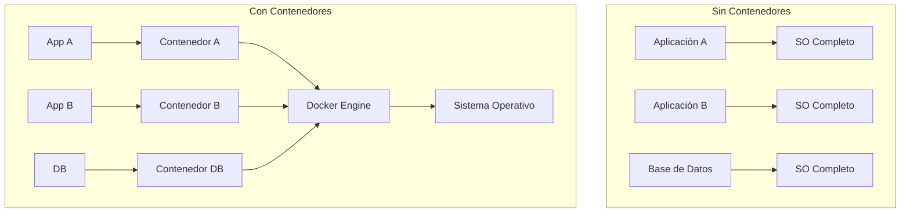
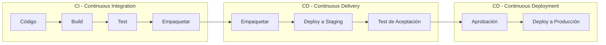
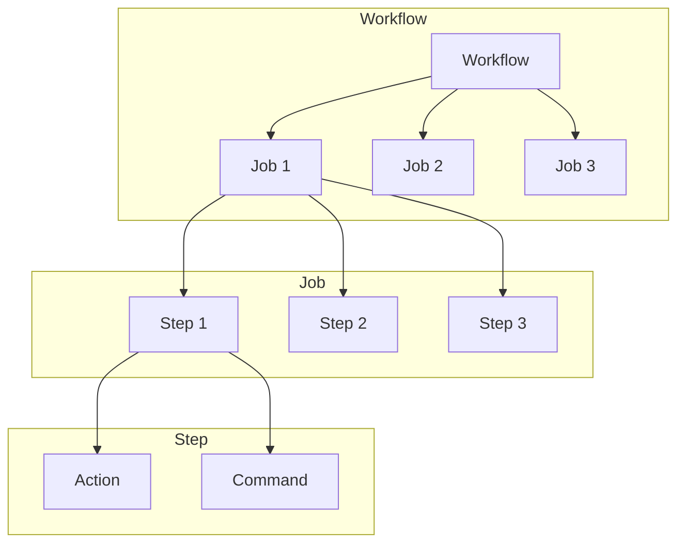
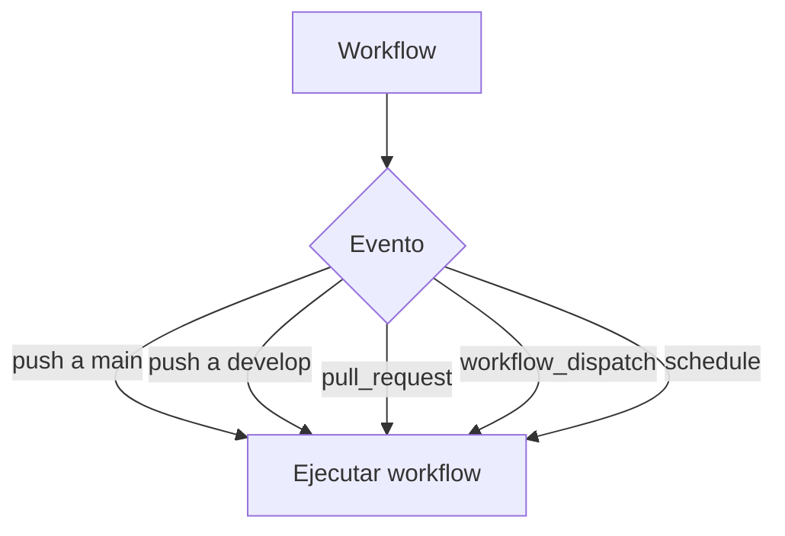
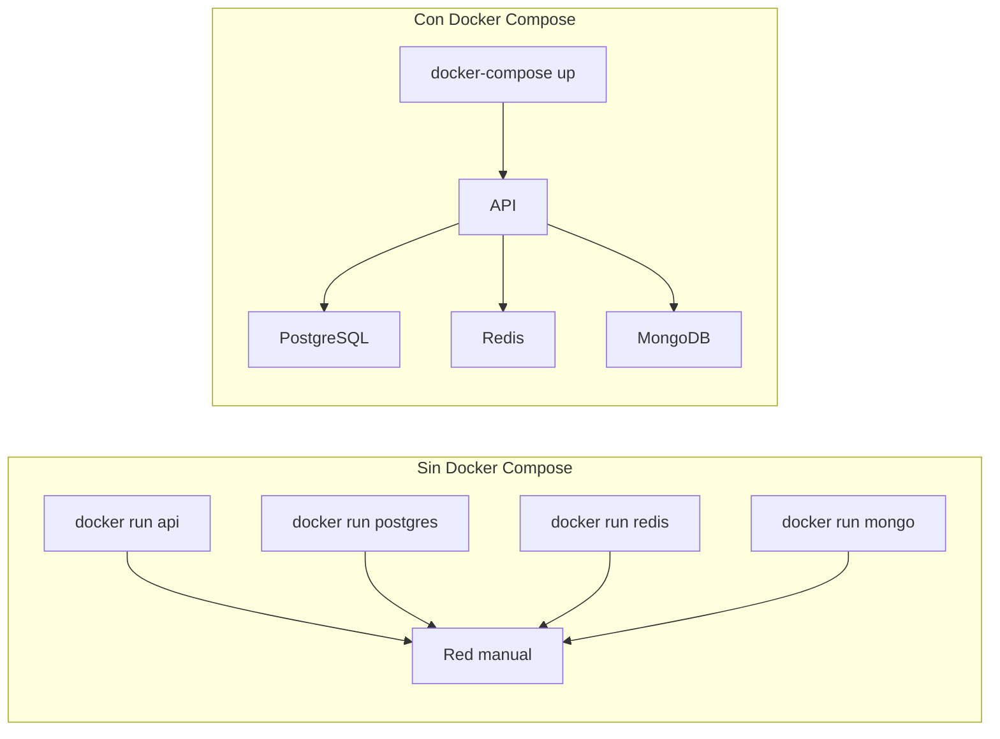
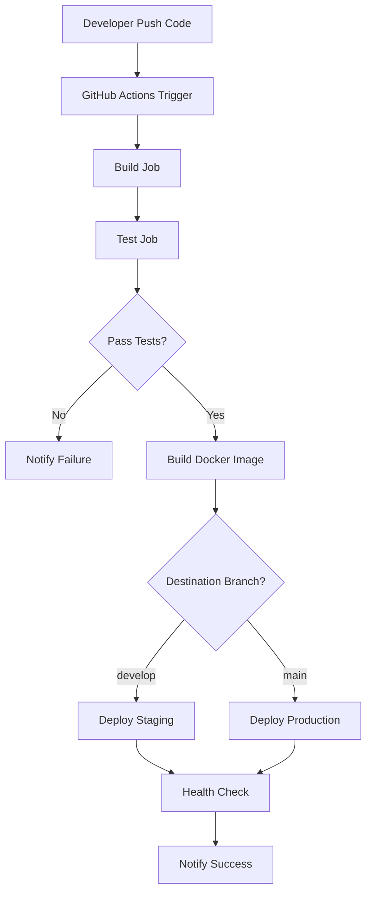

# 23. Docker y CI/CD con GitHub Actions

## Índice

[23. Docker y CI/CD con GitHub Actions](#23-docker-y-cicd-con-github-actions)
  - [23.1. Conceptos Fundamentales](#231-conceptos-fundamentales)
  - [23.2. GitHub Actions CI Pipeline](#232-github-actions-ci-pipeline)
  - [23.3. ¿Qué es CI/CD?](#233-qué-es-cicd)
  - [23.4. Conceptos de GitHub Actions](#234-conceptos-de-github-actions)
  - [23.5. Archivo Dockerfile](#235-archivo-dockerfile)
  - [23.6. Docker Compose](#236-docker-compose)
  - [23.7. GitHub Actions Workflow Completo](#237-github-actions-workflow-completo)
  - [23.8. Modos de Uso](#238-modos-de-uso)
  - [23.9. Comandos de Test](#239-comandos-de-test)
  - [23.10. Resumen y Buenas Prácticas](#2310-resumen-y-buenas-prácticas)

---

## 23.1. Conceptos Fundamentales

### ¿Qué es un Contenedor?

Un **contenedor** es una unidad de software que incluye todo lo necesario para ejecutar una aplicación: código, runtime, herramientas del sistema, librerías y configuraciones. A diferencia de las máquinas virtuales, los contenedores comparten el kernel del sistema operativo y son más ligeros.



### Ventajas de los Contenedores para APIs

| Aspecto | Beneficio |
|---------|-----------|
| **Consistencia** | Mismo entorno en desarrollo, testing y producción |
| **Aislamiento** | Cada servicio corre en su propio contenedor |
| **Escalabilidad** | Facilidad para replicar contenedores |
| **Portabilidad** | Funciona en cualquier servidor con Docker instalado |
| **Reproducibilidad** | Control de versiones del entorno completo |

---

## 23.2. GitHub Actions CI Pipeline

Este proyecto incluye un pipeline de CI/CD automatizado usando **GitHub Actions** que valida cada cambio de código.

### Características del Pipeline

| Job | Descripción | Tiempo estimado |
|-----|-------------|-----------------|
| **Build** | Compila la solución en Release | ~1-2 min |
| **Test** | Ejecuta 1000+ tests unitarios | ~1 min |
| **Validate Docs** | Verifica documentación | ~10 seg |

### Triggers

El pipeline se ejecuta automáticamente en:
- **Push** a branches `main` o `develop`
- **Pull Request** a `main`
- **Manual** mediante workflow_dispatch

### Configuración

```yaml
# .github/workflows/ci.yml
name: CI Pipeline

on:
  push:
    branches: [main, develop]
  pull_request:
    branches: [main]
```

### ¿Necesita Secretos?

**NO** para CI básico (build + test). El pipeline usa:
- Testcontainers para tests de integración
- Sin conexión a bases de datos externas
- Sin variables sensibles necesarias

### Ver Resultados

1. Ir a **Actions** tab en GitHub
2. Ver el último workflow run
3. Revisar logs de cada job

### Badge de Status

Añade este badge al README:

```markdown

```

---

## 23.3. ¿Qué es CI/CD?

**CI/CD** son las siglas de **Continuous Integration** (Integración Continua) y **Continuous Deployment/Delivery** (Despliegue Continuo). Es una práctica moderna de desarrollo de software que automatiza la construcción, prueba y entrega de aplicaciones.

### Las Tres Fases de CI/CD



| Fase | Descripción | Frecuencia |
|------|-------------|------------|
| **Continuous Integration** | Cada cambio de código se construye y prueba automáticamente | En cada push |
| **Continuous Delivery** | El código está siempre listo para desplegar a producción | En cada merge |
| **Continuous Deployment** | Cada cambio aprobado se despliega automáticamente a producción | En cada merge |

### ¿Por qué usar CI/CD?

| Problema sin CI/CD | Solución con CI/CD |
|-------------------|-------------------|
| Errors detectados tarde | Tests automáticos en cada push |
| Deploys manuales y propensos a errores | Deploy automatizado y consistente |
| Miedo a hacer cambios frecuentes | Confianza para innovar |
| Tiempo perdido en configuración manual | Entornos reproducibles |
| Incertidumbre sobre qué está en producción | historial completo de despliegues |

---

## 23.4. Conceptos de GitHub Actions



| Concepto | Descripción | Ejemplo |
|----------|-------------|---------|
| **Workflow** | Proceso automatizado completo | Build, test y deploy |
| **Job** | Conjunto de steps que se ejecutan en el mismo runner | "Build" o "Deploy" |
| **Step** | Tarea individual dentro de un job | "Instalar .NET", "Ejecutar tests" |
| **Action** | Reutilizable, combina steps | `actions/checkout@v4` |
| **Runner** | Servidor donde se ejecutan los jobs | Ubuntu, Windows, macOS |
| **Trigger** | Evento que inicia el workflow | push, pull_request, manual |

### Triggers de Workflow



---

## 23.5. Archivo Dockerfile

El **Dockerfile** es un archivo de texto que contiene instrucciones para construir una imagen Docker. Cada instrucción crea una capa en la imagen.

### ¿Por qué usar Multi-Stage Build?

El **multi-stage build** permite construir la aplicación en una etapa y copiar solo los archivos necesarios a una imagen final más pequeña. Esto reduce el tamaño de la imagen y mejora la seguridad.

### Estructura del Proyecto

```
TiendaDawApi-NetCore/
├── src/
│   ├── TiendaApi.Apis/
│   │   ├── Program.cs
│   │   └── TiendaApi.Apis.csproj
│   ├── TiendaApi.Core/
│   │   └── TiendaApi.Core.csproj
│   └── TiendaApi.Tests/
│       └── TiendaApi.Tests.csproj
├── Dockerfile
├── .dockerignore
├── docker-compose.local.yml
└── docker-compose.prod.yml
```

### Dockerfile Completo Explicado

```dockerfile
# ============================================
# ETAPA 1: BUILD - Compilar la aplicación
# Usamos la imagen SDK que incluye todas las
# herramientas de compilación
# ============================================
FROM mcr.microsoft.com/dotnet/sdk:10.0 AS build

# Establecer el directorio de trabajo
WORKDIR /src

# COPIA SOLO LOS ARCHIVOS DE PROYECTO
# Esto permite que Docker use caché de capas
# si no han cambiado los paquetes NuGet
COPY "TiendaApi.Apis/TiendaApi.Apis.csproj" "TiendaApi.Apis/"
COPY "TiendaApi.Tests/TiendaApi.Tests.csproj" "TiendaApi.Tests/"

# RESTAURAR DEPENDENCIAS
# Descarga todos los paquetes NuGet necesarios
RUN dotnet restore "TiendaApi.Apis/TiendaApi.Apis.csproj"

# COPIAR TODO EL CÓDIGO FUENTE
# Nota: Esto invalidará el caché cuando haya cambios
COPY . .

# PUBLICAR LA APLICACIÓN
# -c Release: Compila en modo Release
# -o /publish: Carpeta de salida
# --no-restore: No restore (ya hecho arriba)
RUN dotnet publish "TiendaApi.Apis/TiendaApi.Apis.csproj" \
    --configuration Release \
    --output /publish \
    --no-restore

# ============================================
# ETAPA 2: RUNTIME - Imagen final
# Imagen más pequeña que solo incluye el runtime
# ============================================
FROM mcr.microsoft.com/dotnet/aspnet:10.0 AS runtime

# INSTALAR DEPENDENCIAS DEL SISTEMA
# Necesarias para que .NET funcione correctamente
RUN apt-get update && apt-get install -y \
    --no-install-recommends \
    libicu80 \
    curl \
    && rm -rf /var/lib/apt/lists/*

# CREAR USUARIO NO-ROOT
# Por seguridad, los contenedores no deben correr como root
RUN useradd -m -u 1000 appuser

WORKDIR /app

# COPIAR ARCHIVOS COMPILADOS
COPY --from=build /publish .

# CAMBIAR PROPIETARIO
RUN chown -R appuser:appuser /app

# CONFIGURAR VARIABLES DE ENTORNO
ENV ASPNETCORE_URLS=http://+:5000
ENV ASPNETCORE_ENVIRONMENT=Production

EXPOSE 5000

# USUARIO NO-ROOT
USER appuser

# HEALTHCHECK
# Docker verificará la salud del contenedor
HEALTHCHECK --interval=30s --timeout=10s --start-period=5s --retries=3 \
    CMD curl -f http://localhost:5000/health || exit 1

ENTRYPOINT ["dotnet", "TiendaApi.Apis.dll"]
```

### Explicación de Instrucciones del Dockerfile

| Instruccion | Proposito |
|-------------|-----------|
| `FROM` | Base image |
| `WORKDIR` | Directorio de trabajo |
| `COPY` | Copiar archivos |
| `RUN` | Ejecutar comandos |
| `ENV` | Variables de entorno |
| `EXPOSE` | Puerto que expone el contenedor |
| `USER` | Usuario que ejecuta |
| `ENTRYPOINT` | Comando que se ejecuta al iniciar |
| `HEALTHCHECK` | Verificacion de salud |

### .dockerignore

El archivo `.dockerignore` funciona como `.gitignore`: exclude archivos del contexto de build para reducir tamaño y mejorar seguridad.

```gitignore
# .dockerignore

# Git
.git
.gitignore

# IDE
.vs
.vscode
*.suo
*.user

# Build outputs
bin/
obj/
out/

# Tests
coverage/
**/TiendaApi.Tests/

# Documentacion
*.md

# Configuracion sensible
appsettings.*.json
!appsettings.Development.json

# Docker
Dockerfile*
docker-compose*
```

---

## 23.6. Docker Compose

**Docker Compose** es una herramienta para definir y ejecutar aplicaciones Docker multi-contenedor. Se usa un archivo YAML para configurar todos los servicios.

### ¿Por qué usar Docker Compose?



### docker-compose.local.yml para Desarrollo

```yaml
version: '3.8'

services:
  # ========================================
  # API de Tienda
  # ========================================
  api:
    build:
      context: .
      dockerfile: Dockerfile
    container_name: tiendaapi-local
    ports:
      - "5000:5000"
    environment:
      - ASPNETCORE_ENVIRONMENT=Development
      - ConnectionStrings__PostgreSQL=Host=postgres;Database=TiendaDb;Username=postgres;Password=postgres
      - ConnectionStrings__Redis=redis:6379
      - ConnectionStrings__MongoDB=mongodb://mongo:27017
    depends_on:
      postgres:
        condition: service_healthy
      redis:
        condition: service_started
      mongo:
        condition: service_started
    volumes:
      # Montar codigo fuente para hot-reload
      - ./src:/app/src:ro

  # ========================================
  # PostgreSQL
  # ========================================
  postgres:
    image: postgres:15-alpine
    environment:
      POSTGRES_USER: postgres
      POSTGRES_PASSWORD: postgres
      POSTGRES_DB: TiendaDb
    ports:
      - "5432:5432"
    volumes:
      - postgres-data:/var/lib/postgresql/data
    healthcheck:
      test: ["CMD-SHELL", "pg_isready -U postgres"]
      interval: 10s
      timeout: 5s
      retries: 5

  # ========================================
  # Redis
  # ========================================
  redis:
    image: redis:7-alpine
    ports:
      - "6379:6379"
    volumes:
      - redis-data:/data

  # ========================================
  # MongoDB
  # ========================================
  mongo:
    image: mongo:7
    ports:
      - "27017:27017"
    volumes:
      - mongo-data:/data/db

networks:
  tienda-network:
    driver: bridge

volumes:
  postgres-data:
  redis-data:
  mongo-data:
```

### Comandos de Docker Compose

| Comando | Descripcion |
|---------|-------------|
| `docker-compose up -d` | Iniciar todos los servicios en background |
| `docker-compose down` | Detener todos los servicios |
| `docker-compose logs -f api` | Ver logs de la API |
| `docker-compose build api` | Reconstruir imagen de la API |
| `docker-compose restart api` | Reiniciar solo la API |

---

## 23.7. GitHub Actions Workflow Completo

El workflow de CI/CD define qué sucede automáticamente cuando se hace push o se crea un pull request.

### Estructura de Archivos

```
.github/
└── workflows/
    └── ci-cd.yml
```

### Workflow Completo con Explicaciones

```yaml
# ============================================
# NOMBRE DEL WORKFLOW
# ============================================
name: CI/CD Pipeline

# ============================================
# TRIGGERS - Cuándo se ejecuta
# ============================================
on:
  # Ejecutar en push a main o develop
  push:
    branches: [main, develop]
  # Ejecutar en pull requests a main
  pull_request:
    branches: [main]
  # Permite ejecucion manual desde GitHub
  workflow_dispatch:
    inputs:
      environment:
        description: 'Environment to deploy'
        required: true
        default: 'staging'
        type: choice
        options:
          - staging
          - production

# ============================================
# VARIABLES DE ENTORNO
# ============================================
env:
  REGISTRY: ghcr.io
  IMAGE_NAME: ${{ github.repository }}
  DOTNET_VERSION: '10.0.x'

# ============================================
# JOBS - Conjuntos de tareas
# ============================================
jobs:
  # ----------------------------------------
  # JOB: BUILD - Compilar la aplicacion
  # ----------------------------------------
  build:
    name: Build
    runs-on: ubuntu-latest
    
    outputs:
      image-tag: ${{ steps.meta.outputs.tags }}

    steps:
      # 1. Obtener codigo del repositorio
      - name: Checkout code
        uses: actions/checkout@v4

      # 2. Instalar .NET
      - name: Setup .NET
        uses: actions/setup-dotnet@v4
        with:
          dotnet-version: ${{ env.DOTNET_VERSION }}

      # 3. Restaurar dependencias NuGet
      - name: Restore dependencies
        run: dotnet restore

      # 4. Compilar en modo Release
      - name: Build
        run: dotnet build --configuration Release --no-restore

      # 5. Configurar Docker Buildx
      - name: Set up Docker Buildx
        uses: docker/setup-buildx-action@v3

      # 6. Login al registry de GitHub
      - name: Log in to Container Registry
        uses: docker/login-action@v3
        with:
          registry: ${{ env.REGISTRY }}
          username: ${{ github.actor }}
          password: ${{ secrets.GITHUB_TOKEN }}

      # 7. Extraer metadata de la imagen
      - name: Extract metadata for Docker
        id: meta
        uses: docker/metadata-action@v5
        with:
          images: ${{ env.REGISTRY }}/${{ env.IMAGE_NAME }}
          tags: |
            type=raw,value=latest,enable={{is_default_branch}}
            type=ref,event=branch
            type=sha

      # 8. Build y push de imagen Docker
      - name: Build and push Docker image
        uses: docker/build-push-action@v5
        with:
          context: .
          push: ${{ github.event_name == 'push' }}
          tags: ${{ steps.meta.outputs.tags }}
          labels: ${{ steps.meta.outputs.labels }}
          cache-from: type=gha
          cache-to: type=gha,mode=max

  # ----------------------------------------
  # JOB: TEST - Ejecutar tests
  # ----------------------------------------
  test:
    name: Test
    needs: build  # Espera a que termine build
    runs-on: ubuntu-latest

    services:
      postgres:
        image: postgres:15-alpine
        env:
          POSTGRES_USER: postgres
          POSTGRES_PASSWORD: postgres
          POSTGRES_DB: TiendaDb
        ports:
          - 5432:5432
        options: >-
          --health-cmd pg_isready
          --health-interval 10s
          --health-timeout 5s
          --health-retries 5

    steps:
      - name: Checkout code
        uses: actions/checkout@v4

      - name: Setup .NET
        uses: actions/setup-dotnet@v4
        with:
          dotnet-version: ${{ env.DOTNET_VERSION }}

      - name: Restore dependencies
        run: dotnet restore

      - name: Build
        run: dotnet build --configuration Release --no-restore

      - name: Run tests
        run: |
          dotnet test \
            --configuration Release \
            --no-build \
            --collect:"XPlat Code Coverage"

  # ----------------------------------------
  # JOB: DEPLOY STAGING
  # ----------------------------------------
  deploy-staging:
    name: Deploy to Staging
    needs: [build, test]
    if: github.event_name == 'push' && github.ref == 'refs/heads/develop'
    runs-on: ubuntu-latest

    steps:
      - name: Deploy to Staging
        run: |
          echo "Deploying to staging..."
          # Comandos SSH para conectar al servidor y desplegar
```

### Conceptos Clave del Workflow

| Concepto | Descripción | Ejemplo en el YAML |
|----------|-------------|-------------------|
| `on` | Define cuándo se ejecuta el workflow | `push: [main, develop]` |
| `jobs` | Agrupa los trabajos a realizar | `build`, `test`, `deploy` |
| `runs-on` | El runner donde se ejecuta | `ubuntu-latest` |
| `needs` | Dependencias entre jobs | `needs: build` |
| `steps` | Pasos individuales | `Checkout`, `Setup .NET` |
| `uses` | Reutilizar actions | `actions/checkout@v4` |
| `run` | Ejecutar comandos | `dotnet restore` |
| `if` | Condiciones | `if: github.ref == 'refs/heads/main'` |

### Secrets de GitHub

Los **secrets** son variables encriptadas para datos sensibles como claves SSH, passwords o tokens.

| Secret | Descripcion |
|--------|-------------|
| `SSH_KEY_STAGING` | Clave SSH para servidor staging |
| `SSH_KEY_PRODUCTION` | Clave SSH para servidor producción |
| `GITHUB_TOKEN` | Automático de GitHub |

---

## 23.8. Modos de Uso

Este proyecto soporta diferentes modos de ejecución según las necesidades.

### Comparación de Modos

| Aspecto | CI (GitHub Actions) | Desarrollo Local | Producción |
|---------|---------------------|------------------|------------|
| **Base de datos** | Testcontainers | Docker Compose | Externo |
| **Secrets** | No necesarios | .env | Variables entorno |
| **Build** | Release | Debug | Release |
| **Cache** | GitHub Actions Cache | Local | CDN |
| **Logs** | GitHub Actions Logs | Consola | Serilog |

### Modo CI (GitHub Actions)

```yaml
# .github/workflows/ci.yml
jobs:
  build:
    runs-on: ubuntu-latest
    steps:
      - uses: actions/checkout@v4
      - uses: actions/setup-dotnet@v4
        with:
          dotnet-version: '10.0.x'
      - run: dotnet build --configuration Release
      - run: dotnet test --configuration Release
```

**Características:**
- Sin secrets necesarios
- Testcontainers para BDs
- Builds reproducibles
- Coverage automático

### Modo Desarrollo Local

```bash
# Usando docker-compose.local.yml
docker-compose -f docker-compose.local.yml up -d

# O directamente con .NET
dotnet run --project TiendaApi.Apis
```

**Características:**
- Variables en `.env`
- Hot reload con `dotnet watch`
- Volúmenes montados
- PostgreSQL, MongoDB, Redis locales

### Modo Producción

```bash
# Build y deploy con Docker
docker-compose -f docker-compose.prod.yml up -d --build
```

**Características:**
- Multi-stage build
- Usuario no-root
- Health checks
- Variables de entorno seguras

### Comandos de Test

Este proyecto distingue entre tests unitarios y de integración:

| Escenario | Comando | Docker |
| --------- | ------- | ------ |
| **Solo unitarios** (rápido, sin dependencias) | `dotnet test --filter "FullyQualifiedName~Unit"` | ❌ |
| **Solo integración** (requiere servicios) | `dotnet test --filter "FullyQualifiedName~Integration"` | ✅ |
| **Todos sin Docker** | `SKIP_INTEGRATION_TESTS=true dotnet test` | ❌ |
| **Todos con Docker** (completo) | `dotnet test` | ✅ |

#### Características de los Tests

| Tipo | Paralelismo | Tiempo | Cobertura |
|------|-------------|--------|-----------|
| **Unitarios** | ✅ Paralelos | ~7s | 71.52% |
| **Integración** | ❌ Secuenciales | ~81s | 40.57% |

#### Configuración de Paralelismo

```csharp
// Tests de integración tienen [NonParallelizable]
// porque comparten recursos (Testcontainers)
[NonParallelizable]
public class ProductoServiceIntegrationTests { }

// Tests unitarios son paralelos por defecto en NUnit
public class ProductoValidatorTests { }
```

### Cambiar entre Modos

```bash
# Desarrollo
export ASPNETCORE_ENVIRONMENT=Development

# Staging  
export ASPNETCORE_ENVIRONMENT=Staging

# Producción
export ASPNETCORE_ENVIRONMENT=Production
```

---

## 23.10. Resumen y Buenas Prácticas

### Flujo Completo de CI/CD



### Buenas Prácticas

```mermaid
flowchart TB
    subgraph "Docker"
        A1["Multi-stage build"]
        A2["Imagenes pequenas"]
        A3["Usuario no-root"]
        A4["Healthcheck"]
    end
    
    subgraph "CI/CD"
        B1["Build rapido con cache"]
        B2["Test antes de deploy"]
        B3["Quality gates"]
        B4["Rollback plan"]
    end
    
    subgraph "Seguridad"
        C1["Scanning de vulnerabilidades"]
        C2["Secrets fuera del codigo"]
        C3["Imagenes firmadas"]
        C4["Least privilege"]
    end
    
    A1 --> A2 --> A3 --> A4
    B1 --> B2 --> B3 --> B4
    C1 --> C2 --> C3 --> C4
```



### Siguientes Pasos

Con Docker y CI/CD dominado, el siguiente paso es aprender sobre testing.

### Recursos Adicionales

- Docker Documentation: https://docs.docker.com/
- Docker Compose: https://docs.docker.com/compose/
- GitHub Actions: https://docs.github.com/en/actions
- .NET in Containers: https://learn.microsoft.com/dotnet/core/docker/
